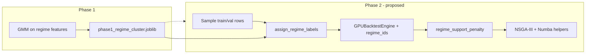

# Phase 2: Regime-Aware Support + Numba Optimization

## Current state (verified in codebase)

| Area         | Today                                                                                                                                                                                                                                                                              |
| ------------ | ---------------------------------------------------------------------------------------------------------------------------------------------------------------------------------------------------------------------------------------------------------------------------------- |
| Regimes      | Phase 1 fits GMM on [`PHASE1_REGIME_FEATURES`](gpu_fuzzy_trader/config.py), persists [`phase1_regime_cluster.joblib`](gpu_fuzzy_trader/config.py) via [`regime_cluster.py`](gpu_fuzzy_trader/features/regime_cluster.py). Used only for feature stationarity, not Phase 2 fitness. |
| Support      | [`trade_support_penalty(executed)`](gpu_fuzzy_trader/phases/phase2_rule_pool.py) uses global `MIN_TRADE_SUPPORT` / `MIN_TRADE_POOL_FLOOR` only. Duplicated in [`evox_runner._evaluate_population_indices`](gpu_fuzzy_trader/evolution/evox_runner.py).                             |
| Backtest     | [`GPUBacktestEngine.simulate_rule_batch`](gpu_fuzzy_trader/backtest/gpu_engine.py) returns aggregate metrics (`executed_trades`, `win_rate`, …) — **no per-regime breakdown**.                                                                                                     |
| Numba        | Not in [`requirements.txt`](requirements.txt); no `@njit` usage anywhere.                                                                                                                                                                                                          |
| Phase 2 data | [`Rule_Pool_Generator`](gpu_fuzzy_trader/phases/phase2_rule_pool.py) samples train/val, then [`slim_backtest_df`](gpu_fuzzy_trader/backtest/df_slim.py) drops regime columns before engine build.                                                                                  |

Your Phase 1 regime setup is correct (`PHASE1_STATIONARITY_STRATIFY="regime"`). Phase 2 simply does not consume the saved model yet.



---

## Execution safeguards (do not skip during implementation)

1. **JAX → NumPy before Numba:** Coerce all regime metrics with `np.asarray(..., dtype=...)` at the engine output and again before `batch_trade_support_penalties`. Numba cannot consume `jax.Array` / `DeviceArray`.
2. **Benchmark warm-up:** First `gen=1` Numba run is compile-only; timed comparisons use post-warm-up runs; rely on `cache=True` for repeatability.
3. **Val regime absence:** If `PHASE2_REGIME_REQUIRE_VAL_CONFIRMATION` is enabled, a train-dominant regime with **no val rows or zero val trades** is inconclusive — specialist status stands; only apply val gates when val actually contains that regime with enough trades.

---

## Part A — Regime-stratified dynamic support

### A1. Config knobs ([`gpu_fuzzy_trader/config.py`](gpu_fuzzy_trader/config.py))

Add Phase 2 regime block (defaults chosen to match your answers):

| Constant                                 | Suggested default                | Role                                                                                                   |
| ---------------------------------------- | -------------------------------- | ------------------------------------------------------------------------------------------------------ |
| `PHASE2_REGIME_SUPPORT_ENABLED`          | `True`                           | Master switch; `False` → current static penalty                                                        |
| `PHASE2_REGIME_MODEL_PATH`               | reuse `PHASE1_REGIME_MODEL_PATH` | Load artifact                                                                                          |
| `PHASE2_REGIME_CONCENTRATION_MIN`        | `0.90`                           | `trades_dominant / executed`                                                                           |
| `PHASE2_REGIME_MIN_WIN_RATE`             | `0.40`                           | Win rate in dominant regime                                                                            |
| `PHASE2_REGIME_USE_PNL_GATE`             | `True`                           | Specialist if **either** win rate ≥ 40% **or** net PnL in dominant regime > 0                          |
| `PHASE2_REGIME_MIN_TRADE_FRACTION`       | `1.0`                            | Per-regime threshold = `max(MIN_TRADE_POOL_FLOOR, round(MIN_TRADE_SUPPORT * row_fraction * fraction))` |
| `PHASE2_REGIME_REQUIRE_VAL_CONFIRMATION` | `False`                          | When `True`, optional val check; missing val regime → pass (inconclusive)                              |
| `PHASE2_NUMBA_ENABLED`                   | `True`                           | Use `@njit` NSGA/penalty helpers; fallback to NumPy on import failure                                  |

Document in [`docs/hyperparameters/phase2_rule_pool.md`](docs/hyperparameters/phase2_rule_pool.md).

### A2. Regime labels aligned to backtest rows ([`phase2_rule_pool.py`](gpu_fuzzy_trader/phases/phase2_rule_pool.py))

In `Rule_Pool_Generator.__init__`, **after** `_sample_df`, **before** `slim_backtest_df`:

1. Try `load_regime_model(PHASE2_REGIME_MODEL_PATH)`; on missing file / missing regime columns → log warning, `regime_ids = None`, static penalty only.
2. `assign_regime_labels(sampled, bundle)` on train (and val if joint mode).
3. Build `regime_ids: np.int32` aligned to row order; compute `regime_row_counts` and `n_regimes` for thresholds.
4. Pass `regime_ids` into `_build_engine_for_df` (new optional kwarg).

`slim_backtest_df` stays unchanged (no need to keep regime feature columns in the engine DataFrame).

### A3. Extend GPU batch simulation ([`gpu_engine.py`](gpu_fuzzy_trader/backtest/gpu_engine.py))

Extend `_jax_simulate_equity_batch` / `simulate_one` scan carry when `regime_ids` is provided (static `n_regimes`):

- Per chromosome: vectors `trades_by_regime[R]`, `wins_by_regime[R]`, `net_pnl_by_regime[R]`.
- On `can_trade`, increment using `regime_ids[t]`.
- Append to returned row (e.g. indices 10..10+3R-1) or return a second array `(B, R, 3)` to avoid breaking existing column layout.

Update `simulate_rule_batch` metrics dict:

```python
"regime_trade_counts": list[int],   # length R
"regime_win_counts": list[int],
"regime_net_pnl": list[float],
```

**JAX → NumPy boundary (required):** Inside `simulate_rule_batch`, after `np.asarray(results_array)`, convert any regime slice to host NumPy **before** building Python metrics dicts. In `_evaluate_population_indices`, when assembling batches for Numba, use explicit coercion:

```python
regime_counts = np.asarray(metrics.get("regime_trade_counts"), dtype=np.int64)
# same for wins / net_pnl — never pass jax.Array or DeviceArray into @njit
```

Add a small helper `_to_host_numpy(x)` in [`gpu_engine.py`](gpu_fuzzy_trader/backtest/gpu_engine.py) or [`phase2_support.py`](gpu_fuzzy_trader/phases/phase2_support.py) used at every JAX→penalty/Numba handoff.

**Parity:** extend [`tests/property/test_gpu_engine_properties.py`](tests/property/test_gpu_engine_properties.py) so when `regime_ids` is set, summing `regime_trade_counts` equals `executed_trades` and global `win_rate` is consistent with pooled wins.

**CPU fallback:** Phase 2 without JAX is rare; if `CPUBacktestEngine` is still used, add a thin `simulate_rule_batch` wrapper that loops chromosomes and aggregates per-regime stats from the existing entry loop (correctness over speed).

### A4. New penalty API ([`phase2_rule_pool.py`](gpu_fuzzy_trader/phases/phase2_rule_pool.py))

Replace single-arg `trade_support_penalty` with a small module (e.g. [`phase2_support.py`](gpu_fuzzy_trader/phases/phase2_support.py)):

```python
def trade_support_penalty(
    executed: int,
    *,
    regime_trade_counts: np.ndarray | None = None,
    regime_win_counts: np.ndarray | None = None,
    regime_net_pnl: np.ndarray | None = None,
    regime_row_fractions: np.ndarray | None = None,
) -> tuple[float, bool]:
    """Returns (penalty, is_regime_specialist)."""
```

**Logic:**

1. If `executed >= MIN_TRADE_SUPPORT` → `(0.0, False)`.
2. If regime disabled or arrays missing → current graduated / hard-reject behavior.
3. Compute per-regime thresholds from `regime_row_fractions`.
4. Find dominant regime `d = argmax(regime_trade_counts)`.
5. **Specialist** if:
   - `executed >= MIN_TRADE_POOL_FLOOR` (still reject noise below floor unless specialist path applies),
   - `regime_trade_counts[d] / executed >= PHASE2_REGIME_CONCENTRATION_MIN`,
   - `regime_trade_counts[d] >= threshold[d]`,
   - quality: `wins_d / trades_d >= 0.40` **or** `regime_net_pnl[d] > 0`.
6. If specialist → `(0.0, True)` (per your choice: full waiver).
7. Else → existing quadratic shortfall penalty; hard reject `2 * SUPPORT_PENALTY_MAX` only when below floor **and** not specialist.

Wire into:

- [`_evaluate_chromosome`](gpu_fuzzy_trader/phases/phase2_rule_pool.py)
- [`_evaluate_population_indices`](gpu_fuzzy_trader/evolution/evox_runner.py) (single code path — import shared helper)
- [`_build_pool_from_archive`](gpu_fuzzy_trader/phases/phase2_rule_pool.py): replace `if executed < MIN_TRADE_POOL_FLOOR: continue` with specialist-aware check using cached regime fields from metrics (re-simulate only when missing).

Store on pool entries for audit: `"regime_specialist": true`, `"dominant_regime": d`, `"regime_trade_counts": [...]`.

**Joint train+val:** compute specialist status on **train** metrics for penalty; optionally require val dominant regime to meet a lighter gate — `PHASE2_REGIME_REQUIRE_VAL_CONFIRMATION = False` by default.

**Val confirmation edge case (when flag enabled):** Validation sample may omit the train-dominant regime entirely (e.g. train has sideways + trending, val slice is only uptrend). Rules:

- If val has **zero rows** in regime `d` (dominant on train): do **not** reject the specialist; treat val confirmation as **skipped / inconclusive** (pass through with caution). Log at debug: `val_regime_absent`.
- If val has rows in `d` but `val_regime_trade_counts[d] == 0`: same — inconclusive, do not penalize extra.
- Only apply val gates when `val_rows_in_d > 0` **and** `val_trades_in_d >= min_val_trades` (e.g. `max(MIN_TRADE_POOL_FLOOR // 4, 10)`): then check concentration and quality on val subset.

Implement in `trade_support_penalty` / a companion `val_regime_confirmation(...)` so missing regimes never flip a train specialist into hard reject.

### A5. Tests

- Unit tests for penalty boundaries (specialist at 60 trades, non-specialist at 60 scattered trades).
- Extend [`tests/unit/test_cpu_engine.py`](tests/unit/test_cpu_engine.py) `TestTradeSupportPenalty` → new `TestRegimeSupportPenalty`.
- Integration: mock engine returning regime arrays in [`test_evox_runner.py`](tests/unit/test_evox_runner.py).

---

## Part B — Numba for evolution overhead (not JAX backtest)

**Realistic expectation:** With JAX GPU batch backtest, the ~80k evals/gen dominate wall time. Numba will help most on **merged-population NSGA work** (400 individuals × O(n²) dominance in [`_non_dominated_sort`](gpu_fuzzy_trader/phases/phase2_rule_pool.py)) and duplicated Python penalty loops — not a guaranteed 19× end-to-end speedup. Add a small benchmark script or pytest timing guard optional.

### B1. Dependency

Add `numba>=0.58` to [`requirements.txt`](requirements.txt).

### B2. Numba module ([`gpu_fuzzy_trader/evolution/numba_ops.py`](gpu_fuzzy_trader/evolution/numba_ops.py))

`@njit` implementations (pure NumPy in / out):

| Function                                                            | Replaces                                                                                                    |
| ------------------------------------------------------------------- | ----------------------------------------------------------------------------------------------------------- |
| `dominates(a, b)`                                                   | `_dominates`                                                                                                |
| `fast_non_dominated_sort(objectives)`                               | `_non_dominated_sort` (same semantics; consider replacing O(n²) with NSGA-II fast sort later if still slow) |
| `crowding_distance(front_obj)`                                      | `_crowding_distance`                                                                                        |
| `batch_trade_support_penalties(executed, regime_counts_batch, ...)` | inner loop in `_evaluate_population_indices`                                                                |

Use `cache=True`; gate with `PHASE2_NUMBA_ENABLED = True` and fall back to pure NumPy if import fails.

**Type contract:** All `@njit` entry points accept only `numpy.ndarray` with explicit `dtype` (`float64` objectives, `int64` counts). Callers must `np.asarray(..., dtype=...)` immediately after reading engine metrics — see JAX boundary in A3.

### B3. Refactor call sites

- [`evox_runner.py`](gpu_fuzzy_trader/evolution/evox_runner.py): use numba sort/crowding in `environmental_selection_nsga2`, `_nsga3_environmental_selection` prep, `_build_rank_and_crowding`.
- [`phase2_rule_pool.py`](gpu_fuzzy_trader/phases/phase2_rule_pool.py): archive merge `_non_dominated_sort` / `_crowding_distance`.
- Vectorize `_repair_population` with NumPy indexing (no per-row Python list) — small win, low risk.

**Do not** rewrite JAX `_jax_simulate_equity_batch` in Numba (GPU path is already optimized).

### B4. Profiling checkpoint (avoid the JIT trap)

Numba compiles on first call; a single short run can make Numba look **slower** than pure Python.

**Procedure:**

1. **Warm-up:** `pop=50, gen=1` with `PHASE2_NUMBA_ENABLED=True` (discards compile time; with `cache=True`, disk cache warms for later runs).
2. **Timed run:** same config `gen=5` (or full `pop=200, gen=20` if feasible); log wall time for selection-only vs `simulate_rule_batch` eval.
3. **Baseline:** repeat steps 1–2 with Numba off.
4. Report **post-warm-up** timings only in PR notes / config comment.

Optional: add `tests/benchmark/test_phase2_numba_warmup.py` (marked `@pytest.mark.benchmark`, not CI-gating) documenting the warm-up requirement.

---

## Part C — Docs and cleanup

- Update [`docs/hyperparameters/phase2_rule_pool.md`](docs/hyperparameters/phase2_rule_pool.md): regime support table, specialist definition, interaction with `MIN_TRADE_SUPPORT`.
- Remove duplicated penalty logic between `phase2_rule_pool` and `evox_runner` (single import).
- Per [AGENTS.md](AGENTS.md): delete superseded static-only branches once regime path is wired.

---

## Implementation order (recommended)

1. Regime label plumbing + engine `regime_ids` (no penalty change) — verify counts sum correctly.
2. GPU per-regime metrics + penalty/specialist + pool floor bypass.
3. Tests + docs.
4. Numba NSGA/penalty batch + benchmark.
5. Optional val-confirmation toggle if joint mode shows train-only specialists.

---

## Risks / mitigations

| Risk                                         | Mitigation                                                                                    |
| -------------------------------------------- | --------------------------------------------------------------------------------------------- |
| Stale `joblib` after data/regime shift       | Log regime cluster counts at Phase 2 start; warn if file missing                              |
| Sampled rows change regime mix vs full train | Thresholds use **sampled** `regime_row_fractions` (consistent with backtest)                  |
| Specialist overfit                           | Concentration + per-regime quality gate; optional val confirmation flag                       |
| Numba + JAX coexistence                      | `np.asarray()` at every handoff; `@njit` never sees `DeviceArray` / `jax.Array`               |
| Numba benchmark misleading                   | Warm-up gen + `cache=True`; time only after compile                                           |
| Val regime absent when confirmation on       | Missing val regime → inconclusive pass, not reject; gate only if val has rows + trades in `d` |
