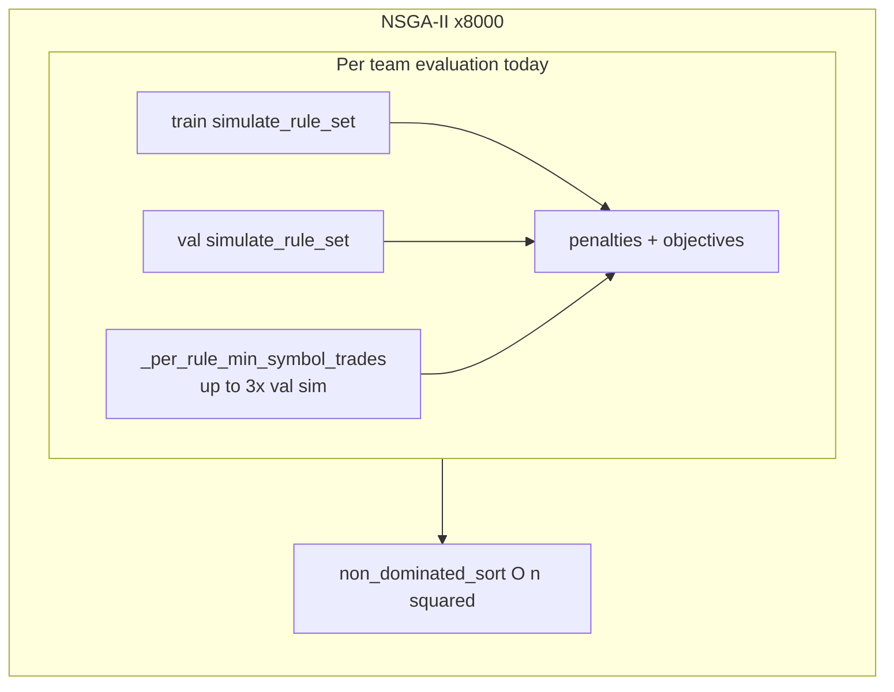

# Phase 3 evaluation acceleration plan

## Analysis vs your write-up

Your doc is directionally right (search budget = pop × generations; ~8k evals today is tiny), but **the current bottleneck is not Jaccard/correlation penalties**. Those are already cheap NumPy on small dicts in [`phase3_rule_set.py`](gpu_fuzzy_trader/phases/phase3_rule_set.py) (`_symbol_consistency_penalty`, `_train_val_corr_penalty`).

**Where time actually goes (per candidate team):**

| Step                              | Cost          | Notes                                                                                                                                                |
| --------------------------------- | ------------- | ---------------------------------------------------------------------------------------------------------------------------------------------------- |
| `train_engine.simulate_rule_set`  | High          | Full equity sim in [`cpu_engine.py`](gpu_fuzzy_trader/backtest/cpu_engine.py)                                                                        |
| `val_engine.simulate_rule_set`    | High          | Second full sim                                                                                                                                      |
| `_per_rule_min_symbol_trades`     | High (hidden) | Up to **3 extra val backtests** per eval when train-target gates are on ([`phase3_rule_set.py:348-351`](gpu_fuzzy_trader/phases/phase3_rule_set.py)) |
| Jaccard / corr / gates arithmetic | Low           | Microseconds                                                                                                                                         |
| NSGA-II sort/crowding             | Low–medium    | Duplicated pure Python in phase3; Phase 2 already has Numba in [`numba_ops.py`](gpu_fuzzy_trader/evolution/numba_ops.py)                             |

**`PHASE3_USE_GPU` today is misleading:** [`GPUBacktestEngine.simulate_rule_set_batch`](gpu_fuzzy_trader/backtest/gpu_engine.py) runs **ThreadPoolExecutor + CPUBacktestEngine**, not JAX vmap. True GPU batch exists only for Phase 2 **`simulate_rule_batch`** (chromosome encoding).

**Numba “19×” in-repo today:** Numba accelerates Phase 2 **NSGA helpers and support penalties**, not `CPUBacktestEngine` ([`PHASE2_NUMBA_ENABLED`](gpu_fuzzy_trader/config.py)). Any equity-loop Numba would be **new work**, not a migration of existing code.



---

## Phase A — CPU quick wins (ship first)

### A1. Per-rule validation metric cache (eliminate gate backtests)

**Problem:** [`_per_rule_min_symbol_trades`](gpu_fuzzy_trader/phases/phase3_rule_set.py) re-simulates each rule alone on validation for every team eval (~+50% val sim cost for teams of 3).

**Fix:** At `Rule_Set_Selector` init (in [`_build_phase3_engines`](gpu_fuzzy_trader/phases/phase3_rule_set.py) or `Rule_Set_Selector.__init__`), precompute once per pool rule:

```python
# key: frozenset(conditions) -> min trade_count across symbols on val
```

Store `per_symbol_metrics` from `val_engine.simulate_rule_set([single_rule])`. Gate becomes:

```python
min_per_rule = min(cache[conditions_key(r)] for r in rule_set)
```

Wire through [`_objectives_from_metrics`](gpu_fuzzy_trader/phases/phase3_greedy.py) (pass cache instead of `val_engine` for this gate).

**Tests:** Extend [`tests/unit/test_phase3_rule_set.py`](tests/unit/test_phase3_rule_set.py) — gate penalty unchanged vs brute-force path on small synthetic pool.

---

### A2. Rule signal mask cache (skip repeated condition parsing)

**Problem:** Every `simulate_rule_set` re-parses text conditions via [`_apply_dynamic_rule`](gpu_fuzzy_trader/backtest/cpu_engine.py) for each rule in the team.

**Fix:** New small module e.g. `gpu_fuzzy_trader/phases/phase3_cache.py`:

- On init: for each pool rule, compute `_build_rule_signal_mask(df, conditions)` once for train and val DataFrames.
- Add `build_entries_from_masks(rule_set, masks, assigned)` mirroring priority logic in [`_build_entries_from_rule_set`](gpu_fuzzy_trader/backtest/cpu_engine.py) (lines 216–234) without re-parsing strings.
- Optional fast path on `CPUBacktestEngine`: `simulate_entries(entries)` if entries already built (thin wrapper around `_simulate_rule_set_entries`).

Integrate cache into greedy batch + `_evaluate_rule_set` / batch path so hot loop avoids string parsing.

**Tests:** Parity: cached-path metrics == direct `simulate_rule_set` on a few real pool snippets (same tolerances as [`test_gpu_rule_set_batch.py`](tests/unit/test_gpu_rule_set_batch.py): rel 1e-4).

---

### A3. Parallel batch evaluation decoupled from “GPU” flag

**Problem:** Batching only runs when `PHASE3_USE_GPU=True` ([`phase3_rule_set.py:704-712`](gpu_fuzzy_trader/phases/phase3_rule_set.py)), but implementation is CPU threads.

**Fix:**

- Add `PHASE3_BATCH_WORKERS` (default: `min(32, os.cpu_count())`) and `PHASE3_USE_PARALLEL_BATCH = True` in [`config.py`](gpu_fuzzy_trader/config.py).
- Move batch executor to `CPUBacktestEngine.simulate_rule_set_batch` (ProcessPoolExecutor for CPU-bound sims; keep thread path as fallback if pickling fails in tests).
- `Rule_Set_Selector` sets `use_batch` from `PHASE3_USE_PARALLEL_BATCH`, not only `PHASE3_USE_GPU`.
- Rename log lines to “parallel batch” to avoid implying JAX GPU.

Update [`docs/hyperparameters/phase3_rule_set.md`](docs/hyperparameters/phase3_rule_set.md) and [`RUN.md`](RUN.md) accordingly.

---

### A4. Reuse Phase 2 Numba NSGA helpers in Phase 3

**Problem:** [`_non_dominated_sort` / `_crowding_distance`](gpu_fuzzy_trader/phases/phase3_rule_set.py) duplicate slow Python versions.

**Fix:**

- Import `non_dominated_sort`, `crowding_distance` from [`numba_ops.py`](gpu_fuzzy_trader/evolution/numba_ops.py).
- Add `PHASE3_NUMBA_ENABLED = True` (mirror `PHASE2_NUMBA_ENABLED`) for explicit opt-out.
- Remove duplicated `_dominates` / sort / crowding implementations after swap.

**Tests:** Existing phase3 property tests should pass unchanged; add one benchmark marker under `tests/benchmark/` for NSGA warm-up (mirror [`test_phase2_numba_warmup.py`](tests/benchmark/test_phase2_numba_warmup.py)).

---

### A5. Consolidate penalty + objective computation (Numba optional, small)

**Fix:** Single function `compute_phase3_objectives(train_metrics, val_metrics, rule_set_keys, caches, cfg)` used by both `_evaluate_rule_set` and `_objectives_from_metrics` to avoid drift.

Optional `@njit` helpers for:

- Jaccard on fixed-size symbol index bitsets (10 symbols)
- Pearson corr on aligned PnL vectors

Only worth doing **after** A1–A3; expected marginal vs backtests.

---

### A6. Benchmark harness + budget bump (your choice)

Add `tests/benchmark/test_phase3_eval_throughput.py`:

- Fixture: small prepared train/val slice + mock pool (or cached real pool subset).
- Measure: evals/sec for (a) baseline, (b) after A1+A2+A3, (c) after A4.
- Log recommended `PHASE3_REFINE_POP_SIZE` × `PHASE3_REFINE_GENERATIONS` for target wall-clock (e.g. match current ~8k baseline runtime at 100k budget).

**After benchmark:** If throughput gain ≥ threshold (e.g. 10×), update defaults in [`config.py`](gpu_fuzzy_trader/config.py) toward your target (e.g. `500` × `200`) **only if** pipeline dry-run on your machine stays acceptable; otherwise document achieved values in `phase3_rule_set.md`.

---

## Phase B — JAX/GPU batched rule-set eval (follow-up)

### B1. Precomputed signal tensors

Extend mask cache to JAX arrays `(n_pool, n_rows)` bool on device for train/val.

### B2. Batched priority assignment + equity

New `GPUBacktestEngine.simulate_rule_set_batch_jax`:

- Input: batch of team indices into pool (shape `(B, max_rules)` with padding / length mask).
- Vectorize priority assignment → entry indices per team (or batched signal → shared trade-outcome path like [`simulate_rule_batch`](gpu_fuzzy_trader/backtest/gpu_engine.py)).
- Reuse `_jax_simulate_equity_batch` / trade-outcome cache.

**Hard part:** Teams have **per-rule TP/SL/capital_pct** (unlike Phase 2 fixed static risk). Batch kernel must carry rule-index-specific params per entry.

### B3. Parity + enable flag

- Strict tests like [`test_gpu_rule_set_batch.py`](tests/unit/test_gpu_rule_set_batch.py) vs CPU on diverse teams (2–3 rules, mixed TP/SL).
- Set `PHASE3_USE_GPU=True` only after parity; wire NSGA/greedy to JAX batch path when flag on.

### B4. Deprecate thread-pool pseudo-GPU batch or keep as CPU fallback when JAX missing.

---

## Files to touch (Phase A)

| File                                                                                       | Changes                                                                                            |
| ------------------------------------------------------------------------------------------ | -------------------------------------------------------------------------------------------------- |
| [`gpu_fuzzy_trader/config.py`](gpu_fuzzy_trader/config.py)                                 | `PHASE3_USE_PARALLEL_BATCH`, `PHASE3_BATCH_WORKERS`, `PHASE3_NUMBA_ENABLED`; later budget defaults |
| [`gpu_fuzzy_trader/phases/phase3_rule_set.py`](gpu_fuzzy_trader/phases/phase3_rule_set.py) | Caches, batch flags, NSGA imports, remove duplicate NSGA                                           |
| [`gpu_fuzzy_trader/phases/phase3_greedy.py`](gpu_fuzzy_trader/phases/phase3_greedy.py)     | Use caches + unified objectives                                                                    |
| [`gpu_fuzzy_trader/backtest/cpu_engine.py`](gpu_fuzzy_trader/backtest/cpu_engine.py)       | `simulate_rule_set_batch` (ProcessPool), optional entries fast path                                |
| New `phase3_cache.py`                                                                      | Mask + per-rule metric caches                                                                      |
| [`docs/hyperparameters/phase3_rule_set.md`](docs/hyperparameters/phase3_rule_set.md)       | Bottleneck truth table, new knobs, budget guidance                                                 |
| Tests                                                                                      | unit parity + benchmark throughput                                                                 |

## Out of scope (unless you ask later)

- MOPSO / alternate MOEA (NSGA-II stays).
- Numba-compiling full equity loop (defer unless Phase A benchmarks still insufficient).
- Changing penalty weights or gate logic (speed only; behavior preserved).

## Success criteria

1. **Correctness:** All existing `test_phase3_*` pass; new parity tests for cache paths.
2. **Throughput:** Phase A benchmark shows large evals/sec increase (target: enough headroom for ~10–12× more evals at similar wall-clock).
3. **Budget:** After benchmark, defaults raised per your “bump after bench” choice.
4. **Phase B:** GPU batch within 1e-4 of CPU on rule-set metrics; `PHASE3_USE_GPU` documented as real JAX batch.
