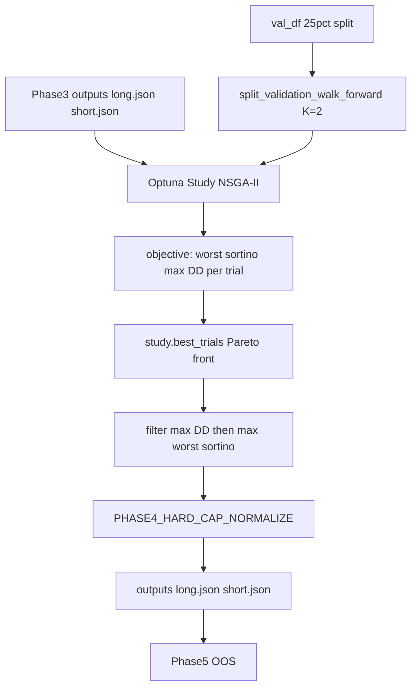

# Phase 4: RL → Optuna Walk-Forward Rewrite

## Goal

Remove DDPG/PPO, `TradingEnv`, elbow stopping, and single-objective Optuna/random fallbacks. Replace with **worst-case walk-forward evaluation** + **NSGA-II (or TPE multi-objective) Pareto search** on **validation data only**, preserving Phase 3→4→5 JSON I/O.

## Current state (what gets replaced)

| Piece                                                                                    | Location                                                                                                                                               | Action                                                        |
| ---------------------------------------------------------------------------------------- | ------------------------------------------------------------------------------------------------------------------------------------------------------ | ------------------------------------------------------------- |
| `RL_Agent`, `TradingEnv`, SB3/DDPG/PPO                                                   | [`phase4_rl_optimizer.py`](gpu_fuzzy_trader/phases/phase4_rl_optimizer.py) (~1.2k lines)                                                               | Delete                                                        |
| `find_elbow_point`, `_phase4_val_score`, `_bayesian_optimize`, `_random_search_optimize` | same file                                                                                                                                              | Delete                                                        |
| RL config keys                                                                           | [`config.py`](gpu_fuzzy_trader/config.py) L201–213                                                                                                     | Remove/replace                                                |
| Optional deps                                                                            | [`requirements.txt`](requirements.txt) L21–24                                                                                                          | Drop `stable-baselines3`, `gymnasium`, `torch`; keep `optuna` |
| Docs/tests                                                                               | [`phase4_rl_risk.md`](docs/hyperparameters/phase4_rl_risk.md), [`test_phase4_rl_optimizer.py`](tests/unit/test_phase4_rl_optimizer.py), property tests | Rewrite                                                       |

**Keep unchanged (reuse):**

- Output schema: `{direction, risk_optimized: true, rules_set: [{conditions, tp, sl, capital_pct}]}`
- [`_load_rule_set`](gpu_fuzzy_trader/phases/phase4_rl_optimizer.py), [`_params_within_bounds`](gpu_fuzzy_trader/phases/phase4_rl_optimizer.py), [`_is_risk_optimized`](gpu_fuzzy_trader/phases/phase4_rl_optimizer.py), `skip_if_valid` semantics
- [`PHASE4_HARD_CAP_NORMALIZE`](gpu_fuzzy_trader/config.py) + proportional scale to `MAX_TOTAL_EXPOSURE_PCT`
- Backtest entry point: **`CPUBacktestEngine.simulate_rule_set`** (there is no `simulate_rules_team`; metrics are `sortino_ratio` and `max_drawdown_pct`)

## Assumptions (you skipped clarifiers)

1. **Capital bounds:** adopt your plan’s **10–50** (update `config.py`; today code has 40–100, docs already say 10–50).
2. **Naming:** rename module to [`phase4_wf_optimizer.py`](gpu_fuzzy_trader/phases/phase4_wf_optimizer.py) and public class to **`WalkForwardRiskOptimizer`** (update [`run_pipeline.py`](gpu_fuzzy_trader/run_pipeline.py), tests, README/docs links).
3. **`train_df`:** no longer used for optimization; keep `train_df` in orchestrator signature for minimal pipeline churn, but optimizer constructor only needs `val_df` + `rule_set` + `direction`.
4. **Optuna:** required (fail fast with clear log if missing; no random-search fallback).

## Architecture



## Important design fix: per-symbol walk-forward splits

`val_df` is built by concatenating **per-symbol** validation blocks ([`Data_Splitter`](gpu_fuzzy_trader/data/splitter.py)), not a global timeline. **Do not** slice `val_df` by global row index into K chunks — that would put different symbols in different “windows.”

**Implement splits like this:**

```python
def split_validation_walk_forward(val_df: pd.DataFrame, k: int) -> list[pd.DataFrame]:
    # For each symbol: sort by datetime, split into k equal contiguous chunks
    # For window i: concat all symbols' chunk i → one DataFrame per window
```

- Preserves chronological candle integrity per symbol.
- Each window includes all symbols for that segment of their validation period.
- If any symbol has fewer than `k` rows, raise a clear error (or log and use `min` chunk size with a documented minimum-row guard).

## Implementation plan

### 1. New module: `phase4_wf_optimizer.py`

**Helpers**

| Function                                                                              | Responsibility                                                                                                                                                                                             |
| ------------------------------------------------------------------------------------- | ---------------------------------------------------------------------------------------------------------------------------------------------------------------------------------------------------------- |
| `split_validation_walk_forward(val_df, k)`                                            | Per-symbol chronological K-way split → `list[pd.DataFrame]`                                                                                                                                                |
| `_build_candidate_rule_set(rules, params_list)`                                       | Copy frozen `conditions`; attach `tp`/`sl`/`capital_pct`                                                                                                                                                   |
| `_evaluate_params_worst_case(val_splits, direction, candidate_rule_set, params_list)` | Loop splits → `CPUBacktestEngine(split_df, {}, direction).simulate_rule_set(...)` → collect `sortino_ratio`, `max_drawdown_pct`; return `min(sortinos)`, `max(drawdowns)`                                  |
| `_overalloc_penalty(params_list)`                                                     | Existing formula: `max(0, sum(cap)-100)/100 * PHASE4_TOTAL_CAP_PENALTY`                                                                                                                                    |
| `_optuna_objective(trial, rules, val_splits, direction)`                              | Quantized `trial.suggest_float(..., step=...)` per rule; apply penalty to returned objectives: `worst_sortino - penalty`, `worst_drawdown + penalty`; store `params` / `rule_set` in `trial.set_user_attr` |
| `_select_pareto_trial(study, max_worst_dd_pct)`                                       | Filter `study.best_trials` where objective drawdown ≤ threshold; pick max worst-case Sortino; **fallback** if empty: trial with minimum drawdown objective, then max Sortino                               |
| `_normalize_capital_pct(params_list)`                                                 | Existing hard-cap logic                                                                                                                                                                                    |

**Class `WalkForwardRiskOptimizer`**

- `__init__(val_df, rule_set, direction, n_trials=None, n_splits=None, seed=42)`
- `train() -> dict`: build splits → create study → optimize → select → hard-cap normalize → write JSON → optional report plot
- `@staticmethod skip_if_valid(direction)` — move existing helpers here (bounds check must match new capital 10–50)

**Optuna study**

```python
study = optuna.create_study(
    directions=["maximize", "minimize"],
    sampler=optuna.samplers.NSGAIISampler(seed=seed),  # default
)
study.optimize(
    objective,
    n_trials=PHASE4_N_TRIALS,
    n_jobs=PHASE4_N_JOBS,
    show_progress_bar=False,
)
```

- Config flag `PHASE4_SAMPLER`: `"nsga2"` (default) or `"tpe"` → `TPESampler(multivariate=True, seed=seed)` with same two directions.
- Config `PHASE4_N_JOBS` (default `1`): see **Parallel Optuna trials** below before raising.
- No elbow, no `train_df` env, no checkpoint windows.

### 2. Config changes ([`config.py`](gpu_fuzzy_trader/config.py))

**Remove:** `PHASE4_RL_ALGORITHM`, `PHASE4_RL_EVAL_WINDOW`, `PHASE4_VAL_SORTINO_WEIGHT`, `PHASE4_VAL_SORTINO_BONUS_CAP`, `PHASE4_TOTAL_TIMESTEPS`, `PHASE4_ELBOW_WINDOW`

**Add:**

| Key                             | Default   | Purpose                                                     |
| ------------------------------- | --------- | ----------------------------------------------------------- |
| `PHASE4_N_TRIALS`               | `1000`    | Optuna trials                                               |
| `PHASE4_WF_SPLITS`              | `2`       | K windows                                                   |
| `PHASE4_TP_STEP`                | `0.2`     | Quantization                                                |
| `PHASE4_SL_STEP`                | `0.2`     | Quantization                                                |
| `PHASE4_CAPITAL_STEP`           | `5.0`     | Quantization                                                |
| `PHASE4_MAX_WORST_DRAWDOWN_PCT` | `15.0`    | Pareto filter on **worst-case** drawdown objective          |
| `PHASE4_SAMPLER`                | `"nsga2"` | `nsga2` or `tpe`                                            |
| `PHASE4_SEED`                   | `42`      | Reproducibility                                             |
| `PHASE4_N_JOBS`                 | `1`       | Optuna `study.optimize(..., n_jobs=)`; see parallel section |

**Update:** `PHASE4_CAPITAL_PCT_MIN = 10.0`, `PHASE4_CAPITAL_PCT_MAX = 50.0` (per your plan)

**Keep:** `PHASE4_TP_MIN/MAX`, `PHASE4_SL_MIN/MAX`, `PHASE4_TOTAL_CAP_PENALTY`, `PHASE4_HARD_CAP_NORMALIZE`

### 3. Pipeline integration ([`run_pipeline.py`](gpu_fuzzy_trader/run_pipeline.py))

- Import `WalkForwardRiskOptimizer` from `phase4_wf_optimizer`
- Point `_phase4_module` at new module (output path dict moves with it)
- Update `_log_pipeline_config()` to log `PHASE4_N_TRIALS`, `PHASE4_WF_SPLITS`, `PHASE4_SAMPLER` instead of RL timesteps
- Rename log strings: `"Phase 4: Walk-Forward Risk Optimization"`
- `_run_phase4`: `WalkForwardRiskOptimizer(val_df=val_df, rule_set=..., direction=...).train()` (drop unused `train_df` from constructor call)

### 4. Reporting

- Add `Reporter.plot_phase4_pareto(trials, selected_trial, direction)` (scatter: worst Sortino vs worst drawdown; highlight chosen point) **or** adapt `plot_rl_curve` in place.
- Save under `outputs/reports/phase4_{long|short}_pareto.png`
- Remove elbow-specific RL curve usage from Phase 4

### 5. Delete old file and dependencies

- Delete [`phase4_rl_optimizer.py`](gpu_fuzzy_trader/phases/phase4_rl_optimizer.py) after porting skip/load helpers
- Trim [`requirements.txt`](requirements.txt) Phase 4 section to `optuna>=3.5.0` only

### 6. Documentation

- Replace [`docs/hyperparameters/phase4_rl_risk.md`](docs/hyperparameters/phase4_rl_risk.md) with **`phase4_wf_risk.md`** (walk-forward, quantized search, multi-objective, Pareto selection, `PHASE4_N_JOBS` / backtest thread-safety rules, config table)
- Update [`docs/hyperparameters/README.md`](docs/hyperparameters/README.md), [`phase3_rule_set.md`](docs/hyperparameters/phase3_rule_set.md), [`phase5_oos.md`](docs/hyperparameters/phase5_oos.md), [`README.md`](README.md), [`RUN.md`](RUN.md) links and Phase 4 description

### 7. Tests

**Rewrite** [`tests/unit/test_phase4_rl_optimizer.py`](tests/unit/test_phase4_rl_optimizer.py) → `test_phase4_wf_optimizer.py`:

- `split_validation_walk_forward`: 2 symbols, uneven lengths, chronological order preserved, K=2
- `_overalloc_penalty` / objective penalty wiring
- `_select_pareto_trial`: filter + fallback when no trial passes DD threshold
- `_params_within_bounds` / `skip_if_valid` with new capital bounds
- Hard-cap normalize (new unit test — currently untested)
- Integration: `WalkForwardRiskOptimizer.train()` with `PHASE4_N_TRIALS=5`, tiny synthetic `val_df`, mock or real `CPUBacktestEngine`
- Parallel smoke (optional CI): `PHASE4_N_JOBS=2`, `PHASE4_N_TRIALS=10`, same seed — assert study completes without error (no strict value equality vs `n_jobs=1` for NSGA-II)

**Rewrite** [`tests/property/test_phase4_rl_optimizer_properties.py`](tests/property/test_phase4_rl_optimizer_properties.py): property that suggested TP/SL/capital always land on quantization grid and within bounds (replace `TradingEnv` properties).

**Update** [`tests/unit/test_run_pipeline.py`](tests/unit/test_run_pipeline.py) patches to `WalkForwardRiskOptimizer`.

## Objective function (aligned to your spec + engine)

Pseudo-code mapping to real metrics:

```python
split_sortinos.append(metrics["sortino_ratio"])
split_drawdowns.append(metrics["max_drawdown_pct"])
worst_sortino = min(split_sortinos) - overalloc_penalty
worst_drawdown = max(split_drawdowns) + overalloc_penalty
return worst_sortino, worst_drawdown
```

This replaces the old scalar `_phase4_val_score` (return + Sortino bonus), which is intentionally dropped for robustness.

## Pareto selection (Step 5)

1. `candidates = [t for t in study.best_trials if t.values[1] <= PHASE4_MAX_WORST_DRAWDOWN_PCT]`
2. `selected = max(candidates, key=lambda t: t.values[0])` # max worst-case Sortino
3. Load `rules_set` from `selected.user_attrs["rule_set"]`
4. Apply `PHASE4_HARD_CAP_NORMALIZE`
5. Write `outputs/long.json` / `outputs/short.json`

## Parallel Optuna trials (`PHASE4_N_JOBS`)

1000 trials × K walk-forward splits is CPU-heavy (~2000 `simulate_rule_set` calls per direction at K=2). Parallelism is desirable but must respect backtest safety.

### `CPUBacktestEngine` safety audit ([`cpu_engine.py`](gpu_fuzzy_trader/backtest/cpu_engine.py))

| Concern                        | Finding                                                                                                                                          |
| ------------------------------ | ------------------------------------------------------------------------------------------------------------------------------------------------ |
| Class-level mutable caches     | **None** — no shared class variables or module-level simulation state                                                                            |
| `simulate_rule_set`            | Reads `self.df` / precomputed numpy arrays; simulation state (`equity`, `open_positions`, etc.) is **local** inside `_simulate_rule_set_entries` |
| `simulate_rule_set_from_cache` | Uses external `Phase3EvalCache` — **not used in Phase 4 WF** (Phase 3 only)                                                                      |
| `simulate_rule_set_batch`      | Reuses one engine across `ThreadPoolExecutor` / `ProcessPoolExecutor` workers — Phase 4 WF must **not** route trials through this helper         |

**Conclusion:** `simulate_rule_set` is safe for concurrent trials **if each trial uses its own engine instance** and shared inputs are read-only.

### Required Phase 4 objective pattern (parallel-safe)

```python
# Inside objective — per trial, per split (no shared engine, no cache)
for split_df in val_splits:
    engine = CPUBacktestEngine(split_df, {}, direction)  # new instance each time
    metrics = engine.simulate_rule_set(candidate_rule_set)
```

Additional rules:

- Treat `val_splits` and frozen `conditions` as **read-only** (never mutate DataFrames or rule dicts in the objective).
- Do **not** pass a shared `Phase3EvalCache` or shared `CPUBacktestEngine` across concurrent Optuna workers.
- Do **not** reuse `simulate_rule_set_batch` for Optuna parallelism (it shares one engine per batch).

### Optuna `n_jobs` behavior and practical limits

- Optuna’s `study.optimize(..., n_jobs=N)` runs up to **N trials concurrently in-process** (thread-based worker pool in Optuna 3.x).
- Backtests are **CPU-bound** and NumPy-heavy; the GIL limits speedup from threads — expect **sub-linear** scaling unless much time is spent outside Python.
- **Default `PHASE4_N_JOBS = 1`** for reproducibility, simpler debugging, and predictable memory.
- Raising `PHASE4_N_JOBS` (e.g. to CPU count) is an **opt-in** speed knob after the sequential path is verified.

### When `n_jobs > 1` is acceptable

Enable only after confirming:

1. Objective follows the per-split **new engine** pattern above.
2. No shared mutable cache objects in the closure passed to `study.optimize`.
3. Smoke test: run a small study with `PHASE4_N_JOBS=2` and `PHASE4_N_TRIALS=20`; results should match sequential mode for the same `PHASE4_SEED` and sampler (allow minor NSGA-II ordering differences if sampler is stochastic across threads — log a warning in docs).

### If thread parallelism is insufficient (future, out of initial scope)

- **Process-based** trial evaluation (custom `ProcessPoolExecutor` wrapping the objective, or Optuna distributed workers + RDB storage) avoids GIL but requires picklable objective inputs (`val_splits`, `rule_set`, config constants) and **no** shared in-memory cache.
- Do **not** implement process-pool trial runners in the first PR unless profiling shows thread `n_jobs` is inadequate; document this as the escalation path in `phase4_wf_risk.md`.

### Logging

At Phase 4 start, log: `n_trials`, `wf_splits`, `n_jobs`, and a one-line note when `n_jobs > 1` that trials use isolated read-only backtests per split.

## Other design notes

| Topic                     | Recommendation                                                            |
| ------------------------- | ------------------------------------------------------------------------- |
| Multi-symbol splits       | Per-symbol walk-forward concat (above) — **required** for correct windows |
| Metric names              | Use engine keys `sortino_ratio`, `max_drawdown_pct`                       |
| Empty Pareto after filter | Documented fallback (min drawdown, then max Sortino)                      |
| Phase 5 compatibility     | No Phase 5 code changes if JSON schema unchanged                          |

## Files touched (summary)

- **New:** `gpu_fuzzy_trader/phases/phase4_wf_optimizer.py`
- **Delete:** `gpu_fuzzy_trader/phases/phase4_rl_optimizer.py`
- **Edit:** `config.py`, `run_pipeline.py`, `requirements.txt`, `reporter.py`, docs, tests listed above

## Verification checklist

- `python -m gpu_fuzzy_trader.run_pipeline --phase 4` on existing Phase 3 outputs
- `--resume` skips when `risk_optimized` + in-bounds params
- Phase 5 still loads `long.json` / `short.json` without changes
- `pytest tests/unit/test_phase4_wf_optimizer.py tests/unit/test_run_pipeline.py -q` via `.venv`
