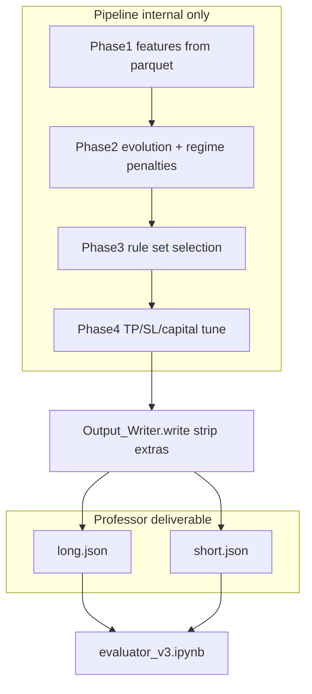
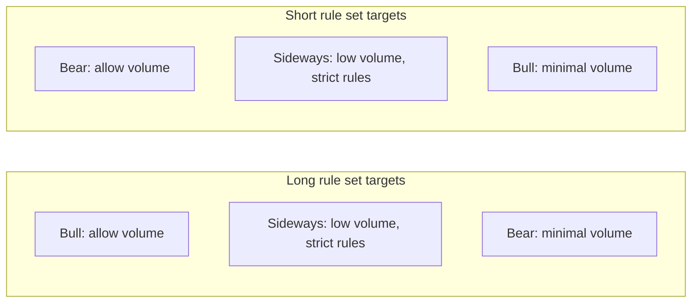

# Regime-aware Long/Short rule search (single JSON output)

## Hard constraint — professor evaluation via evaluator_v3.ipynb

Your deliverables are **exactly two files** using the **same JSON structure** as your example—not the same counts. The example showed *shape only* (3 rules with 2–3 conditions each); you are **not** required to match those numbers.

**Structure template (illustrative):**

```json
{
  "direction": "long",
  "rules_set": [
    {
      "tp": <float>,
      "sl": <float>,
      "capital_pct": <float>,
      "conditions": ["[feature_name] IS Fuzzy Value Name", "..."]
    }
  ]
}
```

**Must have (per file):**

| Requirement | Detail |
|-------------|--------|
| Top-level keys | Only `"direction"` and `"rules_set"` in the file you submit (evaluator reads these; extra keys are ignored today but risky if grading code is strict) |
| `direction` | `"long"` or `"short"` (lowercase) |
| `rules_set` | **2–5** rule objects ([`Output_Writer`](gpu_fuzzy_trader/output/writer.py) / evaluator allow this range; pipeline may tune via `PHASE3_MIN_RULES` / `PHASE3_MAX_RULES` and Phase 2 `MIN_CONDITIONS` / `MAX_CONDITIONS`—not fixed at 3 rules) |
| Each rule | **Exactly** `tp`, `sl`, `capital_pct`, `conditions` — no `regime`, `dominant_regime`, `chromosome`, etc. |
| `conditions` | **Non-empty** list (any length ≥ 1 per rule)—not fixed at 2 or 3 conditions; stricter sideways search may produce *more* conditions per rule, fewer rules in set, etc. |
| Risk fields | Floats; at least one of `tp` / `sl` / `capital_pct` non-zero per rule; `capital_pct > 0` at evaluation time |

**Will fail evaluation if violated:**

1. **Unknown feature** — condition uses a column not in the reference train/test parquet schema:

   `Unknown feature in strategy condition: 'foo'` ([`apply_dynamic_rule`](evaluator_v3.ipynb))

2. **Unknown fuzzy label** — value string not recognized for that feature’s threshold logic (e.g. typo `"Very high"` vs `"Very High"`).

3. **Missing labels** — evaluation parquet must still contain `label_max_288`, `label_min_288`, `label_close_288`, etc. (evaluator loads schema from reference train file).

4. **Malformed condition syntax** — must match `[name] IS Value` (brackets and ` IS ` required).

**Regime detection is never exported.** Labels (0=sideways, 1=bear, 2=bull) are used only inside the pipeline ([`regime_cluster.py`](gpu_fuzzy_trader/features/regime_cluster.py), Phase 2 penalties). The professor’s evaluator does not read regime fields from your JSON.

**Feature safety (already enforced if you don’t hand-edit JSON):**

- Phase 1 writes [`selected_features_long.json`](gpu_fuzzy_trader/features/selector.py) / `selected_features_short.json` from **columns present in train parquet**.
- Phase 2 builds conditions via [`decode_chromosome`](gpu_fuzzy_trader/features/encoder.py) → same fuzzy names as evaluator (`Very High`, `Extreme Bullish`, `Active (1)`, …).
- Do **not** add conditions manually unless the feature exists in `data/train_75.parquet` (or your reference schema path in the notebook).

**Submission sanitization (recommended implementation task):**

Today Phase 3/4 may write extra keys (`risk_optimized`, `deployment_accepted`, `validation_gate`). [`Output_Writer`](gpu_fuzzy_trader/output/writer.py) already strips to professor format. Final step should be:

```python
Output_Writer().write(rule_set, "outputs/long.json")  # and short.json
```

Add a **pre-submit gate** in the pipeline or notebook: `Output_Writer.load_and_validate(path)` then run evaluator cells on both files.



---

## Your goal (translated to measurable targets)

You already have **3 regimes** from rolling regression ([`regime_cluster.py`](gpu_fuzzy_trader/features/regime_cluster.py)):

| ID  | Label    | Detection idea             |
| --- | -------- | -------------------------- |
| 0   | Sideways | Weak / mixed trend         |
| 1   | Bear     | Strong negative fast trend |
| 2   | Bull     | Strong positive fast trend |

For a **data-science framing**, treat each candidate rule (and each final rule set) as a **regime × direction trade matrix**. Targets:



- **Long** (`direction=long`): prefer trades in **bull (2)**; tolerate some **sideways (0)** only if quality is high; **strongly suppress bear (1)** trades.
- **Short** (`direction=short`): mirror — prefer **bear (1)**; strict **sideways**; suppress **bull (2)**.
- **Sideways (both directions)**: fewer trades via **more active conditions** (stricter fuzzy AND) and/or higher quality bar (win rate / net PnL in regime 0).

Today the pipeline **measures** per-regime trades in the GPU backtest ([`_jax_simulate_equity_batch_regime`](gpu_fuzzy_trader/backtest/gpu_engine.py)) and can label **regime specialists** ([`phase2_support.py`](gpu_fuzzy_trader/phases/phase2_support.py)), but specialists are **direction-agnostic** (any single regime with concentration ≥ 70% qualifies). **Phase 3 has zero regime logic** ([`phase3_rule_set.py`](gpu_fuzzy_trader/phases/phase3_rule_set.py)). [`evaluator_v3.ipynb`](evaluator_v3.ipynb) only mentions regime in narrative text, not in metrics.

You chose **one** `long.json` / `short.json` — so regime control must happen **during search and selection**, not via multiple runtime files.

---

## Recommended architecture (3 layers)

### Layer 1 — Regime diagnostics in project reports (after every run)

Layer 1 is **not notebook-only**. It must run automatically as part of your existing reporting pipeline ([`Reporter`](gpu_fuzzy_trader/reporting/reporter.py)), the same way `write_generalization_diagnostics` and `write_feature_stratified_performance` run today in [`phase5_oos.py`](gpu_fuzzy_trader/phases/phase5_oos.py).

**When it runs**

| Trigger | Splits reported | Purpose |
|---------|-----------------|--------|
| **Phase 5** (`OOS_Evaluator.run`) — **required** | `train`, `validation`, `test` | Full pipeline run (`python -m gpu_fuzzy_trader.run_pipeline`) ends here; this is the canonical “after each run” report |
| **Phase 3** (`Rule_Set_Selector.run`) — **recommended** | `train`, `validation` | Early feedback right after rule-set selection, before Phase 4 risk tuning |
| **evaluator_v3.ipynb** — **optional mirror** | Same splits you evaluate manually | Same logic as Reporter for ad-hoc checks; does not change submission JSON |

**New Reporter API** — `Reporter.write_regime_trade_matrix(...)`

Inputs (same pattern as `write_generalization_diagnostics`):

- `direction`: `"long"` \| `"short"`
- `metrics_by_split`: optional; use `regime_trade_counts` from metrics if present
- `trade_logs_by_split`: dict of DataFrames from `simulate_rule_set(..., return_logs=True)`
- `datasets_by_split`: train / validation / test DataFrames (for regime label assignment)

**Regime attribution (CPU path)** — trade logs already include `Entry_Index` ([`cpu_engine.py`](gpu_fuzzy_trader/backtest/cpu_engine.py)). For each realized trade:

1. Load regime bundle from `PHASE1_REGIME_MODEL_PATH` / `assign_regime_labels(dataset, bundle)` (same as Phase 2).
2. Map `Entry_Index` → regime id `0|1|2` on that split’s DataFrame.
3. Aggregate per regime: `executed_trades`, `win_rate`, `net_pnl`, `trade_share` (= trades_in_regime / total_trades).

**Output artifacts** (under `outputs/reports/`, written every run):

- `regime_trade_matrix_{direction}.json` — structured payload per split
- `regime_trade_matrix_{direction}.csv` — flat table for spreadsheets (rows: split × regime)

**JSON payload shape (per direction)**

```json
{
  "direction": "long",
  "regime_labels": {"0": "sideways", "1": "bear", "2": "bull"},
  "thresholds": {
    "max_adverse_trade_share": 0.15,
    "max_sideways_trade_share": 0.35
  },
  "splits": {
    "train": {
      "total_executed_trades": 420,
      "regimes": {
        "0": {"executed_trades": 80, "win_rate": 0.42, "net_pnl": 120.5, "trade_share": 0.19},
        "1": {"executed_trades": 40, "win_rate": 0.30, "net_pnl": -80.0, "trade_share": 0.10},
        "2": {"executed_trades": 300, "win_rate": 0.48, "net_pnl": 900.0, "trade_share": 0.71}
      },
      "violations": []
    },
    "validation": { "...": "..." },
    "test": { "...": "..." }
  },
  "summary_flags": {
    "any_adverse_violation": false,
    "worst_split_adverse_share": {"split": "validation", "regime": "bear", "share": 0.12}
  }
}
```

**Violation flags** (config-driven, direction-aware — same targets as Layer 2 calibration):

- **Long:** flag if bear `trade_share` > `REPORT_REGIME_MAX_ADVERSE_SHARE_LONG` (default 0.15); optional sideways cap.
- **Short:** flag if bull `trade_share` > `REPORT_REGIME_MAX_ADVERSE_SHARE_SHORT`.
- Log one **INFO/WARNING** line per direction at end of Phase 5 listing violations (visible in `run_pipeline` console).

**Phase 5 wiring** — after existing reporter calls in [`phase5_oos.py`](gpu_fuzzy_trader/phases/phase5_oos.py) (~line 255), add:

```python
reporter.write_regime_trade_matrix(
    direction=direction,
    metrics_by_split=metrics_by_split,
    trade_logs_by_split=trade_logs_by_split,
    datasets_by_split=datasets_by_split,
)
```

**Phase 3 wiring** — after train/val equity reports in [`phase3_rule_set.py`](gpu_fuzzy_trader/phases/phase3_rule_set.py), call the same helper with `metrics_by_split={"train": ..., "validation": ...}`.

**Do not** add regime fields to submitted `long.json` / `short.json` or change evaluator strategy schema.

**Acceptance (Layer 1)**

- After `run_pipeline`, `outputs/reports/regime_trade_matrix_long.json` and `_short.json` exist and are non-empty when trades > 0.
- Matrices match manual spot-check on one split in `evaluator_v3.ipynb`.
- Professor evaluator still passes with no schema/feature errors.

### Layer 2 — Direction-aware penalties in Phase 2 (primary lever)

Extend [`phase2_support.py`](gpu_fuzzy_trader/phases/phase2_support.py) with new config-driven helpers (keep existing specialist logic; compose penalties):

**A. Adverse-regime trade fraction penalty** (new)

```python
# Conceptual — config in config.py
REGIME_IDS = {"sideways": 0, "bear": 1, "bull": 2}

ADVERSE_REGIME_WEIGHTS = {
    "long":  {0: 0.4, 1: 1.0, 2: 0.0},   # bear worst; sideways mild
    "short": {0: 0.4, 1: 0.0, 2: 1.0},   # bull worst
}

def adverse_regime_penalty(direction, regime_trade_counts, executed) -> float:
    share = counts / max(executed, 1)
    return PHASE2_ADVERSE_REGIME_PENALTY_MAX * sum(w[r] * share[r] for r in regimes)
```

- Add to all three NSGA objectives in [`evox_runner.py`](gpu_fuzzy_trader/evolution/evox_runner.py) and the duplicate path in [`phase2_rule_pool.py`](gpu_fuzzy_trader/phases/phase2_rule_pool.py) (same pattern as `cond_penalty` + `support_penalty`).
- Weights are **tunable**; start with bear/bull weight `1.0`, sideways `0.3–0.5` so sideways is discouraged but not as harsh as fighting the macro trend.

**B. Direction-aligned specialist waiver** (refine existing specialist)

Today `_is_regime_specialist` rewards concentration in **any** regime. Tighten for your use case:

- `FAVORABLE_DOMINANT_REGIME["long"] = {2}` (optionally allow `{0, 2}` with stricter gates for 0).
- `FAVORABLE_DOMINANT_REGIME["short"] = {1}`.
- Only waive `MIN_TRADE_SUPPORT` if `dominant_regime` is favorable **and** adverse share is below a cap (e.g. bear trades ≤ 10% of total for long).

Persist in pool JSON (already has `dominant_regime`, `regime_trade_counts`) for Phase 3 filtering.

**C. Sideways strictness via condition count** (stricter rules in regime 0)

Two complementary mechanisms (pick both for strongest effect):

1. **Evolution constraint**: config `MIN_CONDITIONS_SIDeways = 4`, `MAX_CONDITIONS_SIDeways = 5` applied when `dominant_regime == 0` **or** when sideways trade share > 50% (detected from `regime_trade_counts`).
2. **Sideways quality gate**: if sideways share > `PHASE2_SIDeways_MAX_TRADE_SHARE` (e.g. 0.25) unless sideways win rate ≥ `PHASE2_SIDeways_MIN_WIN_RATE` or sideways net PnL > 0 — add penalty (analogous to specialist quality gate).

This directly encodes “more rules, fewer trades” in sideways **during search** (higher `MIN_CONDITIONS` for sideways-heavy chromosomes). Exported JSON still uses the same schema; you only get **more condition strings per rule** (e.g. 3–4 `"[feat] IS …"` lines), never new keys or regime columns.

**Config block** to add in [`config.py`](gpu_fuzzy_trader/config.py) (names illustrative):

- `PHASE2_ADVERSE_REGIME_ENABLED`
- `PHASE2_ADVERSE_REGIME_PENALTY_MAX`
- `PHASE2_ADVERSE_REGIME_WEIGHTS_LONG` / `_SHORT`
- `PHASE2_FAVORABLE_REGIMES_LONG` / `_SHORT`
- `PHASE2_SIDeways_MAX_TRADE_SHARE`, `PHASE2_SIDeways_MIN_WIN_RATE`
- `MIN_CONDITIONS_SIDeways`, `MAX_CONDITIONS_SIDeways`

**Tests**: extend [`tests/unit/test_phase2_support.py`](tests/unit/test_phase2_support.py) with cases: long rule with 60% bear trades gets higher penalty than 60% bull; specialist waiver denied when dominant=bear for long.

### Layer 3 — Phase 3 rule-set composition (secondary lever)

Phase 3 greedily builds `PHASE3_MIN_RULES`–`PHASE3_MAX_RULES` rules (allowed range 2–5) from the pool on **validation** only. Use existing pool fields:

- Filter pool candidates: optional `dominant_regime` match for direction (e.g. long pool prefers `dominant_regime in (2,)` or sideways specialists with `regime_specialist` and high condition count).
- In [`phase3_objectives.py`](gpu_fuzzy_trader/phases/phase3_objectives.py), add **`combined_adverse_regime_penalty`**: after `CPUBacktestEngine` evaluates the full ordered rule set, apply the same adverse weights to **set-level** `regime_trade_counts` (engine already aggregates per simulation).

This prevents Phase 3 from assembling one good bull rule + one rule that fires heavily in bear.

**Phase 3 config**: `PHASE3_ADVERSE_REGIME_PENALTY_WEIGHT`, `PHASE3_MAX_ADVERSE_REGIME_SHARE`.

---

## Calibration workflow (how you tune as a data scientist)

1. **Baseline matrix** — Run current `long.json` / `short.json` through new evaluator regime cells; save train/val/test matrices.
2. **Enable Layer 2 only** — Re-run Phase 2 (both directions) with moderate adverse weights; inspect pool JSON `regime_trade_counts` distribution.
3. **Re-run Phase 3 → 4 → 5** — Confirm combined sets improve val/test adverse shares without collapsing total trades below `MIN_TRADE_SUPPORT`.
4. **Ablate** — Toggle adverse penalty vs sideways condition bump separately; document which knob moved bear-share vs trade count.
5. **Final sign-off** — `evaluator_v3.ipynb` test split: long bear-share and short bull-share below your chosen thresholds; sideways trade count down with stable or better Sortino in regime 0.

Suggested initial thresholds (adjust from baseline):

| Metric                                       | Long          | Short         |
| -------------------------------------------- | ------------- | ------------- |
| Max share of trades in adverse regime (val)  | bear ≤ 10–15% | bull ≤ 10–15% |
| Max share in sideways (val)                  | 25–35%        | 25–35%        |
| Min active conditions when sideways-dominant | 4             | 4             |

---

## What we will _not_ do (scope control)

- **No schema change** to submitted `long.json` / `short.json` — no `regime`, `regime_gate`, `dominant_regime`, pool metadata, or Phase 4 deployment fields in final exports.
- **No conditions** referencing columns outside Phase 1 selected features / train parquet schema.
- **No new fuzzy value strings** — only labels defined in [`encoder.py`](gpu_fuzzy_trader/features/encoder.py) (mirrors evaluator thresholds).
- No change to regime **detection** math unless diagnostics show mis-labeling (separate `PHASE1_REGIME_*` tuning).
- No runtime regime switcher — behavior is baked into stricter rules at export time.

---

## Pre-submission checklist (for you / professor run)

1. `Output_Writer.load_and_validate("outputs/long.json")` and same for `short.json`.
2. Open `evaluator_v3.ipynb` → run evaluation cells on both paths against reference train + test parquet.
3. Confirm zero errors on: unknown feature, unrecognized value, missing `capital_pct`, empty `conditions`.
4. Review `outputs/reports/regime_trade_matrix_long.json` / `_short.json` (auto-generated each run) for adverse-regime violations.
5. Optionally mirror Layer 1 in `evaluator_v3.ipynb` — not required by professor.
6. Hand in **only** the two JSON files with this structure (2–5 rules, each with ≥1 condition; counts are your pipeline’s choice, not the example’s 3×2–3 layout).

---

## File touch list (implementation order)

0. [`gpu_fuzzy_trader/reporting/reporter.py`](gpu_fuzzy_trader/reporting/reporter.py) — `write_regime_trade_matrix` (+ helper to join `Entry_Index` → regime); config thresholds in [`config.py`](gpu_fuzzy_trader/config.py)
0b. [`phase5_oos.py`](gpu_fuzzy_trader/phases/phase5_oos.py) + [`phase3_rule_set.py`](gpu_fuzzy_trader/phases/phase3_rule_set.py) — invoke reporter after each run
0c. [`evaluator_v3.ipynb`](evaluator_v3.ipynb) — optional mirror cells (same math as Reporter)
1. [`gpu_fuzzy_trader/phases/phase3_rule_set.py`](gpu_fuzzy_trader/phases/phase3_rule_set.py) + [`phase4_wf_optimizer.py`](gpu_fuzzy_trader/phases/phase4_wf_optimizer.py) — final persist via [`Output_Writer.write`](gpu_fuzzy_trader/output/writer.py) (strip extra keys)
2. [`gpu_fuzzy_trader/phases/phase2_support.py`](gpu_fuzzy_trader/phases/phase2_support.py) — adverse penalty, favorable specialist, sideways gates
3. [`gpu_fuzzy_trader/config.py`](gpu_fuzzy_trader/config.py) — penalty + **report** thresholds (`REPORT_REGIME_MAX_ADVERSE_SHARE_*`, etc.)
4. [`gpu_fuzzy_trader/evolution/evox_runner.py`](gpu_fuzzy_trader/evolution/evox_runner.py) + [`gpu_fuzzy_trader/phases/phase2_rule_pool.py`](gpu_fuzzy_trader/phases/phase2_rule_pool.py) — wire penalties + conditional `MIN/MAX_CONDITIONS`
5. [`gpu_fuzzy_trader/phases/phase3_objectives.py`](gpu_fuzzy_trader/phases/phase3_objectives.py) + [`phase3_rule_set.py`](gpu_fuzzy_trader/phases/phase3_rule_set.py) — set-level adverse penalty + optional pool filter
6. [`tests/unit/test_regime_reporting.py`](tests/unit/test_regime_reporting.py) (new) + [`tests/unit/test_phase2_support.py`](tests/unit/test_phase2_support.py)
7. [`docs/phase5_oos.md`](docs/phase5_oos.md) or [`docs/README.md`](docs/README.md) — document new report files under `outputs/reports/`
8. [`docs/phase2_rule_pool.md`](docs/phase2_rule_pool.md) — document new penalties

---

## Risk notes (professional caveats)

- **Regime labels are ex-post on daily trend** — they will not perfectly match intraday rule triggers; penalties shape _population_, not guarantee OOS regime timing.
- **Trade-off**: suppressing adverse-regime trades reduces sample size — monitor `executed_trades` and validation Sortino jointly (Pareto front should move, not collapse).
- **Specialist waiver** can still admit low-global-trade rules; combining with `PHASE2_REGIME_REQUIRE_VAL_CONFIRMATION = True` is advisable once adverse penalties are stable.
