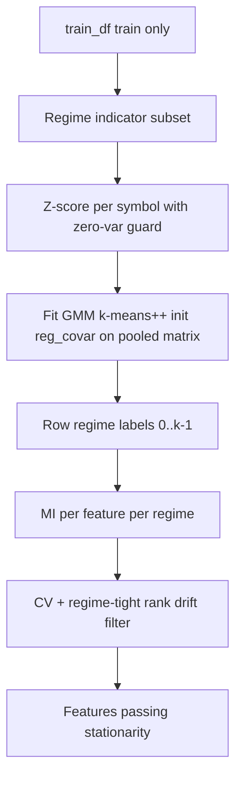

# Regime-Stratified Stationarity for Phase 1

## Feasibility (your column list)

Yes — this is implementable without OHLC. All proposed regime indicators exist in your feature set:

| Role              | Columns (from your list)                                                  |
| ----------------- | ------------------------------------------------------------------------- |
| Volatility        | `realized_vol_20`, `parkinson_vol_20`, `atr_pct_14`, `vol_regime_pct_120` |
| Trend vs sideways | `efficiency_ratio_20`, `ret_autocorr_1_30`                                |
| Liquidity         | `amihud_illiquidity_20`, `vol_ratio_20_100`                               |

Phase 1 already excludes `datetime`, `symbol`, and label columns from MI candidates ([`gpu_fuzzy_trader/config.py`](gpu_fuzzy_trader/config.py)); regime indicators remain ordinary feature columns and can still be selected by MI.

## Current behavior (what we change)

Stationarity today lives in [`gpu_fuzzy_trader/features/selector.py`](gpu_fuzzy_trader/features/selector.py):

```604:661:gpu_fuzzy_trader/features/selector.py
def _compute_stationarity_scores(
    ...
    boundaries = np.linspace(0, n, n_folds + 1, dtype=int)
    for f in range(n_folds):
        scores = mutual_info_classif(Xf, yf, ...)
```

[`_stationarity_filter`](gpu_fuzzy_trader/features/selector.py) keeps features with low CV of fold MI and stable rank across folds (`PHASE1_STATIONARITY_CV_MAX`, `PHASE1_STATIONARITY_RANK_DRIFT_MAX`). **Main relevance/stability (per-symbol MI) stays unchanged** — only the definition of a “fold” changes.

## Target architecture



**Leakage guard:** fit per-symbol scalers + clusterer **only on `train_df`**. No labels in clustering inputs.

**Hybrid clustering:** z-score each regime feature **within symbol**, then fit **one pooled** cluster model on the stacked matrix.

---

## Robustness requirements (runtime safety)

### A. Zero-variance guard in per-symbol Z-score (`regime_cluster.py`)

When a regime indicator is **constant for a symbol** (or `std == 0`), `StandardScaler` produces `NaN` and breaks GMM.

**Implementation:** helper `_safe_standardize_per_symbol(df, regime_features)`:

1. For each `symbol` group and each regime column:
   - Compute `mean` and `std` (ddof=0) on that symbol’s train rows.
   - If `std < 1e-12` (or `n_unique == 1`): set scaled values to **0.0** (neutral) for that column/symbol — do not divide by zero.
   - Else: `(x - mean) / std`.
2. After stacking all symbols, run `np.nan_to_num(X, nan=0.0, posinf=0.0, neginf=0.0)` as a final safety net before clustering.
3. Log a **warning** once per `(symbol, column)` when zero-variance is detected (aids debugging sparse symbols).

Store per-symbol `mean` and `std` (with `std` floored to `1.0` when zero-var) in the fitted bundle so `assign_regime_labels` uses the same logic at inference.

**Test:** synthetic symbol with constant `realized_vol_20` → labels still assigned, no NaNs in cluster input.

### B. Stable GMM initialization (default clusterer)

Default: `GaussianMixture` with:

```python
GaussianMixture(
    n_components=k,
    random_state=42,
    init_params="k-means++",
    reg_covar=1e-6,  # config: PHASE1_REGIME_GMM_REG_COVAR
)
```

- `init_params="k-means++"` — better starting centroids, fewer bad local optima.
- `reg_covar=1e-6` — stabilizes covariance estimates (avoids singular/near-singular matrices).

If `fit()` raises (e.g. convergence failure), log warning and **fall back to chronological** stationarity (same as missing columns).

`KMeans` path unchanged (`n_init=10`, `random_state=42`) when `PHASE1_REGIME_CLUSTERER == "kmeans"`.

### C. Dynamic rank drift in regime mode (`selector.py`)

`PHASE1_STATIONARITY_RANK_DRIFT_MAX = 30` is appropriate for **chronological** folds (many folds, hundreds of features). With **3 regime folds**, it is effectively a no-op.

**Change `_stationarity_filter` signature** to accept optional `rank_drift_max: float | int | None = None` (default: use config value).

**Regime mode** (`PHASE1_STATIONARITY_STRATIFY == "regime"`):

```python
n_valid_folds = max(len(scores) for scores in fold_scores.values())  # regimes with MI
effective_rank_drift = min(
    config.PHASE1_STATIONARITY_RANK_DRIFT_MAX,
    max(n_valid_folds - 1, 1),
)
```

For `k=3` regimes → **`effective_rank_drift = 2`**. A feature ranked **#1** in high-vol MI and **last** among ~50 features in sideways has drift ≈ 49 → **rejected**. A feature with ranks 10, 11, 12 across regimes (drift 2) → **passes** rank check.

**Chronological mode:** `effective_rank_drift = PHASE1_STATIONARITY_RANK_DRIFT_MAX` (unchanged, 30).

Pass `effective_rank_drift` from `select_features` when calling `_stationarity_filter` after regime fold scores are built.

**Test:** mock `fold_scores` with one feature rank `[0, 0, 0]` (pass) vs `[0, 49, 0]` with 3 folds under regime effective max 2 (fail rank check).

---

## Implementation plan

### 1. Config ([`gpu_fuzzy_trader/config.py`](gpu_fuzzy_trader/config.py))

| Constant                       | Purpose                            | Default                                                      |
| ------------------------------ | ---------------------------------- | ------------------------------------------------------------ |
| `PHASE1_STATIONARITY_STRATIFY` | `"regime"` or `"chronological"`    | `"regime"`                                                   |
| `PHASE1_REGIME_FEATURES`       | 8 indicator columns                | fixed list                                                   |
| `PHASE1_REGIME_N_CLUSTERS`     | k for GMM/KMeans                   | `3` (alias `PHASE1_STATIONARITY_FOLDS` when stratify=regime) |
| `PHASE1_REGIME_MIN_SAMPLES`    | Min rows per regime for MI         | `100`                                                        |
| `PHASE1_REGIME_CLUSTERER`      | `"gmm"` or `"kmeans"`              | `"gmm"`                                                      |
| `PHASE1_REGIME_GMM_REG_COVAR`  | Covariance regularization          | `1e-6`                                                       |
| `PHASE1_REGIME_ZERO_VAR_EPS`   | Std threshold for constant feature | `1e-12`                                                      |
| `PHASE1_REGIME_MODEL_PATH`     | Saved bundle                       | `outputs/phase1_regime_cluster.joblib`                       |

Keep `PHASE1_STATIONARITY_CV_MAX` and `PHASE1_STATIONARITY_RANK_DRIFT_MAX` for chronological mode and as an upper cap in regime mode.

### 2. New module: [`gpu_fuzzy_trader/features/regime_cluster.py`](gpu_fuzzy_trader/features/regime_cluster.py)

- **`_safe_standardize_per_symbol(...)`** — zero-variance handling (section A).
- **`fit_regime_labels(...)`** — validate columns → safe z-score → GMM/KMeans (section B) → labels + bundle.
- **`assign_regime_labels`**, **`persist_regime_model`**, **`load_regime_model`**.

**Regime imbalance:** unweighted CV across regime MI scores; skip regimes below `PHASE1_REGIME_MIN_SAMPLES`; require ≥2 valid regimes for stationarity to apply.

### 3. Refactor stationarity in [`selector.py`](gpu_fuzzy_trader/features/selector.py)

- `_compute_fold_mi_scores` + chronological / regime wrappers (unchanged structure).
- `_stationarity_filter(fold_scores, cv_max, rank_drift_max)` — use passed `rank_drift_max` when provided (section C).
- Regime branch computes `effective_rank_drift` from `n_valid_folds` before filter call.

### 4. Documentation

Update [`docs/hyperparameters/phase1_feature_selection.md`](docs/hyperparameters/phase1_feature_selection.md):

- Stationarity trio: note regime mode tightens rank drift to `min(RANK_DRIFT_MAX, n_regimes - 1)`.
- Document zero-var z-score and GMM `init_params` / `reg_covar`.

### 5. Tests

| Test                                | Assert                                                            |
| ----------------------------------- | ----------------------------------------------------------------- |
| Constant feature per symbol         | No NaNs; clustering completes                                     |
| GMM with `init_params`, `reg_covar` | Uses config values; fits on synthetic data                        |
| Regime rank drift                   | rank 0 vs rank N-1 across 3 regimes fails when effective max is 2 |
| Chronological rank drift            | still uses config 30                                              |
| Missing regime column               | fallback to chronological                                         |

---

## Design refinements

1. Fallback to chronological on missing columns, GMM fit failure, or &lt;2 valid regime folds.
2. Reuse `PHASE1_STATIONARITY_FOLDS` as `n_clusters` when stratify=regime.
3. Chronological path preserved for ablation.

## Out of scope (v1)

- Regime-stratified Phase 2/3 CV (artifact hook only).
- Weighted CV across regimes.
- Auto-k via BIC.
- Changing cross-symbol relevance/stability scoring.

## Files touched

| File                                                                                                   | Change                             |
| ------------------------------------------------------------------------------------------------------ | ---------------------------------- |
| [`gpu_fuzzy_trader/config.py`](gpu_fuzzy_trader/config.py)                                             | Regime + GMM stability constants   |
| [`gpu_fuzzy_trader/features/regime_cluster.py`](gpu_fuzzy_trader/features/regime_cluster.py)           | **New** — safe z-score, stable GMM |
| [`gpu_fuzzy_trader/features/selector.py`](gpu_fuzzy_trader/features/selector.py)                       | Regime folds + dynamic rank drift  |
| [`docs/hyperparameters/phase1_feature_selection.md`](docs/hyperparameters/phase1_feature_selection.md) | Docs                               |
| `tests/unit/test_regime_cluster.py`                                                                    | **New**                            |
| [`tests/unit/test_feature_selector.py`](tests/unit/test_feature_selector.py)                           | Rank-drift + integration           |

## Verification

1. Phase 1 with `PHASE1_STATIONARITY_STRATIFY="regime"` on `train_75`.
2. Logs: zero-var warnings (if any), regime counts, stationarity drop counts, `phase1_regime_cluster.joblib`.
3. Ablation vs chronological; confirm regime-only features with extreme rank swing are dropped.
