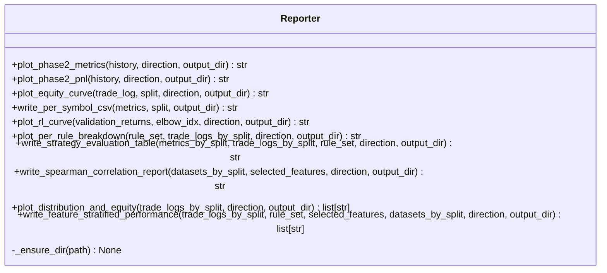

# Design Document: Enhanced Reporting Outputs

## Overview

This feature extends the existing `Reporter` class in
`gpu_fuzzy_trader/reporting/reporter.py` with five new reporting methods that
provide deeper insight into strategy quality, feature relevance, and trade
distribution. The methods are called after Phase 5 (out-of-sample evaluation)
and cover all three data splits: train, validation, and test.

All outputs follow the existing project conventions:
- PNG files for plots, CSV files for tabular data
- Saved to `outputs/reports/` by default (overridable via `output_dir`)
- Saved at 100 DPI; figures closed with `plt.close(fig)` after saving
- Paths logged at INFO level via the module-level `logger`
- Directories created via `_ensure_dir` when no `output_dir` override is given

### Research Summary

**scipy.stats.spearmanr** — The Spearman correlation is computed via
`scipy.stats.spearmanr(a, b)` which returns a `SpearmanrResult` with a
`.statistic` attribute (or `.correlation` in older scipy versions). The
implementation will use `.statistic` with a fallback to `.correlation` for
compatibility. NaN-paired rows must be dropped before calling the function
because `spearmanr` does not skip NaN values by default.

**matplotlib grouped bar charts** — Grouped bars are produced by offsetting
`ax.bar()` calls using `numpy.arange` for x-positions and a fixed bar width
divided by the number of groups. The standard pattern is:
```python
x = np.arange(n_groups)
width = 0.25
ax.bar(x - width, vals_train, width, label="train", color="#4C72B0")
ax.bar(x,         vals_val,   width, label="validation", color="#DD8452")
ax.bar(x + width, vals_test,  width, label="test", color="#55A868")
ax.set_xticks(x)
ax.set_xticklabels([f"Rule {i+1}" for i in range(n_groups)])
```

**Concurrent open positions** — Computed by iterating over a range of candle
indices and counting trades where `Entry_Index <= idx < Release_Index`. For
large trade logs this can be vectorised with numpy broadcasting.

**Sharpe ratio** — Computed as `mean(r) / std(r, ddof=1)` where
`r = Net_PnL / Equity_Before_Entry`. Returns `0.0` when fewer than two trades
exist (std is undefined).

---

## Architecture

The five new methods are added directly to the existing `Reporter` class. No
new classes or modules are introduced. All methods follow the same structural
pattern as the existing methods:

1. Resolve `output_dir` (use `_REPORTS_DIR` if `None`)
2. Validate `direction` (raise `ValueError` if not `"long"` or `"short"`)
3. Validate inputs (log WARNING/ERROR and write empty output on bad data)
4. Compute metrics / build figures
5. Save output(s) via `_ensure_dir` + `fig.savefig` / `df.to_csv`
6. Close figures with `plt.close(fig)`
7. Log saved path(s) at INFO level
8. Return absolute path(s)



### Dependencies

The new methods introduce one new import: `scipy.stats.spearmanr` (used only
in `write_spearman_correlation_report`). All other dependencies (`pandas`,
`numpy`, `matplotlib`) are already present. `scipy` is available in the
project environment via `scikit-learn`'s dependency chain.

---

## Components and Interfaces

### Method 1: `plot_per_rule_breakdown`

```python
def plot_per_rule_breakdown(
    self,
    rule_set: list[dict],
    trade_logs_by_split: dict[str, pd.DataFrame | None],
    direction: str,
    output_dir: str | None = None,
) -> str:
```

**Parameters:**
- `rule_set` — list of rule dicts, each with `"conditions"`, `"tp"`, `"sl"`, `"capital_pct"`
- `trade_logs_by_split` — dict with keys `"train"`, `"validation"`, `"test"` mapping to `pd.DataFrame | None`
- `direction` — `"long"` or `"short"`; raises `ValueError` otherwise
- `output_dir` — optional override for output directory

**Output:** `per_rule_breakdown_{direction}.png`

**Internal logic:**
1. Validate `direction`; raise `ValueError` if invalid
2. For each split, extract the trade log (treat `None`/empty as zero-trade)
3. For each rule index `i` (1-based), filter each split's trade log on `Rule_Index == i`
4. Compute four metrics per rule per split:
   - `total_pnl = filtered["Net_PnL"].sum()` (0.0 if empty)
   - `win_rate = (filtered["Net_PnL"] > 0).mean() * 100` (0.0 if empty)
   - `num_trades = len(filtered)` (0 if empty)
   - `mdd_pct` = max percentage drop from peak to trough in `filtered["Equity_After"]` (0.0 if empty)
5. Build a 2×2 subplot figure (one subplot per metric), each with grouped bars
6. Use fixed colors: `"#4C72B0"` (train), `"#DD8452"` (validation), `"#55A868"` (test)
7. Set figure title to `f"Per-Rule Breakdown — {direction.capitalize()}"`
8. Save, close, log, return path

**MDD computation helper:**
```python
def _compute_mdd(equity_series: pd.Series) -> float:
    if equity_series.empty:
        return 0.0
    peak = equity_series.cummax()
    drawdown = (peak - equity_series) / peak.replace(0, np.nan) * 100
    return float(drawdown.max(skipna=True)) if not drawdown.empty else 0.0
```

---

### Method 2: `write_strategy_evaluation_table`

```python
def write_strategy_evaluation_table(
    self,
    metrics_by_split: dict[str, dict | None],
    trade_logs_by_split: dict[str, pd.DataFrame | None],
    rule_set: list[dict],
    direction: str,
    output_dir: str | None = None,
) -> str:
```

**Parameters:**
- `metrics_by_split` — dict with keys `"train"`, `"validation"`, `"test"` mapping to metrics dicts from `CPUBacktestEngine.simulate_rule_set` (or `None`)
- `trade_logs_by_split` — dict with keys `"train"`, `"validation"`, `"test"` mapping to `pd.DataFrame | None`
- `rule_set` — list of rule dicts
- `direction` — `"long"` or `"short"`; raises `ValueError` otherwise
- `output_dir` — optional override

**Output:** `strategy_evaluation_{direction}.csv`

**Columns:** `split`, `win_rate`, `mdd_pct`, `total_return_pct`, `num_rules`, `num_conditions`, `sortino_ratio`, `profit_factor`, `sharpe_ratio`

**Internal logic:**
1. Validate `direction`
2. Compute `num_rules = len(rule_set)`
3. Compute `num_conditions = sum(len(r.get("conditions", [])) for r in rule_set)`
4. For each split in `["train", "validation", "test"]`:
   - Source `win_rate`, `max_drawdown_pct` (→ `mdd_pct`), `total_return_pct`, `sortino_ratio`, `profit_factor` from `metrics_by_split[split]` (default `0.0` if absent/None)
   - Compute `sharpe_ratio` from `trade_logs_by_split[split]`:
     - `r = log["Net_PnL"] / log["Equity_Before_Entry"]`
     - `sharpe = r.mean() / r.std(ddof=1)` if `len(r) >= 2` else `0.0`
     - Default `0.0` if trade log is `None`/empty or columns are missing
5. Write CSV with `index=False`

---

### Method 3: `write_spearman_correlation_report`

```python
def write_spearman_correlation_report(
    self,
    datasets_by_split: dict[str, pd.DataFrame | None],
    selected_features: list[dict],
    direction: str,
    output_dir: str | None = None,
) -> str:
```

**Parameters:**
- `datasets_by_split` — dict with keys `"train"`, `"validation"`, `"test"` mapping to `pd.DataFrame | None`
- `selected_features` — list of dicts with keys `"name"`, `"mode"`, `"score"`
- `direction` — `"long"` or `"short"`; used only for filename construction
- `output_dir` — optional override

**Output:** `spearman_correlation_{direction}.csv`

**Columns:** `feature`, `train_spearman`, `validation_spearman`, `test_spearman`

**Internal logic:**
1. Validate `direction`
2. For each feature in `selected_features`:
   - For each split in `["train", "validation", "test"]`:
     - If dataset is `None`/empty or feature column absent or `label_close_288` absent → `NaN`
     - Otherwise: drop rows where either column is NaN, then call `scipy.stats.spearmanr`
     - If fewer than 2 non-NaN paired rows remain → `NaN`
     - Store the `.statistic` value (fallback to `.correlation` for older scipy)
3. Build DataFrame with one row per feature
4. Sort by `abs(train_spearman)` descending, then by `feature` ascending (stable sort)
5. Write CSV with `index=False`

**Spearman helper:**
```python
def _spearman(a: pd.Series, b: pd.Series) -> float:
    mask = a.notna() & b.notna()
    if mask.sum() < 2:
        return float("nan")
    result = spearmanr(a[mask].values, b[mask].values)
    stat = getattr(result, "statistic", None) or getattr(result, "correlation", float("nan"))
    return float(stat)
```

---

### Method 4: `plot_distribution_and_equity`

```python
def plot_distribution_and_equity(
    self,
    trade_logs_by_split: dict[str, pd.DataFrame | None],
    direction: str,
    output_dir: str | None = None,
) -> list[str]:
```

**Parameters:**
- `trade_logs_by_split` — dict with keys `"train"`, `"validation"`, `"test"` mapping to `pd.DataFrame | None`
- `direction` — `"long"` or `"short"`; raises `ValueError` otherwise
- `output_dir` — optional override

**Output:** `distribution_equity_{split}_{direction}.png` per non-empty split

**Returns:** list of absolute paths (one per split that had trades); empty splits are skipped

**Internal logic:**
1. Validate `direction`
2. For each split in `["train", "validation", "test"]`:
   - If trade log is `None` or empty: log WARNING, skip (do not add to return list)
   - Otherwise:
     a. Compute `Concurrent_Open_Positions`:
        - `max_idx = int(trade_log["Release_Index"].max())`
        - For each `idx` in `range(0, max_idx + 1)`: count rows where `Entry_Index <= idx < Release_Index`
        - Vectorised: `concurrent = [(log["Entry_Index"] <= idx) & (log["Release_Index"] > idx)).sum() for idx in range(max_idx+1)]`
     b. Compute `Time_Between_Trades`:
        - Sort by `Entry_Index` ascending
        - `diffs = sorted_log["Entry_Index"].diff().dropna()` (first trade excluded)
     c. Build figure with `fig, axes = plt.subplots(2, 2, ...)` — top-left: concurrent histogram, top-right: time-between histogram, bottom (spanning both columns): equity curve
        - Actually use `gridspec` or `subplot2grid` for the 3-panel layout: top row has 2 subplots, bottom row spans full width
     d. Equity curve: x = trade sequence (1..N), y = `Equity_After`
     e. Annotate equity curve: for each trade, plot `^` at (seq, `Equity_After`) if `Net_PnL > 0` (green `"#55A868"`), else `v` (red `"#C44E52"`)
     f. Save, close, log, append path to return list
3. Return list of paths

**Figure layout:**
```python
fig = plt.figure(figsize=(14, 10))
ax_conc  = fig.add_subplot(2, 2, 1)   # top-left: concurrent positions
ax_time  = fig.add_subplot(2, 2, 2)   # top-right: time between trades
ax_eq    = fig.add_subplot(2, 1, 2)   # bottom: equity curve (full width)
```

---

### Method 5: `write_feature_stratified_performance`

```python
def write_feature_stratified_performance(
    self,
    trade_logs_by_split: dict[str, pd.DataFrame | None],
    rule_set: list[dict],
    selected_features: list[dict],
    datasets_by_split: dict[str, pd.DataFrame | None],
    direction: str,
    output_dir: str | None = None,
) -> list[str]:
```

**Parameters:**
- `trade_logs_by_split` — dict with keys `"train"`, `"validation"`, `"test"` mapping to `pd.DataFrame | None`
- `rule_set` — list of rule dicts (used for context; not directly used in computation)
- `selected_features` — list of dicts with keys `"name"`, `"mode"`, `"score"`
- `datasets_by_split` — dict with keys `"train"`, `"validation"`, `"test"` mapping to `pd.DataFrame | None`
- `direction` — `"long"` or `"short"`; raises `ValueError` otherwise
- `output_dir` — optional override

**Output:** `feature_stratified_{split}_{direction}.csv` per split

**Columns:** `feature`, `fuzzy_value`, `split`, `num_trades`, `total_return_pct`, `win_rate`, `sharpe_ratio`

**Internal logic:**
1. Validate `direction`
2. For each split in `["train", "validation", "test"]`:
   - Resolve dataset and trade log for this split
   - If dataset is `None`/empty: write header-only CSV, append path, continue
   - If trade log is `None`/empty: write header-only CSV, append path, continue
   - For each feature in `selected_features`:
     - If feature column absent from dataset: skip (log WARNING), continue
     - Get unique non-NaN string values in `dataset[feature_name]` → `fuzzy_values`
     - For each `fuzzy_value` in `fuzzy_values`:
       - Find trade log rows where `Entry_Index` is in bounds and `dataset.loc[Entry_Index, feature_name] == fuzzy_value`
       - Out-of-bounds `Entry_Index` values: log WARNING, skip those trades
       - Compute metrics on the filtered trade log subset:
         - `num_trades = len(stratum)`
         - `total_return_pct = stratum["Net_PnL"].sum() / config.INITIAL_CAPITAL * 100` (0.0 if `INITIAL_CAPITAL == 0`)
         - `win_rate = (stratum["Net_PnL"] > 0).sum() / num_trades` if `num_trades > 0` else `0.0`
         - `sharpe_ratio`: `mean(r) / std(r, ddof=1)` where `r = Net_PnL / Equity_Before_Entry`, `0.0` if `< 2` trades
       - Append row to results
   - Write CSV with `index=False`, append path to return list
3. Return list of paths

**Stratum lookup (vectorised):**
```python
# Build a lookup: entry_index -> feature_value for valid indices
valid_mask = trade_log["Entry_Index"].between(0, len(dataset) - 1)
if not valid_mask.all():
    logger.warning("...")
valid_log = trade_log[valid_mask].copy()
valid_log["_feat_val"] = dataset[feature_name].iloc[
    valid_log["Entry_Index"].values
].values
stratum = valid_log[valid_log["_feat_val"] == fuzzy_value]
```

---

## Data Models

### Input Types

**`trade_logs_by_split`** — `dict[str, pd.DataFrame | None]`
```
Keys: "train", "validation", "test"
Values: pd.DataFrame with columns:
  Rule_Index         int      — 1-based rule index
  Net_PnL            float    — realized net profit/loss
  Equity_After       float    — equity after trade closes
  Equity_Before_Entry float   — equity at trade entry
  Entry_Index        int      — row index in dataset at entry
  Release_Index      int      — row index in dataset at release
  Exit_Reason        str      — "TP", "SL", or "Time_288"
  Symbol             str      — instrument symbol
  (other columns present but not required by new methods)
```

**`metrics_by_split`** — `dict[str, dict | None]`
```
Keys: "train", "validation", "test"
Values: dict from CPUBacktestEngine.simulate_rule_set() with keys:
  win_rate           float    — fraction of winning trades (0–1 or 0–100)
  max_drawdown_pct   float    — maximum drawdown percentage
  total_return_pct   float    — total return percentage
  sortino_ratio      float    — Sortino ratio
  profit_factor      float    — gross wins / gross losses
  executed_trades    int      — number of executed trades
```

**`selected_features`** — `list[dict]`
```
Each dict: {"name": str, "mode": str, "score": float}
  name  — column name in the dataset DataFrame
  mode  — fuzzy mode (e.g., "positive", "binary", "signed")
  score — feature importance score
```

**`datasets_by_split`** — `dict[str, pd.DataFrame | None]`
```
Keys: "train", "validation", "test"
Values: pd.DataFrame with feature columns and label_close_288
```

**`rule_set`** — `list[dict]`
```
Each dict: {"conditions": list[str], "tp": float, "sl": float, "capital_pct": float}
```

### Output File Naming

| Method | Output file(s) |
|--------|---------------|
| `plot_per_rule_breakdown` | `per_rule_breakdown_{direction}.png` |
| `write_strategy_evaluation_table` | `strategy_evaluation_{direction}.csv` |
| `write_spearman_correlation_report` | `spearman_correlation_{direction}.csv` |
| `plot_distribution_and_equity` | `distribution_equity_{split}_{direction}.png` (×3) |
| `write_feature_stratified_performance` | `feature_stratified_{split}_{direction}.csv` (×3) |

---

## Correctness Properties

*A property is a characteristic or behavior that should hold true across all valid executions of a system — essentially, a formal statement about what the system should do. Properties serve as the bridge between human-readable specifications and machine-verifiable correctness guarantees.*

#### Property Reflection

Before writing the final properties, I reviewed the prework for redundancy:

- Properties about "file is created at the returned path" apply to all five methods. Rather than one property per method, these are consolidated into two properties: one for single-return methods and one for list-return methods.
- Properties about "invalid direction raises ValueError" apply to all five methods and are consolidated into one property.
- Properties about "None/empty trade log still produces a file" apply to all single-return methods and are consolidated.
- The Spearman range invariant (3.9) and the Spearman computation correctness (3.2) are distinct and both kept.
- The CSV schema properties for `write_strategy_evaluation_table` (2.2) and `write_feature_stratified_performance` (5.2) are distinct and both kept.
- The metric computation properties (2.3/2.4 for num_rules/num_conditions, 2.5/5.6 for sharpe, 5.4/5.5 for total_return/win_rate) are all distinct computations and kept separately, but 2.3 and 2.4 can be combined into one property since they both test rule_set counting.
- The output_dir path prefix property (6.6) applies to all methods and is consolidated into one property.
- Properties 4.3 (concurrent positions) and 4.4 (time between trades) are distinct computations and both kept.
- Properties 4.7 (skip empty splits, return list length) and 5.1 (file per split) are distinct and both kept.

After reflection, 9 consolidated properties remain.

---

### Property 1: File creation round-trip (single-return methods)

*For any* valid `direction`, `rule_set`, `trade_logs_by_split`, `metrics_by_split`, `selected_features`, and `datasets_by_split`, calling `plot_per_rule_breakdown`, `write_strategy_evaluation_table`, or `write_spearman_correlation_report` with a valid `output_dir` SHALL return a non-empty string path, and a file SHALL exist at that path after the call.

**Validates: Requirements 1.1, 1.8, 2.1, 3.1, 3.8, 6.6, 7.1**

---

### Property 2: Invalid direction raises ValueError

*For any* string that is not `"long"` or `"short"`, passing it as the `direction` argument to any of the five new `Reporter` methods SHALL raise a `ValueError` before any file is created.

**Validates: Requirements 1.9, 2.9**

---

### Property 3: output_dir override is respected

*For any* valid inputs and any `output_dir` string, the absolute path returned by any new `Reporter` method SHALL start with the provided `output_dir`.

**Validates: Requirements 6.4, 6.5, 6.6**

---

### Property 4: Strategy evaluation table schema and rule_set counts

*For any* `rule_set` of length N with total condition count C, `write_strategy_evaluation_table` SHALL produce a CSV with exactly 3 rows (one per split), exactly the columns `split`, `win_rate`, `mdd_pct`, `total_return_pct`, `num_rules`, `num_conditions`, `sortino_ratio`, `profit_factor`, `sharpe_ratio`, and `num_rules == N` and `num_conditions == C` in every row.

**Validates: Requirements 2.2, 2.3, 2.4**

---

### Property 5: Sharpe ratio computation correctness

*For any* trade log with at least two trades where `Net_PnL` and `Equity_Before_Entry` are finite and non-zero, the `sharpe_ratio` written by `write_strategy_evaluation_table` SHALL equal `mean(r) / std(r, ddof=1)` where `r = Net_PnL / Equity_Before_Entry`, within floating-point tolerance. *For any* trade log with fewer than two trades, `sharpe_ratio` SHALL be `0.0`.

**Validates: Requirements 2.5, 5.6**

---

### Property 6: Spearman correlation correctness and range invariant

*For any* dataset split with at least two non-NaN paired rows for a given feature and `label_close_288`, the Spearman correlation value written by `write_spearman_correlation_report` SHALL equal the value returned by `scipy.stats.spearmanr` on the same NaN-dropped data, and SHALL be a finite float in the range `[-1.0, 1.0]` inclusive.

**Validates: Requirements 3.2, 3.9**

---

### Property 7: Spearman output is sorted by absolute train correlation

*For any* valid inputs to `write_spearman_correlation_report`, the rows in the output CSV SHALL be sorted such that `abs(train_spearman)` is non-increasing from top to bottom, with ties broken by `feature` name in ascending lexicographic order.

**Validates: Requirements 3.4**

---

### Property 8: Distribution and equity skips empty splits

*For any* `trade_logs_by_split` where K splits have non-empty trade logs and (3 - K) splits are `None` or empty, `plot_distribution_and_equity` SHALL return a list of exactly K absolute paths, each pointing to an existing file, and SHALL log a WARNING for each skipped split.

**Validates: Requirements 4.1, 4.7, 4.8**

---

### Property 9: Feature stratification metric correctness

*For any* dataset split, trade log, and feature where a stratum of N trades exists with known `Net_PnL` values:
- `num_trades` SHALL equal N
- `total_return_pct` SHALL equal `sum(Net_PnL) / config.INITIAL_CAPITAL * 100`
- `win_rate` SHALL equal `count(Net_PnL > 0) / N` (or `0.0` if N == 0)

**Validates: Requirements 5.3, 5.4, 5.5**

---

## Error Handling

### Input Validation Strategy

All five methods follow a consistent three-tier validation approach:

**Tier 1 — Direction validation (raises `ValueError`):**
```python
if direction not in ("long", "short"):
    raise ValueError(f"direction must be 'long' or 'short', got {direction!r}")
```
This is the only case where an exception propagates to the caller.

**Tier 2 — Missing required columns (logs ERROR, writes empty output, returns path):**
```python
REQUIRED_COLS = {"Rule_Index", "Net_PnL", "Equity_After",
                 "Equity_Before_Entry", "Entry_Index", "Release_Index"}
missing = REQUIRED_COLS - set(trade_log.columns)
if missing:
    logger.error("Trade log missing required columns: %s", missing)
    # write empty figure / header-only CSV
    return out_path
```

**Tier 3 — None/empty inputs (logs WARNING, writes empty output, returns path):**
```python
if trade_log is None or trade_log.empty:
    logger.warning("Empty trade log for split=%s direction=%s", split, direction)
    # write empty figure / header-only CSV
    return out_path
```

**Tier 4 — Non-numeric data in numeric columns (logs ERROR, writes empty output):**
```python
for col in ("Net_PnL", "Equity_After", "Equity_Before_Entry", "Entry_Index", "Release_Index"):
    if col in trade_log.columns and not pd.api.types.is_numeric_dtype(trade_log[col]):
        logger.error("Column %s contains non-numeric data", col)
        # write empty figure / header-only CSV
        return out_path
```

### Per-Method Empty Output Behavior

| Method | Empty output |
|--------|-------------|
| `plot_per_rule_breakdown` | Figure with empty axes, title set, saved at 100 DPI |
| `write_strategy_evaluation_table` | CSV with header row and 3 zero-valued data rows |
| `write_spearman_correlation_report` | CSV with header row only (no data rows) |
| `plot_distribution_and_equity` | Skip that split entirely; omit from return list |
| `write_feature_stratified_performance` | CSV with header row only (no data rows) |

### `plt.show()` Guard

No new method calls `plt.show()`. All figures are saved to disk and closed with `plt.close(fig)`. This is enforced by the existing project convention and verified in tests.

### `output_dir` Override Behavior

When `output_dir` is provided, `_ensure_dir` is **not** called. If the directory does not exist, the `open()` call inside `fig.savefig()` or `df.to_csv()` will raise a `FileNotFoundError` that propagates to the caller. This matches the existing behavior of all other `Reporter` methods.

---

## Testing Strategy

### Overview

The testing strategy uses a dual approach: example-based unit tests for specific behaviors and edge cases, and property-based tests for universal mathematical invariants. This mirrors the existing test patterns in `tests/unit/test_reporter.py` and `tests/property/`.

PBT is appropriate here because several methods perform non-trivial computations (Spearman correlation, Sharpe ratio, stratum metric aggregation, concurrent position counting) where input variation meaningfully exercises edge cases and the correctness of the computation can be verified against a reference implementation.

### Unit Tests (`tests/unit/test_reporter.py`)

New test classes to add to the existing file:

**`TestPlotPerRuleBreakdown`**
- `test_creates_png_file` — file exists after call
- `test_returns_correct_path` — returned path matches expected filename
- `test_invalid_direction_raises` — `ValueError` for `"sideways"`
- `test_none_trade_log_does_not_raise` — `None` values in dict are handled
- `test_empty_trade_log_does_not_raise` — empty DataFrames are handled
- `test_zero_rule_trades_renders_zero_bar` — rule with no trades → 0.0 metrics
- `test_file_is_nonzero_size` — file size > 0
- `test_creates_parent_dirs` — nested output_dir is created

**`TestWriteStrategyEvaluationTable`**
- `test_creates_csv_file`
- `test_returns_correct_path`
- `test_csv_has_required_columns`
- `test_csv_has_three_rows`
- `test_num_rules_matches_rule_set_length`
- `test_num_conditions_matches_sum`
- `test_sharpe_zero_for_single_trade`
- `test_invalid_direction_raises`
- `test_missing_metrics_defaults_to_zero`

**`TestWriteSpearmanCorrelationReport`**
- `test_creates_csv_file`
- `test_returns_correct_path`
- `test_csv_has_required_columns`
- `test_one_row_per_feature`
- `test_absent_feature_column_records_nan`
- `test_absent_label_column_records_nan`
- `test_fewer_than_two_rows_records_nan`
- `test_sorted_by_abs_train_spearman`
- `test_invalid_direction_raises`

**`TestPlotDistributionAndEquity`**
- `test_creates_png_per_split`
- `test_returns_list_of_paths`
- `test_none_split_skipped`
- `test_empty_split_skipped`
- `test_return_list_length_matches_nonempty_splits`
- `test_file_is_nonzero_size`
- `test_invalid_direction_raises`

**`TestWriteFeatureStratifiedPerformance`**
- `test_creates_csv_per_split`
- `test_returns_list_of_paths`
- `test_csv_has_required_columns`
- `test_absent_feature_column_skipped`
- `test_zero_trade_stratum_row_has_zero_metrics`
- `test_out_of_bounds_entry_index_skipped`
- `test_invalid_direction_raises`

### Property-Based Tests (`tests/property/test_reporter_properties.py`)

New file using `hypothesis` with `@given`, `@settings`, `@st.composite`. All tests suppress `HealthCheck.too_slow` and `HealthCheck.large_base_example`. Minimum 100 examples per property.

**Property 1 — File creation round-trip:**
```python
# Feature: enhanced-reporting-outputs, Property 1: file creation round-trip
@given(data=reporter_inputs_strategy())
@settings(max_examples=100, suppress_health_check=[...])
def test_property_1_file_creation_round_trip(data, tmp_path):
    ...
    assert os.path.exists(result)
    assert result == os.path.abspath(result)
```

**Property 2 — Invalid direction raises ValueError:**
```python
# Feature: enhanced-reporting-outputs, Property 2: invalid direction raises ValueError
@given(direction=st.text().filter(lambda s: s not in ("long", "short")))
@settings(max_examples=100, ...)
def test_property_2_invalid_direction_raises(direction, tmp_path):
    with pytest.raises(ValueError):
        Reporter().plot_per_rule_breakdown([], {}, direction, output_dir=str(tmp_path))
    # repeat for all 5 methods
```

**Property 3 — output_dir override is respected:**
```python
# Feature: enhanced-reporting-outputs, Property 3: output_dir override is respected
@given(data=reporter_inputs_strategy())
@settings(max_examples=100, ...)
def test_property_3_output_dir_respected(data, tmp_path):
    result = Reporter().plot_per_rule_breakdown(..., output_dir=str(tmp_path))
    assert result.startswith(str(tmp_path))
```

**Property 4 — Strategy evaluation table schema and rule_set counts:**
```python
# Feature: enhanced-reporting-outputs, Property 4: strategy evaluation table schema
@given(rule_set=rule_set_strategy(), metrics=metrics_strategy(), logs=trade_log_strategy())
@settings(max_examples=100, ...)
def test_property_4_evaluation_table_schema(rule_set, metrics, logs, tmp_path):
    Reporter().write_strategy_evaluation_table(metrics, logs, rule_set, "long", str(tmp_path))
    df = pd.read_csv(...)
    assert len(df) == 3
    assert set(df.columns) == {"split", "win_rate", "mdd_pct", "total_return_pct",
                                "num_rules", "num_conditions", "sortino_ratio",
                                "profit_factor", "sharpe_ratio"}
    assert (df["num_rules"] == len(rule_set)).all()
    assert (df["num_conditions"] == sum(len(r.get("conditions", [])) for r in rule_set)).all()
```

**Property 5 — Sharpe ratio computation correctness:**
```python
# Feature: enhanced-reporting-outputs, Property 5: sharpe ratio correctness
@given(log=trade_log_with_pnl_strategy())
@settings(max_examples=200, ...)
def test_property_5_sharpe_ratio_correctness(log, tmp_path):
    Reporter().write_strategy_evaluation_table(..., output_dir=str(tmp_path))
    df = pd.read_csv(...)
    r = log["Net_PnL"] / log["Equity_Before_Entry"]
    expected = r.mean() / r.std(ddof=1) if len(r) >= 2 else 0.0
    assert abs(df.loc[df["split"] == "train", "sharpe_ratio"].iloc[0] - expected) < 1e-9
```

**Property 6 — Spearman correlation correctness and range:**
```python
# Feature: enhanced-reporting-outputs, Property 6: spearman correctness and range
@given(data=dataset_with_features_strategy())
@settings(max_examples=200, ...)
def test_property_6_spearman_correctness(data, tmp_path):
    Reporter().write_spearman_correlation_report(data, features, "long", str(tmp_path))
    df = pd.read_csv(...)
    for _, row in df.iterrows():
        if pd.notna(row["train_spearman"]):
            assert -1.0 <= row["train_spearman"] <= 1.0
            # verify against scipy directly
```

**Property 7 — Spearman output sorted by absolute train correlation:**
```python
# Feature: enhanced-reporting-outputs, Property 7: spearman sort order
@given(data=dataset_with_features_strategy())
@settings(max_examples=100, ...)
def test_property_7_spearman_sort_order(data, tmp_path):
    Reporter().write_spearman_correlation_report(...)
    df = pd.read_csv(...)
    abs_vals = df["train_spearman"].abs().fillna(-1)
    assert (abs_vals.diff().dropna() <= 0).all()
```

**Property 8 — Distribution and equity skips empty splits:**
```python
# Feature: enhanced-reporting-outputs, Property 8: skip empty splits
@given(logs=split_logs_strategy())
@settings(max_examples=100, ...)
def test_property_8_skip_empty_splits(logs, tmp_path):
    nonempty_count = sum(1 for v in logs.values() if v is not None and not v.empty)
    result = Reporter().plot_distribution_and_equity(logs, "long", str(tmp_path))
    assert len(result) == nonempty_count
    for path in result:
        assert os.path.exists(path)
```

**Property 9 — Feature stratification metric correctness:**
```python
# Feature: enhanced-reporting-outputs, Property 9: stratification metric correctness
@given(data=stratification_scenario_strategy())
@settings(max_examples=200, ...)
def test_property_9_stratification_metrics(data, tmp_path):
    Reporter().write_feature_stratified_performance(...)
    df = pd.read_csv(...)
    for _, row in df.iterrows():
        stratum = ...  # manually filter
        assert row["num_trades"] == len(stratum)
        expected_return = stratum["Net_PnL"].sum() / config.INITIAL_CAPITAL * 100
        assert abs(row["total_return_pct"] - expected_return) < 1e-9
        expected_wr = (stratum["Net_PnL"] > 0).sum() / len(stratum) if len(stratum) > 0 else 0.0
        assert abs(row["win_rate"] - expected_wr) < 1e-9
```

### Test Configuration

- Property tests: minimum 100 examples (`max_examples=100`), 200 for computation-heavy properties
- All property tests suppress `HealthCheck.too_slow` and `HealthCheck.large_base_example`
- Tag format: `# Feature: enhanced-reporting-outputs, Property N: <property_text>`
- Unit tests use `tmp_path` pytest fixture for `output_dir` override
- Helper functions follow existing patterns: `_make_trade_log()`, `_make_rule_set()`, etc.
