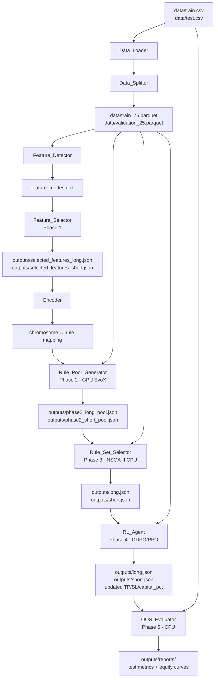

# Design Document: GPU-Fuzzy Trading Pipeline

## Overview

The `gpu-fuzzy-trading-pipeline` is a ground-up rewrite of the previous `bigdata_trader` package. It mines fuzzy trading rules from a discretized feature dataset, optimizes them using GPU-accelerated evolutionary algorithms, refines risk parameters via deep reinforcement learning, and produces two JSON files (`long.json`, `short.json`) fully compatible with `evaluator_v3.ipynb`.

### Key Design Principles

- **Single source of truth**: All hyperparameters live in `config.py`. No runtime flags.
- **Label isolation**: `label_*` columns are used only for trade simulation, never as model inputs.
- **Temporal integrity**: Train/validation split is per-symbol chronological (75/25). Last 288 rows per symbol are always dropped.
- **Evaluator parity**: The internal backtest engine exactly mirrors `evaluator_v3.ipynb`'s `CapitalManagedTradeSimulator` semantics.
- **GPU-first**: JAX + EvoX/EvoMO for evolutionary search; CPU fallback is transparent.
- **Phase isolation**: Each phase produces persisted artifacts; completed phases are skipped on re-runs.

### Pipeline Phases

```
Phase 1: Feature Selection (direction-specific, mode-aware)
    ↓
Phase 2: Rule Pool Generation (GPU-accelerated MOPSO/MOEA/D/RVEA via EvoX)
    ↓
Phase 3: Rule Set Selection (combinatorial NSGA-II on validation split)
    ↓
Phase 4: RL-Based Risk Optimization (DDPG/PPO with Elbow Method stopping)
    ↓
Phase 5: Out-of-Sample Test (CPU backtest on test.csv)
```

---

## Architecture

### Module Structure

```
gpu_fuzzy_trader/
├── config.py                    # Single source of truth for all hyperparameters
├── run_pipeline.py              # Top-level orchestrator (python -m gpu_fuzzy_trader.run_pipeline)
├── data/
│   ├── loader.py                # Data_Loader: CSV loading, datetime parsing, NaN handling
│   └── splitter.py              # Data_Splitter: per-symbol chronological 75/25 split
├── features/
│   ├── detector.py              # Feature_Detector: mode classification (binary/ternary/etc.)
│   ├── selector.py              # Feature_Selector: direction-specific scoring and ranking
│   └── encoder.py               # Encoder: gene → fuzzy value name, condition string formatting
├── backtest/
│   ├── cpu_engine.py            # CPU Backtest_Engine: exact evaluator_v3.ipynb semantics
│   └── gpu_engine.py            # GPU_Backtest_Engine: JAX-accelerated, numerically equivalent
├── phases/
│   ├── phase2_rule_pool.py      # Rule_Pool_Generator: EvoX MOEA/D/MOPSO/RVEA
│   ├── phase3_rule_set.py       # Rule_Set_Selector: NSGA-II combinatorial search
│   ├── phase4_rl_optimizer.py   # RL_Agent: DDPG/PPO with Elbow Method stopping
│   └── phase5_oos.py            # OOS_Evaluator: final test.csv evaluation
├── output/
│   └── writer.py                # Output_Writer: JSON serialization and schema validation
└── reporting/
    └── reporter.py              # Reporter: equity curves, per-symbol CSVs, phase metrics
```

### Data Flow Diagram



---

## Components and Interfaces

### 1. `config.py` — Single Source of Truth

All hyperparameters are defined here. No module may define its own defaults that override these values.

```python
# config.py (representative structure)

# --- Paths ---
TRAIN_CSV_PATH = "data/train.csv"
TEST_CSV_PATH = "data/test.csv"
TRAIN_75_PATH = "data/train_75.parquet"
VALIDATION_25_PATH = "data/validation_25.parquet"
OUTPUTS_DIR = "outputs"
REPORTS_DIR = "outputs/reports"

# --- Schema ---
LABEL_COLUMNS = ["label_open_next", "label_close_288", "label_min_288",
                  "label_max_288", "label_max_before_min"]
META_COLUMNS = ["datetime", "symbol"]
TAIL_DROP_ROWS = 288  # rows dropped per symbol (no labels)

# --- Backtest Constants (must match evaluator_v3.ipynb) ---
INITIAL_CAPITAL = 1000.0
LEVERAGE = 1.0
FEE_PCT = 0.20
MAX_HOLD_CANDLES = 288
MAX_TOTAL_EXPOSURE_PCT = 100.0
MIN_POSITION_NOTIONAL = 1.0

# --- Phase 2 Static Risk (isolates predictive alpha) ---
PHASE2_TP = 4.0
PHASE2_SL = 2.0
PHASE2_CAPITAL_PCT = 50.0

# --- Phase 2 Rule Constraints ---
MIN_CONDITIONS = 2
MAX_CONDITIONS = 5
MIN_TRADE_SUPPORT = 20
PHASE2_POPULATION_SIZE = 200
PHASE2_GENERATIONS = 500
PHASE2_ALGORITHM = "MOEAD"  # or "MOPSO", "RVEA"

# --- Phase 3 Rule Set Selection ---
PHASE3_POPULATION_SIZE = 100
PHASE3_GENERATIONS = 200
PHASE3_MIN_RULES = 2
PHASE3_MAX_RULES = 5
PHASE3_MIN_SYMBOL_COVERAGE = 7  # out of 10 symbols must have >= 1 trade

# --- Phase 4 RL ---
PHASE4_RL_ALGORITHM = "DDPG"  # or "PPO"
PHASE4_TP_MIN = 1.0
PHASE4_TP_MAX = 10.0
PHASE4_SL_MIN = 0.5
PHASE4_SL_MAX = 5.0
PHASE4_CAPITAL_PCT_MIN = 10.0
PHASE4_CAPITAL_PCT_MAX = 100.0
PHASE4_TOTAL_TIMESTEPS = 500_000
PHASE4_ELBOW_WINDOW = 20

# --- Phase 1 Feature Selection ---
PHASE1_DISPERSION_THRESHOLD = 0.95
PHASE1_TOP_K_FEATURES = 30
PHASE1_SAMPLING_TOTAL = 300_000  # shared across symbols (e.g. 30k per symbol for 10)
```

### 2. `data/loader.py` — Data_Loader

**Responsibilities**: Load CSV files, parse datetimes, sort by symbol+datetime, drop last 288 rows per symbol, drop NaN label rows, fill feature NaNs with 0.

**Key interface**:
```python
def load_dataset(path: str, feature_cols: list[str] | None = None) -> pd.DataFrame:
    """
    Load a CSV dataset with full preparation pipeline:
    1. Read CSV with comma separator
    2. Parse datetime column
    3. Sort by (symbol, datetime)
    4. Drop last TAIL_DROP_ROWS rows per symbol
    5. Drop rows where any LABEL_COLUMNS value is NaN
    6. Fill NaN in feature columns with 0
    7. Compute _symbol_bar_index per symbol
    Returns prepared DataFrame.
    """
```

**Design decisions**:
- `_symbol_bar_index` is computed as `groupby("symbol").cumcount()` after all drops, matching evaluator_v3.ipynb exactly.
- Feature modes are detected from the training split only; the loader does not detect modes.
- The loader is stateless — it does not cache or persist results.

### 3. `data/splitter.py` — Data_Splitter

**Responsibilities**: Split the prepared training DataFrame into per-symbol chronological 75/25 train/validation subsets. Persist to Parquet.

**Key interface**:
```python
def split_and_persist(df: pd.DataFrame) -> tuple[pd.DataFrame, pd.DataFrame]:
    """
    For each symbol independently:
      - Sort rows by datetime (already sorted by loader)
      - Take first floor(N * 0.75) rows as train
      - Take remaining rows as validation
    Concatenate all symbols' train rows → train_75
    Concatenate all symbols' validation rows → validation_25
    Persist to TRAIN_75_PATH and VALIDATION_25_PATH.
    Returns (train_df, validation_df).
    """
```

**Design decisions**:
- Split is strictly per-symbol. A symbol with 1000 rows gets 750 train + 250 validation, regardless of other symbols' time ranges.
- Sampling budget (e.g., 300k total = 30k per symbol for 10 symbols) is applied at the phase level, not here.

### 4. `features/detector.py` — Feature_Detector

**Responsibilities**: Classify each feature column into exactly one of six modes using the exact logic from `evaluator_v3.ipynb`'s `detect_feature_mode`.

**Mode detection logic** (must match evaluator exactly):
```python
def detect_feature_mode(series: pd.Series) -> str:
    unique_vals = series.dropna().unique()
    n_unique = len(unique_vals)

    if n_unique <= 2 and set(unique_vals).issubset({0, 1}):
        return "binary"
    if n_unique <= 3 and set(unique_vals).issubset({-1, 0, 1}):
        return "ternary"

    zero_ratio = (series == 0).mean()

    if series.min() < 0:
        return "sparse_signed" if zero_ratio > 0.3 else "signed"
    return "sparse_positive" if zero_ratio > 0.3 else "positive"
```

**Design decisions**:
- Mode detection runs on the training split only. The same modes are applied to validation and test data.
- The `zero_ratio` is computed on the full series including zeros, not just non-NaN values, matching evaluator behavior.

### 5. `features/encoder.py` — Encoder

**Responsibilities**: Map gene integer values to fuzzy value names; format condition strings; define don't-care sentinels.

**Fuzzy value name mappings** (exact, must match `evaluator_v3.ipynb`'s `decode_gene_value` and `apply_dynamic_rule`):

| Mode | Gene → Fuzzy Value Name |
|------|------------------------|
| `binary` | 0→"Inactive (0)", 1→"Active (1)" |
| `ternary` | 0→"Negative (-1)", 1→"Neutral (0)", 2→"Positive (1)" |
| `positive` / `sparse_positive` | 0→"Very Low", 1→"Low", 2→"Medium", 3→"High", 4→"Very High" |
| `sparse_signed` | 0→"Strong Negative", 1→"Weak Negative", 2→"Exactly Zero", 3→"Weak Positive", 4→"Strong Positive" |
| `signed` | 0→"Extreme Bearish", 1→"Strong Bearish", 2→"Bearish", 3→"Weak Bearish", 4→"Neutral Negative", 5→"Neutral Positive", 6→"Weak Bullish", 7→"Bullish", 8→"Strong Bullish", 9→"Extreme Bullish" |

**Don't-care sentinels** (gene value = num_classes):

| Mode | num_classes | dont_care |
|------|-------------|-----------|
| `binary` | 2 | 2 |
| `ternary` | 3 | 3 |
| `positive`, `sparse_positive`, `sparse_signed` | 5 | 5 |
| `signed` | 10 | 10 |

**Key interface**:
```python
def encode_condition(feature_name: str, gene: int, mode: str) -> str:
    """Returns '[feature_name] IS Fuzzy Value Name' or raises if gene == dont_care."""

def decode_chromosome(chromosome: np.ndarray, feature_infos: list[dict]) -> list[str]:
    """Convert a chromosome array to a list of condition strings, skipping dont_care genes."""

def get_dont_care(mode: str) -> int:
    """Return the dont_care sentinel for a given mode."""
```

### 6. `features/selector.py` — Feature_Selector (Phase 1)

**Responsibilities**: Score and rank features separately for long and short directions; remove low-dispersion and redundant features; measure cross-symbol stability.

**Algorithm**:
1. Exclude all `LABEL_COLUMNS` and `META_COLUMNS`.
2. Detect feature modes (from training split only).
3. Remove features where >95% of values are identical (near-zero dispersion).
4. Build direction-specific binary success targets:
   - Long: `label_max_288 >= label_open_next * (1 + PHASE2_TP/100)` before `label_min_288 <= label_open_next * (1 - PHASE2_SL/100)`
   - Short: `label_min_288 <= label_open_next * (1 - PHASE2_TP/100)` before `label_max_288 >= label_open_next * (1 + PHASE2_SL/100)`
5. Score each feature per symbol using mutual information (primary) and optionally tree-based importance.
6. Compute cross-symbol stability score = 1 - (std of per-symbol scores / mean of per-symbol scores).
7. Final score = relevance_score * stability_score.
8. Group features by mode; apply within-mode redundancy removal (drop features with pairwise correlation > 0.95).
9. Select top `PHASE1_TOP_K_FEATURES` features per direction.
10. Persist to `outputs/selected_features_long.json` and `outputs/selected_features_short.json`.

**Output JSON schema**:
```json
{
  "direction": "long",
  "features": [
    {"name": "feature_col_name", "mode": "signed", "score": 0.847}
  ]
}
```

**Skip logic**: If output files exist and are valid JSON with the required schema, Phase 1 is skipped. If files are missing, unreadable, or corrupted, the pipeline fails immediately.

---

## Backtest Engine Design

### 7. `backtest/cpu_engine.py` — CPU Backtest_Engine

This is the canonical reference implementation. Its semantics must exactly match `evaluator_v3.ipynb`'s `CapitalManagedTradeSimulator`. All other engines (GPU, RL environment) must produce numerically equivalent results.

**Core algorithm** (mirrors evaluator_v3.ipynb exactly):

```
1. Build rule signal masks (priority-based assignment):
   - For each rule in order, compute boolean mask of matching rows
   - Assign unassigned rows to this rule; mark them as assigned
   - Result: list of (row_index, rule_index, tp, sl, capital_pct) entries, sorted by row_index

2. Precompute release indices:
   - For each row, find the row index where symbol_bar_index + MAX_HOLD_CANDLES is reached
   - This is the conservative exposure release point

3. Simulate trades in chronological order:
   For each entry (row_index, tp, sl, capital_pct):
     a. Release all positions whose release_index <= current row_index
        - Realize PnL: equity += net_pnl
        - Update peak_equity, max_drawdown_pct
        - Update win/loss counts, gross_profit_sum, gross_loss_sum
        - Release exposure: open_total_exposure -= position_notional
     b. If account_ruined: break
     c. Compute position_notional:
        target = equity * (capital_pct/100) * leverage
        max_exposure = equity * (MAX_TOTAL_EXPOSURE_PCT/100) * leverage
        remaining = max(0, max_exposure - open_total_exposure)
        position_notional = min(target, remaining)
     d. If position_notional < MIN_POSITION_NOTIONAL: skip (increment skipped count)
     e. Compute trade outcome (long or short):
        Long: hit_tp = max_ret >= tp; hit_sl = min_ret <= -sl
        Short: hit_tp = min_ret <= -tp; hit_sl = max_ret >= sl
        Both hit: use max_before_min to determine order
        price_return_pct = tp (TP first), -sl (SL first), or close_ret/−close_ret (time exit)
     f. Compute PnL:
        gross_pnl = position_notional * price_return_pct / 100
        fee = position_notional * FEE_PCT / 100
        net_pnl = gross_pnl - fee
     g. Add to open_positions with release_index
     h. Update open_total_exposure, executed_trades count

4. Final release: release all remaining open positions at end of dataset

5. Compute summary metrics:
   total_return_pct = (equity / INITIAL_CAPITAL - 1) * 100
   win_rate = wins / executed_trades * 100
   profit_factor = gross_profit_sum / gross_loss_sum (or 99.0 if no losses)
```

**Trade outcome logic** (exact evaluator_v3.ipynb semantics):

For **long** direction:
- `hit_tp = max_ret >= tp`
- `hit_sl = min_ret <= -sl`
- Both hit: if `max_before_min == 1` → TP first (return = +tp), else SL first (return = -sl)
- Only TP: return = +tp
- Only SL: return = -sl
- Neither: return = `close_ret` (time exit at `label_close_288`)

For **short** direction:
- `hit_tp = min_ret <= -tp`
- `hit_sl = max_ret >= sl`
- Both hit: if `max_before_min == 1` → SL first (return = -sl), else TP first (return = +tp)
- Only TP: return = +tp
- Only SL: return = -sl
- Neither: return = `-close_ret` (time exit, short profits from price decline)

**Key interface**:
```python
class CPUBacktestEngine:
    def __init__(self, df: pd.DataFrame, feature_modes: dict[str, str],
                 direction: str, **constants): ...

    def simulate_rule_set(self, rule_set: list[dict],
                          return_logs: bool = False) -> dict | tuple[dict, pd.DataFrame]:
        """
        rule_set format: [{"conditions": [...], "tp": float, "sl": float, "capital_pct": float}]
        Returns metrics dict, optionally with trade log DataFrame.
        """
```

### 8. `backtest/gpu_engine.py` — GPU_Backtest_Engine

**Responsibilities**: JAX-accelerated backtest producing numerically equivalent results to the CPU engine. Used exclusively during Phase 2 (rule pool generation) for speed.

**GPU Acceleration Strategy**:

The key insight is that during Phase 2, we evaluate thousands of single-rule candidates with static TP=4%, SL=2%, capital_pct=50%. This allows significant vectorization:

```
For a batch of N candidate rules evaluated on M rows:
  - Rule matching: JAX vmap over rules, vectorized boolean mask computation
  - Trade outcome: vectorized TP/SL/time-exit logic using jnp.where
  - Capital management: sequential (cannot be fully parallelized due to state dependency)
    → Use JAX scan for sequential equity simulation
  - Metrics: vectorized reduction (sum, max, etc.)
```

**JAX implementation approach**:

```python
import jax
import jax.numpy as jnp

@jax.jit
def compute_rule_signals(data_matrix: jnp.ndarray, chromosome: jnp.ndarray,
                          dont_cares: jnp.ndarray) -> jnp.ndarray:
    """Vectorized rule matching: returns boolean mask of matching rows."""
    active_mask = chromosome != dont_cares
    # For each row, check if all active conditions match
    matches = jnp.all(
        jnp.where(active_mask, data_matrix == chromosome, True),
        axis=-1
    )
    return matches

@jax.jit
def compute_trade_outcomes_batch(max_ret, min_ret, close_ret, max_before_min,
                                  tp, sl, direction) -> jnp.ndarray:
    """Vectorized trade outcome computation for all matched rows."""
    # Long direction
    hit_tp = max_ret >= tp
    hit_sl = min_ret <= -sl
    both_hit = hit_tp & hit_sl
    # ... (exact evaluator logic using jnp.where)
```

**Sequential equity simulation** (cannot be parallelized — uses JAX scan):
```python
def simulate_equity_sequential(entries, release_indices, net_pnls,
                                 initial_capital) -> dict:
    """Use jax.lax.scan for sequential equity tracking with exposure management."""
```

**Fallback behavior**:
- If JAX GPU device is unavailable, `jax.default_backend()` returns "cpu" and JAX runs on CPU transparently.
- If JAX cannot be imported, raise `ImportError` with descriptive message.

**Numerical parity requirement**: GPU engine results must match CPU engine within 1e-4 relative tolerance on all metrics (total_return_pct, max_drawdown_pct, win_rate, profit_factor). A benchmark test must confirm this before Phase 2 runs.

**Key interface**:
```python
class GPUBacktestEngine:
    def __init__(self, df: pd.DataFrame, feature_modes: dict[str, str],
                 direction: str, **constants): ...

    def simulate_rule_batch(self, chromosomes: np.ndarray,
                             tp: float, sl: float,
                             capital_pct: float) -> list[dict]:
        """
        Evaluate a batch of rule chromosomes simultaneously.
        Returns list of metrics dicts, one per chromosome.
        """

    def simulate_rule_set(self, rule_set: list[dict],
                           return_logs: bool = False) -> dict | tuple[dict, pd.DataFrame]:
        """Same interface as CPUBacktestEngine for compatibility."""
```

---

## Phase 2: Rule Pool Generation

### 9. `phases/phase2_rule_pool.py` — Rule_Pool_Generator

**Algorithm**: Multi-objective evolutionary search using EvoX (JAX-based). Generates separate pools for long and short directions.

**Chromosome encoding**:
```
chromosome = [gene_0, gene_1, ..., gene_{K-1}]
where K = number of selected features for this direction
gene_i ∈ {0, 1, ..., num_classes_i - 1, dont_care_i}
dont_care_i = num_classes_i (inactive condition)
```

**Fitness function** (three objectives, all minimized by convention):
```
f1 = -total_return_pct          (maximize return → minimize negative)
f2 = max_drawdown_pct           (minimize drawdown)
f3 = -win_rate                  (maximize win rate → minimize negative)

Penalties (added to f1, f2, f3 proportionally):
  + support_penalty: if executed_trades < MIN_TRADE_SUPPORT
  + diversity_penalty: if chromosome is too similar to existing Pareto front members
  + condition_count_penalty: if active_conditions < MIN_CONDITIONS or > MAX_CONDITIONS
```

**Static risk parameters during Phase 2**:
- TP = `PHASE2_TP` (4.0%)
- SL = `PHASE2_SL` (2.0%)
- capital_pct = `PHASE2_CAPITAL_PCT` (50.0%)

This isolates predictive alpha from risk parameter tuning.

**EvoX integration**:
```python
import evox

class FuzzyRuleOptimizer(evox.Algorithm):
    """EvoX-compatible MOEA/D or MOPSO algorithm for fuzzy rule evolution."""

    def setup(self, key):
        # Initialize population with random chromosomes
        # Enforce dont_care distribution for sparsity

    def step(self, state):
        # Standard EvoX step: generate offspring, evaluate, update archive
```

**Sampling strategy**: Total evaluation budget = `PHASE1_SAMPLING_TOTAL` rows (e.g., 300k). Distributed equally across symbols (e.g., 30k per symbol for 10 symbols). This ensures no symbol dominates the fitness signal.

**Diversity mechanism**: Crowding distance in objective space (NSGA-II style) + Hamming distance penalty in chromosome space to prevent identical rules.

**Output**: Pareto-front rules persisted to:
- `outputs/phase2_long_pool.json`
- `outputs/phase2_short_pool.json`
- `outputs/phase2_long_history.json`
- `outputs/phase2_short_history.json`

**Pool JSON schema**:
```json
[
  {
    "chromosome": [2, 5, 1, 5, 3, 5, ...],
    "conditions": ["[feature_a] IS Bearish", "[feature_b] IS Very High"],
    "objectives": {"total_return_pct": 8.2, "max_drawdown_pct": 3.1, "win_rate": 54.0},
    "executed_trades": 87
  }
]
```

**Skip logic**: If pool files exist and are valid, Phase 2 is skipped.

---

## Phase 3: Rule Set Selection

### 10. `phases/phase3_rule_set.py` — Rule_Set_Selector

**Algorithm**: NSGA-II combinatorial search over ordered rule combinations from the Phase 2 pool. Evaluated on the **validation split** using the CPU engine.

**Search space**: All ordered combinations of 2–5 rules from the Phase 2 pool, with no duplicate rules (same conditions).

**Fitness function** (three objectives):
```
f1 = -validation_total_return_pct
f2 = validation_max_drawdown_pct
f3 = -validation_win_rate

Penalties:
  + coverage_penalty: if symbols_with_trades < PHASE3_MIN_SYMBOL_COVERAGE
  + zero_trade_penalty: if total executed_trades == 0 (always applied)
  + overfitting_penalty: |train_return - validation_return| / max(|train_return|, 1.0)
  + duplicate_rule_penalty: if any two rules have identical condition sets
```

**Train/validation agreement**: The overfitting penalty discourages rule sets that perform well on training but poorly on validation. This is computed by re-evaluating the candidate rule set on the training split.

**Output**: Best Pareto-front rule set (selected by hypervolume or user-defined preference) written to:
- `outputs/long.json`
- `outputs/short.json`

**Output JSON format** (exact evaluator_v3.ipynb compatibility):
```json
{
  "direction": "long",
  "rules_set": [
    {
      "tp": 4.0,
      "sl": 2.0,
      "capital_pct": 50.0,
      "conditions": ["[feature_a] IS Bearish", "[feature_b] IS Very High"]
    }
  ]
}
```

At this stage, TP/SL/capital_pct are still the Phase 2 static values. Phase 4 will update them.

**Skip logic**: If both `long.json` and `short.json` exist and pass schema validation, Phase 3 is skipped. If only one exists, Phase 3 is skipped and the pipeline proceeds with the available file.

---

## Phase 4: RL-Based Risk Optimization

### 11. `phases/phase4_rl_optimizer.py` — RL_Agent

**Algorithm**: DDPG (preferred) or PPO agent that fine-tunes TP, SL, and capital_pct for each rule in the selected rule set. Trained on the training split; evaluated on the validation split. Uses the Elbow Method to identify the optimal training checkpoint.

**State space**:
```
state_vector = [
  # Market features at current candle (K features)
  feature_0, feature_1, ..., feature_{K-1},
  # Fuzzy rule activation strengths (R rules)
  # = fraction of conditions satisfied for each rule
  rule_0_activation, rule_1_activation, ..., rule_{R-1}_activation,
  # Portfolio state
  equity_normalized,        # equity / INITIAL_CAPITAL
  open_exposure_normalized  # open_total_exposure / equity
]
```

**Action space** (continuous, per rule):
```
action_vector = [
  tp_0, sl_0, capital_pct_0,
  tp_1, sl_1, capital_pct_1,
  ...
  tp_{R-1}, sl_{R-1}, capital_pct_{R-1}
]
Bounds (from config.py):
  tp_i ∈ [PHASE4_TP_MIN, PHASE4_TP_MAX]           = [1.0, 10.0]
  sl_i ∈ [PHASE4_SL_MIN, PHASE4_SL_MAX]           = [0.5, 5.0]
  capital_pct_i ∈ [PHASE4_CAPITAL_PCT_MIN, PHASE4_CAPITAL_PCT_MAX] = [10.0, 100.0]
```

**Reward function**:
```
reward = net_pnl_normalized - drawdown_penalty
where:
  net_pnl_normalized = net_pnl / INITIAL_CAPITAL * 100
  drawdown_penalty = max(0, current_drawdown_pct - 5.0) * 0.1
```

**Elbow Method stopping**:

The Elbow Method identifies the optimal training checkpoint by finding the point of maximum curvature on the validation performance curve.

```python
def find_elbow_point(validation_returns: list[float]) -> int:
    """
    Given a list of validation returns at each checkpoint,
    find the index of maximum curvature using the kneedle algorithm
    or second-derivative approximation.

    Algorithm:
    1. Normalize the curve to [0, 1] range
    2. Compute the line from first to last point
    3. Find the point with maximum perpendicular distance from this line
    4. Return that index as the optimal checkpoint

    The Elbow Method runs during training (not after) and identifies
    checkpoints as soon as validation curves are available.
    """
```

**Training procedure**:
1. Initialize DDPG/PPO agent with state/action dimensions from config.
2. Train on training split for up to `PHASE4_TOTAL_TIMESTEPS` steps.
3. Every `PHASE4_ELBOW_WINDOW` episodes, evaluate on validation split and record return.
4. Apply Elbow Method to the growing validation curve to identify optimal checkpoint.
5. Save model checkpoint at the identified elbow point.
6. Load the elbow checkpoint and extract optimized TP/SL/capital_pct per rule.
7. Update `outputs/long.json` and `outputs/short.json` with optimized values.

**Separate agents**: One agent is trained for the long strategy, one for the short strategy.

**Skip logic**: If output files exist and pass validation (TP/SL/capital_pct values are within valid ranges), Phase 4 is skipped.

---

## Phase 5: Out-of-Sample Test

### 12. `phases/phase5_oos.py` — OOS_Evaluator

**Responsibilities**: Load final strategies, prepare test data with the same pipeline as training data, evaluate using CPU engine with `return_logs=True`, generate reports.

**Data preparation** (identical to training pipeline):
1. Load `data/test.csv`
2. Sort by (symbol, datetime)
3. Drop last 288 rows per symbol
4. Drop rows where any label column is NaN
5. Fill feature NaN with 0
6. Compute `_symbol_bar_index`

**Evaluation**:
- Load `outputs/long.json` and `outputs/short.json`
- Parse conditions using `apply_dynamic_rule` semantics (threshold-based, not mode-based)
- Run `CPUBacktestEngine.simulate_rule_set()` with `return_logs=True`
- Compute per-symbol breakdowns from trade logs

**Metrics reported**:
- total_return_pct, max_drawdown_pct, win_rate, profit_factor
- executed_trades, account_status (survived / ruined)
- Per-symbol: trade_count, win_rate, net_pnl

**Special case**: If no trades were executed, report 0% total return and do NOT report account ruin unless actual trading losses caused equity to reach zero.

**Outputs**:
- `outputs/reports/test_long_report.json`
- `outputs/reports/test_short_report.json`
- `outputs/reports/test_per_symbol_performance.csv`
- `outputs/reports/test_long_equity.png`
- `outputs/reports/test_short_equity.png`

---

## Data Models

### Rule Representation

**Internal rule** (used during optimization):
```python
@dataclass
class Rule:
    chromosome: np.ndarray      # gene array, length = num_selected_features
    conditions: list[str]       # decoded condition strings
    tp: float                   # take-profit %
    sl: float                   # stop-loss %
    capital_pct: float          # capital allocation %
    direction: str              # "long" or "short"
```

**Rule Set** (ordered list of 2–5 rules):
```python
@dataclass
class RuleSet:
    direction: str
    rules: list[Rule]           # ordered; first match wins per candle
```

### JSON Output Format

The final output format must exactly match `evaluator_v3.ipynb`'s expected input:

```json
{
  "direction": "long",
  "rules_set": [
    {
      "tp": 2.5,
      "sl": 1.2,
      "capital_pct": 15.0,
      "conditions": [
        "[dmi_balance_14] IS Bearish",
        "[vol_ratio_20_100] IS Very Low"
      ]
    },
    {
      "tp": 3.1,
      "sl": 1.8,
      "capital_pct": 12.0,
      "conditions": [
        "[amihud_illiquidity_20] IS Very High",
        "[macd_hist_atr] IS Extreme Bearish",
        "[return_skew_30] IS Strong Bearish"
      ]
    }
  ]
}
```

**Schema constraints** (enforced by `output/writer.py`):
- Top-level keys: exactly `"direction"` and `"rules_set"`
- `"direction"`: string, must be `"long"` or `"short"` (lowercase)
- `"rules_set"`: array of 2–5 rule objects
- Each rule object: exactly keys `"tp"`, `"sl"`, `"capital_pct"`, `"conditions"`
- `"tp"`, `"sl"`, `"capital_pct"`: float, non-zero
- `"conditions"`: non-empty array of strings matching `"[feature_name] IS Fuzzy Value Name"`
- If `rules_set` has > 5 rules, truncate to first 5
- If any rule has all-zero tp/sl/capital_pct, reject that rule

### Feature Info Structure

```python
feature_info = {
    "col": "feature_name",
    "mode": "signed",
    "num_classes": 10,
    "dont_care": 10
}
```

### Backtest Metrics Structure

```python
metrics = {
    "direction": str,
    "total_return_pct": float,
    "max_drawdown_pct": float,
    "win_rate": float,
    "account_ruined": bool,
    "loss_count": int,
    "time_closed_count": int,
    "raw_signal_count": int,
    "executed_trades": int,
    "final_equity": float,
    "profit_factor": float,
    "avg_position_notional": float,
    "skipped_min_notional_count": int,
    "max_simultaneous_positions": int,
    "max_total_open_exposure": float,
    # Symbol-aware additions:
    "per_symbol": {
        "BTCUSDT": {"trade_count": int, "win_rate": float, "net_pnl": float},
        ...
    }
}
```

---

## Correctness Properties

*A property is a characteristic or behavior that should hold true across all valid executions of a system — essentially, a formal statement about what the system should do. Properties serve as the bridge between human-readable specifications and machine-verifiable correctness guarantees.*

### Property 1: Per-Symbol Chronological Sort

*For any* dataset with multiple symbols and rows in arbitrary order, after loading via `Data_Loader`, all rows belonging to the same symbol must appear in strictly ascending `datetime` order.

**Validates: Requirements 2.2**

### Property 2: Last-288-Row Drop

*For any* symbol with N rows in the raw dataset (N > 288), after loading via `Data_Loader`, that symbol must have exactly N − 288 rows in the output. For symbols with N ≤ 288, the symbol must have 0 rows in the output.

**Validates: Requirements 2.3**

### Property 3: No NaN Labels After Loading

*For any* dataset containing rows with NaN values in any label column, after loading via `Data_Loader`, the resulting DataFrame must contain zero rows where any label column value is NaN.

**Validates: Requirements 2.4**

### Property 4: No NaN Features After Loading

*For any* dataset containing NaN values in feature columns, after loading via `Data_Loader`, all feature columns in the resulting DataFrame must be NaN-free (all NaN values replaced with 0).

**Validates: Requirements 2.5**

### Property 5: Per-Symbol Chronological Split Ratio

*For any* symbol with N rows in the prepared training dataset, after splitting via `Data_Splitter`, the train subset must contain exactly `floor(N * 0.75)` rows and the validation subset must contain `N − floor(N * 0.75)` rows, both in chronological order with no row appearing in both subsets.

**Validates: Requirements 2.6, 2.7**

### Property 6: Feature Mode Classification Completeness

*For any* feature column, `Feature_Detector.detect_feature_mode()` must return exactly one of the six valid modes: `{"binary", "ternary", "positive", "sparse_positive", "sparse_signed", "signed"}`. No other value is acceptable.

**Validates: Requirements 3.1**

### Property 7: Feature Mode Classification Correctness

*For any* feature column whose unique non-NaN values are a subset of {0, 1} with count ≤ 2, the detected mode must be `"binary"`. For any column whose unique non-NaN values are a subset of {−1, 0, 1} with count ≤ 3, the mode must be `"ternary"`. For any column with `min < 0` and `zero_ratio > 0.3`, the mode must be `"sparse_signed"`. For any column with `min < 0` and `zero_ratio ≤ 0.3`, the mode must be `"signed"`. For any column with `min ≥ 0` and `zero_ratio > 0.3`, the mode must be `"sparse_positive"`. For any column with `min ≥ 0` and `zero_ratio ≤ 0.3`, the mode must be `"positive"`.

**Validates: Requirements 3.2**

### Property 8: Fuzzy Value Name Encoding Round-Trip

*For any* valid (gene_value, mode) pair where `gene_value < num_classes(mode)`, encoding the gene to a fuzzy value name and then applying `apply_dynamic_rule` with that name to a column containing the corresponding raw value must return `True`. This round-trip must hold for all valid gene values across all six modes.

**Validates: Requirements 4.1, 4.2**

### Property 9: Don't-Care Sentinel Correctness

*For any* mode, the don't-care sentinel value must equal `num_classes` for that mode: 2 for `binary`, 3 for `ternary`, 5 for `positive`/`sparse_positive`/`sparse_signed`, and 10 for `signed`. Any chromosome gene equal to the don't-care sentinel must be excluded from condition matching.

**Validates: Requirements 4.3**

### Property 10: Priority-Based Rule Assignment Exclusivity

*For any* rule set and dataset, each row can be assigned to at most one rule. If multiple rules match the same row, only the first matching rule (by position in the rule set) generates a trade entry for that row. The union of all assigned rows across all rules must be disjoint.

**Validates: Requirements 5.1**

### Property 11: Trade Outcome Correctness

*For any* trade entry with known `max_ret`, `min_ret`, `close_ret`, and `max_before_min` values, and given `tp` and `sl` parameters, the computed `price_return_pct` and `exit_reason` must exactly match the evaluator_v3.ipynb `_build_trade_outcome_single` logic for both long and short directions.

**Validates: Requirements 5.2**

### Property 12: Capital-Managed Position Sizing

*For any* equity level `E`, `capital_pct` value `C`, `leverage` `L`, and current `open_total_exposure` `X`, the computed `position_notional` must equal `min(E * C/100 * L, max(0, E * MAX_TOTAL_EXPOSURE_PCT/100 * L − X))`. If this value is less than `MIN_POSITION_NOTIONAL`, the trade must be skipped.

**Validates: Requirements 5.4, 5.9**

### Property 13: Exposure Reservation Invariant

*For any* sequence of trades, the `open_total_exposure` at any point in the simulation must never exceed `equity * MAX_TOTAL_EXPOSURE_PCT/100 * leverage`. Exposure for each trade is reserved from entry until `entry_symbol_bar_index + MAX_HOLD_CANDLES` is reached.

**Validates: Requirements 5.5**

### Property 14: Fee Deduction Correctness

*For any* trade with `position_notional` P and `gross_pnl` G, the `net_pnl` must equal `G − P * FEE_PCT/100`. The fee is always deducted regardless of trade outcome.

**Validates: Requirements 5.6**

### Property 15: Equity Tracking Consistency

*For any* completed backtest simulation, the `final_equity` must equal `INITIAL_CAPITAL + sum(net_pnl for all realized trades)`. The `max_drawdown_pct` must equal the maximum observed value of `(peak_equity − equity) / peak_equity * 100` across all equity updates.

**Validates: Requirements 5.7**

### Property 16: GPU-CPU Numerical Parity

*For any* rule set and dataset, the metrics produced by `GPUBacktestEngine.simulate_rule_set()` must match those produced by `CPUBacktestEngine.simulate_rule_set()` within 1e-4 relative tolerance for all numeric metrics (`total_return_pct`, `max_drawdown_pct`, `win_rate`, `profit_factor`, `executed_trades`).

**Validates: Requirements 6.1**

### Property 17: Label and Meta Column Exclusion from Feature Selection

*For any* dataset, the feature lists produced by `Feature_Selector` must not contain any column name that appears in `LABEL_COLUMNS` or `META_COLUMNS`. This must hold regardless of the dataset's column composition.

**Validates: Requirements 7.2**

### Property 18: Low-Dispersion Feature Exclusion

*For any* feature column where more than 95% of values are identical (i.e., the most frequent value has frequency > 0.95), that feature must not appear in the selected feature output for either direction.

**Validates: Requirements 7.5**

### Property 19: Phase 2 Static Risk Parameters

*For any* candidate rule evaluated during Phase 2 (rule pool generation), the TP value used in the backtest must be exactly `PHASE2_TP` (4.0), the SL value must be exactly `PHASE2_SL` (2.0), and the `capital_pct` must be exactly `PHASE2_CAPITAL_PCT` (50.0). No other values are permitted during Phase 2 evaluation.

**Validates: Requirements 8.4**

### Property 20: Rule Condition Count Bounds

*For any* rule in the generated pool or selected rule set, the number of active conditions (genes not equal to their don't-care sentinel) must be at least `MIN_CONDITIONS` (default: 2) and at most `MAX_CONDITIONS` (default: 5).

**Validates: Requirements 8.6**

### Property 21: Rule Set Size Bounds

*For any* selected rule set output by Phase 3, the number of rules must be at least `PHASE3_MIN_RULES` (2) and at most `PHASE3_MAX_RULES` (5). If the optimization produces more than 5 rules, the output must be truncated to the first 5.

**Validates: Requirements 9.1, 12.8**

### Property 22: Rule Set Uniqueness

*For any* selected rule set, no two rules may have identical condition sets (same set of `[feature] IS Value` strings). The uniqueness check must be order-independent (i.e., two rules with the same conditions in different order are considered identical).

**Validates: Requirements 9.4**

### Property 23: JSON Output Schema Validity

*For any* generated `long.json` or `short.json`, the file must conform to the exact schema: top-level keys are exactly `"direction"` and `"rules_set"`; `"direction"` is `"long"` or `"short"`; `"rules_set"` is an array of 2–5 objects each with exactly keys `"tp"`, `"sl"`, `"capital_pct"`, `"conditions"`; `"tp"` and `"sl"` are positive floats; `"capital_pct"` is a positive float; `"conditions"` is a non-empty array of strings matching `"[feature_name] IS Fuzzy Value Name"`.

**Validates: Requirements 12.1, 12.2, 12.3, 12.4, 12.5, 12.6, 12.7, 12.8, 12.9**

### Property 24: RL Action Bounds

*For any* action output from the RL agent, all TP values must be in `[PHASE4_TP_MIN, PHASE4_TP_MAX]`, all SL values must be in `[PHASE4_SL_MIN, PHASE4_SL_MAX]`, and all `capital_pct` values must be in `[PHASE4_CAPITAL_PCT_MIN, PHASE4_CAPITAL_PCT_MAX]`.

**Validates: Requirements 10.3**

### Property 25: RL State Vector Completeness

*For any* observation generated by the RL environment, the state vector must contain all three components: market feature values (K features), fuzzy rule activation strengths (R values, one per rule), and portfolio state (equity_normalized, open_exposure_normalized). The total dimension must equal K + R + 2.

**Validates: Requirements 10.2**

### Property 26: Elbow Method Correctness

*For any* monotonically increasing then plateauing validation performance curve, the Elbow Method must identify the point of maximum curvature (the "knee") as the optimal checkpoint. For a perfectly linear curve, the elbow must be at the last point. For a curve that immediately plateaus, the elbow must be at the first point.

**Validates: Requirements 10.5**

### Property 27: Test Data Preparation Consistency

*For any* test dataset, after preparation via `OOS_Evaluator`, the resulting DataFrame must satisfy the same invariants as the training data: no NaN label rows, no NaN feature values, last 288 rows per symbol dropped, rows sorted by (symbol, datetime).

**Validates: Requirements 11.2**

### Property 28: Per-Symbol Metrics Consistency

*For any* completed backtest simulation with per-symbol tracking, the sum of per-symbol `trade_count` values must equal the total `executed_trades`. For each symbol, the per-symbol `win_rate` must equal `per_symbol_wins / per_symbol_trade_count * 100` (or 0 if no trades). The sum of per-symbol `net_pnl` values must equal `final_equity − INITIAL_CAPITAL`.

**Validates: Requirements 15.1**

### Property 29: Symbol Coverage Penalty Application

*For any* rule set that generates zero trades on more than `MAX_ZERO_SYMBOL_COUNT` symbols (default: 3 out of 10), the fitness function must include a non-zero coverage penalty. A rule set generating zero trades on all symbols must always receive the maximum coverage penalty.

**Validates: Requirements 9.5, 15.4**

---

## Error Handling

### Data Loading Errors
- Missing CSV files: raise `FileNotFoundError` with path
- Missing required label columns: raise `ValueError` listing missing columns
- Invalid `label_open_next` values (non-finite or ≤ 0): raise `ValueError` with count of bad rows
- All rows dropped after NaN removal: raise `ValueError` with symbol name

### Configuration Errors
- Invalid chromosome sentinel (gene value ≠ num_classes for its mode): raise `ConfigurationError` requiring manual correction
- Invalid `capital_pct` (≤ 0 or non-finite): raise `ValueError` with rule index
- TP/SL/capital_pct outside valid ranges in output JSON: raise `ValidationError`

### Phase Skip Errors
- Phase 1 output files missing or corrupted: pipeline fails immediately (no auto-retry)
- Phase 2/3/4 output files invalid: re-run that phase automatically

### GPU Errors
- JAX GPU unavailable: transparent fallback to CPU (logged as INFO)
- JAX import failure: raise `ImportError` with descriptive message and installation instructions
- GPU OOM during batch evaluation: reduce batch size and retry (configurable in config.py)

### RL Training Errors
- Elbow Method cannot find a knee (monotonically increasing curve): use the last checkpoint
- RL agent produces out-of-bounds actions: clip to valid range and log a warning

### Output Validation Errors
- Rule set with > 5 rules: truncate to first 5 (logged as WARNING)
- Rule with all-zero tp/sl/capital_pct: reject that rule (logged as ERROR)
- Output directory creation failure: raise `OSError` with path

### Account Ruin
- When equity ≤ 0 during simulation: set `account_ruined = True`, stop processing new entries, release all open positions, compute final metrics
- Report 0% return for zero-trade scenarios (not account ruin)

---

## Testing Strategy

### Overview

The testing strategy uses a dual approach:
- **Unit tests**: Verify specific examples, edge cases, and error conditions
- **Property-based tests**: Verify universal properties across many generated inputs

Property-based testing is appropriate here because the pipeline contains pure functions (mode detection, encoding, backtest simulation, elbow method) with clear input/output behavior and large input spaces where edge cases matter.

**PBT library**: [Hypothesis](https://hypothesis.readthedocs.io/) (Python)
**Minimum iterations per property test**: 100

Each property test is tagged with a comment referencing the design property:
```python
# Feature: gpu-fuzzy-trading-pipeline, Property N: <property_text>
```

---

### Unit Tests

**Data loading and splitting**:
- Load a known CSV and verify row count, column names, datetime parsing
- Verify `_symbol_bar_index` is computed correctly after drops
- Verify per-symbol split produces correct row counts and no overlap
- Verify output Parquet files are created and readable

**Feature mode detection**:
- Binary: column with only {0, 1} → "binary"
- Ternary: column with only {-1, 0, 1} → "ternary"
- Sparse signed: column with negatives and zero_ratio > 0.3 → "sparse_signed"
- Signed: column with negatives and zero_ratio ≤ 0.3 → "signed"
- Sparse positive: column with non-negatives and zero_ratio > 0.3 → "sparse_positive"
- Positive: column with non-negatives and zero_ratio ≤ 0.3 → "positive"

**Encoder**:
- All 29 valid (gene, mode) pairs produce the correct fuzzy value name
- Condition string format: `[feature_name] IS Fuzzy Value Name`
- Don't-care gene is excluded from decoded conditions
- Invalid sentinel raises ConfigurationError

**CPU Backtest Engine**:
- Long TP hit: max_ret=5.0, tp=4.0 → return=4.0, exit="TP"
- Long SL hit: min_ret=-3.0, sl=2.0 → return=-2.0, exit="SL"
- Long both hit, max_before_min=1: → return=tp, exit="TP"
- Long both hit, max_before_min=0: → return=-sl, exit="SL"
- Long time exit: neither hit → return=close_ret, exit="Time_288"
- Short direction: analogous cases
- Fee deduction: net_pnl = gross_pnl - position_notional * 0.002
- Account ruin: equity ≤ 0 stops simulation
- Zero trades: returns 0% return, account_ruined=False

**JSON output validation**:
- Valid schema passes validation
- Missing "direction" key raises ValidationError
- rules_set with 6 rules is truncated to 5
- Rule with all-zero tp/sl/capital_pct is rejected
- Condition string not matching pattern raises ValidationError

**Elbow Method**:
- Flat curve → elbow at last point
- Immediately plateauing curve → elbow at first point
- Classic knee curve → elbow at the knee

---

### Property-Based Tests

```python
from hypothesis import given, settings
from hypothesis import strategies as st

# Feature: gpu-fuzzy-trading-pipeline, Property 1: Per-Symbol Chronological Sort
@given(st.lists(
    st.fixed_dictionaries({
        "symbol": st.sampled_from(["SYM_A", "SYM_B", "SYM_C"]),
        "datetime": st.datetimes(),
        "feature_x": st.floats(0, 1),
        "label_open_next": st.floats(1, 100),
        # ... other required columns
    }),
    min_size=10, max_size=500
))
@settings(max_examples=100)
def test_per_symbol_chronological_sort(rows):
    df = pd.DataFrame(rows)
    result = load_dataset_from_df(df)
    for symbol, group in result.groupby("symbol"):
        assert group["datetime"].is_monotonic_increasing

# Feature: gpu-fuzzy-trading-pipeline, Property 2: Last-288-Row Drop
@given(
    st.integers(min_value=0, max_value=1000),  # N rows per symbol
    st.integers(min_value=1, max_value=5)       # number of symbols
)
@settings(max_examples=100)
def test_last_288_row_drop(n_rows, n_symbols):
    df = make_synthetic_dataset(n_rows_per_symbol=n_rows, n_symbols=n_symbols)
    result = load_dataset_from_df(df)
    for symbol in result["symbol"].unique():
        expected = max(0, n_rows - 288)
        actual = len(result[result["symbol"] == symbol])
        assert actual == expected

# Feature: gpu-fuzzy-trading-pipeline, Property 7: Feature Mode Classification Correctness
@given(st.one_of(
    # binary: values subset of {0, 1}
    st.lists(st.sampled_from([0, 1]), min_size=10, max_size=1000),
    # ternary: values subset of {-1, 0, 1}
    st.lists(st.sampled_from([-1, 0, 1]), min_size=10, max_size=1000),
    # signed: min < 0, zero_ratio <= 0.3
    st.lists(st.floats(-1, 1), min_size=10, max_size=1000),
))
@settings(max_examples=200)
def test_feature_mode_classification(values):
    series = pd.Series(values)
    mode = detect_feature_mode(series)
    assert mode in {"binary", "ternary", "positive", "sparse_positive", "sparse_signed", "signed"}
    # Verify specific rules
    unique = set(series.dropna().unique())
    if unique.issubset({0, 1}) and len(unique) <= 2:
        assert mode == "binary"
    elif unique.issubset({-1, 0, 1}) and len(unique) <= 3:
        assert mode == "ternary"

# Feature: gpu-fuzzy-trading-pipeline, Property 8: Fuzzy Value Name Encoding Round-Trip
@given(
    st.sampled_from(["binary", "ternary", "positive", "sparse_positive", "sparse_signed", "signed"]),
    st.floats(-2, 2)  # raw feature value
)
@settings(max_examples=200)
def test_fuzzy_encoding_round_trip(mode, raw_value):
    # For each valid gene value, encode to fuzzy name, then apply threshold rule
    num_classes = get_num_classes(mode)
    for gene in range(num_classes):
        fuzzy_name = encode_gene_to_fuzzy_name(gene, mode)
        series = pd.Series([raw_value])
        # The threshold rule should return True for the raw value that maps to this gene
        expected_gene = discretize_value(raw_value, mode)
        result = apply_dynamic_rule_single(series, fuzzy_name)
        if expected_gene == gene:
            assert result.iloc[0] == True

# Feature: gpu-fuzzy-trading-pipeline, Property 11: Trade Outcome Correctness
@given(
    st.floats(-20, 20),   # max_ret
    st.floats(-20, 20),   # min_ret
    st.floats(-20, 20),   # close_ret
    st.integers(0, 1),    # max_before_min
    st.floats(0.5, 10),   # tp
    st.floats(0.5, 10),   # sl
    st.sampled_from(["long", "short"])
)
@settings(max_examples=500)
def test_trade_outcome_correctness(max_ret, min_ret, close_ret, mbm, tp, sl, direction):
    result_pct, exit_reason = compute_trade_outcome(max_ret, min_ret, close_ret, mbm, tp, sl, direction)
    if direction == "long":
        hit_tp = max_ret >= tp
        hit_sl = min_ret <= -sl
        if hit_tp and hit_sl:
            if mbm == 1:
                assert result_pct == tp and exit_reason == "TP"
            else:
                assert result_pct == -sl and exit_reason == "SL"
        elif hit_tp:
            assert result_pct == tp and exit_reason == "TP"
        elif hit_sl:
            assert result_pct == -sl and exit_reason == "SL"
        else:
            assert result_pct == close_ret and exit_reason == "Time_288"

# Feature: gpu-fuzzy-trading-pipeline, Property 12: Capital-Managed Position Sizing
@given(
    st.floats(1, 10000),   # equity
    st.floats(1, 100),     # capital_pct
    st.floats(0, 5000),    # open_total_exposure
)
@settings(max_examples=200)
def test_position_sizing(equity, capital_pct, open_total_exposure):
    leverage = 1.0
    max_exposure = equity * 100.0 / 100.0 * leverage
    remaining = max(0.0, max_exposure - open_total_exposure)
    target = equity * capital_pct / 100.0 * leverage
    expected = min(target, remaining)
    actual = compute_position_notional(equity, capital_pct, open_total_exposure, leverage)
    assert abs(actual - expected) < 1e-9

# Feature: gpu-fuzzy-trading-pipeline, Property 16: GPU-CPU Numerical Parity
@given(
    st.integers(1, 5),    # number of rules
    st.integers(2, 5),    # conditions per rule
)
@settings(max_examples=50)
def test_gpu_cpu_parity(n_rules, n_conditions):
    rule_set = generate_random_rule_set(n_rules, n_conditions)
    cpu_metrics = cpu_engine.simulate_rule_set(rule_set)
    gpu_metrics = gpu_engine.simulate_rule_set(rule_set)
    for key in ["total_return_pct", "max_drawdown_pct", "win_rate", "executed_trades"]:
        cpu_val = cpu_metrics[key]
        gpu_val = gpu_metrics[key]
        if abs(cpu_val) > 1e-9:
            assert abs(cpu_val - gpu_val) / abs(cpu_val) < 1e-4
        else:
            assert abs(gpu_val) < 1e-4

# Feature: gpu-fuzzy-trading-pipeline, Property 23: JSON Output Schema Validity
@given(
    st.integers(2, 5),    # number of rules
    st.sampled_from(["long", "short"])
)
@settings(max_examples=100)
def test_json_output_schema(n_rules, direction):
    rule_set = generate_random_valid_rule_set(n_rules, direction)
    json_output = output_writer.write(rule_set)
    validate_json_schema(json_output)  # raises if invalid
    assert json_output["direction"] in {"long", "short"}
    assert 2 <= len(json_output["rules_set"]) <= 5
    for rule in json_output["rules_set"]:
        assert set(rule.keys()) == {"tp", "sl", "capital_pct", "conditions"}
        assert rule["tp"] > 0
        assert rule["sl"] > 0
        assert rule["capital_pct"] > 0
        assert len(rule["conditions"]) >= 1
        for cond in rule["conditions"]:
            assert re.match(r'^\[.+\] IS .+$', cond)

# Feature: gpu-fuzzy-trading-pipeline, Property 26: Elbow Method Correctness
@given(
    st.integers(5, 100),   # curve length
    st.floats(0.1, 10),    # plateau value
    st.integers(1, 50),    # knee position
)
@settings(max_examples=200)
def test_elbow_method(curve_length, plateau_value, knee_pos):
    knee_pos = min(knee_pos, curve_length - 1)
    # Build a curve that rises to knee_pos then plateaus
    curve = [plateau_value * i / knee_pos for i in range(knee_pos + 1)]
    curve += [plateau_value] * (curve_length - knee_pos - 1)
    elbow = find_elbow_point(curve)
    # Elbow should be near the knee position (within 20% tolerance)
    assert abs(elbow - knee_pos) <= max(1, int(curve_length * 0.2))
```

---

### Integration Tests

**Backtest engine parity benchmark**:
- Sample 1000 random rule sets from the Phase 2 pool
- Run both CPU and GPU engines on each
- Assert all metrics match within 1e-4 relative tolerance
- Report speedup ratio

**Pipeline skip logic**:
- Run full pipeline, verify all output files are created
- Run pipeline again, verify all phases are skipped (no recomputation)
- Delete one output file, verify only that phase re-runs

**End-to-end smoke test**:
- Run full pipeline on a small synthetic dataset (100 rows per symbol, 3 symbols)
- Verify `long.json` and `short.json` are produced and pass schema validation
- Load them in a mock evaluator_v3.ipynb-compatible function and verify no errors

**Phase 2 static risk parameters**:
- Run Phase 2 with logging enabled
- Verify all backtest calls use TP=4.0, SL=2.0, capital_pct=50.0

---

### Test Configuration

```python
# pytest configuration
# Run property tests with: pytest --hypothesis-seed=42
# Run all tests: pytest tests/
# Run only unit tests: pytest tests/unit/
# Run only property tests: pytest tests/property/
# Run only integration tests: pytest tests/integration/

# Hypothesis settings for CI (faster)
settings.register_profile("ci", max_examples=50)
# Hypothesis settings for thorough testing
settings.register_profile("thorough", max_examples=500)
```

---

## Pipeline Orchestration

### `run_pipeline.py` — Pipeline_Orchestrator

**Invocation**: `python -m gpu_fuzzy_trader.run_pipeline`

**Execution order**:
1. Create `outputs/` and `outputs/reports/` directories
2. Load and prepare data (Data_Loader + Data_Splitter)
3. Phase 1: Feature Selection (skip if outputs valid)
4. Phase 2: Rule Pool Generation (skip if outputs valid)
5. Phase 3: Rule Set Selection (skip if outputs valid)
6. Phase 4: RL Risk Optimization (skip if outputs valid)
7. Phase 5: Out-of-Sample Test (always runs)

**Phase timing**: Each phase logs start time, end time, and elapsed duration.

**Skip validation**: Before skipping a phase, the orchestrator validates output files:
- JSON files: parse and check required keys
- Parquet files: load and check required columns
- If validation fails: re-run the phase

**Logging**: Structured log lines with timestamps, phase names, and elapsed times. Log file saved to `outputs/pipeline.log`.

---

## Reporting and Visualization

### `reporting/reporter.py` — Reporter

**Phase 2 metrics plots**:
- `outputs/reports/phase2_long_metrics.png`: objectives (return, drawdown, win rate) vs. generation
- `outputs/reports/phase2_short_metrics.png`: same for short direction

**Equity curve plots** (train, validation, test):
- `outputs/reports/train_long_equity.png`, `train_short_equity.png`
- `outputs/reports/validation_long_equity.png`, `validation_short_equity.png`
- `outputs/reports/test_long_equity.png`, `test_short_equity.png`

**Per-symbol performance CSVs**:
- `outputs/reports/train_per_symbol_performance.csv`
- `outputs/reports/validation_per_symbol_performance.csv`
- `outputs/reports/test_per_symbol_performance.csv`

**Phase 4 RL training curve**:
- `outputs/reports/phase4_long_rl_curve.png`: validation return vs. training step, with elbow point marked
- `outputs/reports/phase4_short_rl_curve.png`: same for short direction

**Test reports** (JSON):
- `outputs/reports/test_long_report.json`
- `outputs/reports/test_short_report.json`

---

## Design Decisions and Rationale

### Why JAX + EvoX for GPU acceleration?
JAX provides JIT compilation and automatic differentiation on GPU/CPU with a NumPy-compatible API. EvoX is a JAX-native evolutionary computation library that supports MOEA/D, MOPSO, and RVEA out of the box. This combination avoids reimplementing evolutionary algorithms from scratch while leveraging GPU parallelism for fitness evaluation.

### Why static TP/SL in Phase 2?
Using fixed TP=4%, SL=2%, capital_pct=50% during rule pool generation isolates the predictive signal in the rule conditions from the risk parameter optimization. This prevents the evolutionary search from finding rules that only work with specific TP/SL values, making the pool more robust for Phase 3 selection.

### Why per-symbol chronological split (not global)?
A global split would cut all symbols at the same calendar date, which could cause temporal leakage if symbols have different time ranges or if the split date falls in a period of unusual market behavior for some symbols. Per-symbol splitting ensures each symbol's temporal structure is preserved independently.

### Why CPU engine for Phase 3 and Phase 5?
Phase 3 evaluates rule set combinations (not individual rules), which involves sequential capital management that is harder to parallelize. The CPU engine is the reference implementation and must be used for validation and final evaluation to ensure exact evaluator_v3.ipynb parity.

### Why the Elbow Method for RL stopping?
Standard early stopping (patience-based) can stop too early if the validation curve is noisy. The Elbow Method finds the point of maximum curvature, which corresponds to the training step where additional training yields diminishing returns on validation performance. Running it during training (not after) allows checkpointing at the optimal point without waiting for full training to complete.

### Why shared sampling budget across symbols?
A total budget of 300k rows distributed equally (30k per symbol for 10 symbols) ensures no single symbol dominates the fitness signal during Phase 2. This is critical for finding rules that generalize across all trading instruments.
