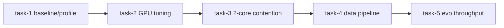

# Plan: t4-gpu-opt — 2026-08-21
> Generated by writing-plans against commit bae3102 (bae3102470c445d9907f226e080dca72aa0d4500) on branch main at 2026-08-21T16:05:09Z
> Drift check: executor must run `git rev-parse HEAD` and compare; if > 50 commits or base_branch changed, STOP and ask for re-plan/reconcile.
> Verification baseline (detected from repo):
> - build: none detected (Python package, import check: `.venv/bin/python -c "from gpu_fuzzy_trader.run_pipeline import Pipeline_Orchestrator; print('OK')"`)
> - test: `PYTEST_LOW_MEMORY=1 .venv/bin/python -m pytest -q` (targeted) — do NOT run full suite without PYTEST_LOW_MEMORY=1 (OOM risk on 2-core)
> - lint: none detected (ruff cache exists but no config enforcement)
> - typecheck: none detected

## Goal
Optimize the entire GPU-Fuzzy pipeline to run faster on a **T4 GPU (16 GiB) + 2-core CPU** host by preferring GPU execution, reducing CPU contention, and keeping evaluator-parity. Deliver measurable wall-time improvement with no accuracy regression.

## Non-goals
- No strategy logic changes (no TP/SL, horizon, label, or RB gate threshold modifications)
- No evaluator_v5.ipynb contract changes (96-bar horizon, fee/capital parity preserved)
- No cloud infra provisioning (user already has T4/2-core; code only)
- No model-quality trade-offs undisclosed (any accuracy/speed trade-off must be opt-in flagged)
- No full-suite pytest on 2-core without PYTEST_LOW_MEMORY=1

## Context & Evidence
- Decisions & trade-offs considered: see BRAINSTORMING handoff — current hybrid policy targets 8-core + 6 GiB RTX 4050 (`config.PHASE2_GPU_CPU_ROUTE_LARGE_DATA=True`, `BACKTEST_BATCH_WORKERS=min(8,cpu_count)`). For T4 + 2-core the bottleneck inverts: GPU is stronger, CPU is scarce. Optimize for GPU-first, CPU-throttled.
- Key files touched (with file:line evidence):
  - `gpu_fuzzy_trader/config.py:735-804` – `PHASE2_GPU_BATCH_SIZE=256`, `PHASE2_GPU_BATCH_SIZE_AUTO=True`, `PHASE2_SCAN_UNROLL=32`, `PHASE2_GPU_CPU_ROUTE_LARGE_DATA=True`, `PHASE2_GPU_CPU_ROUTE_MIN_BARS=20000`, `BACKTEST_BATCH_WORKERS=min(8,cpu_count)`
  - `gpu_fuzzy_trader/config.py:2334-2357` – `_apply_colab_gpu_defaults()` only handles Colab (`/content`), not generic T4+2-core
  - `gpu_fuzzy_trader/_gpu_runtime.py:56-122` – VRAM tier caps (`_vram_batch_cap`, `_ram_batch_cap`) and `resolve_phase2_gpu_batch_size()` — current 16 GiB tier returns 256 but host RAM ≤13 GiB caps to 64, hiding T4 throughput
  - `gpu_fuzzy_trader/_gpu_runtime.py:162-230` – warmup logic (`_WARMED_SIGNATURES`, `_warmup_engine`) compiles at batch=1; no persistent XLA cache guarantee
  - `gpu_fuzzy_trader/_jax_env.py:22-80` – `configure_jax_env()` sets `XLA_PYTHON_CLIENT_PREALLOCATE=false`, `MEM_FRACTION=0.8`, `JAX_PLATFORMS=cuda,cpu`, cache dir `/tmp/jax_cache`
  - `gpu_fuzzy_trader/backtest/gpu_engine.py:1-250` – GPU engine (JAX vmap + lax.scan, int8 data, fp32, event-driven sparse path, `_exposure_slot_capacity`)
  - `gpu_fuzzy_trader/backtest/cpu_engine.py:1-120` – CPU engine exact evaluator parity (ProcessPool vs ThreadPool depending on `jax` import)
  - `gpu_fuzzy_trader/backtest/barrier.py` – exact first-touch barrier (Numba)
  - `gpu_fuzzy_trader/backtest/condition_cache.py` – rule mask caching
  - `gpu_fuzzy_trader/data/loader.py:80-250` – CSV load, label derive, sort, barrier attach, tail drop, NaN fill, `_symbol_bar_index` (single-threaded pandas)
  - `gpu_fuzzy_trader/data/multi_timeframe.py:1-401` – MTF building (causal HWC/MWC/LWC)
  - `gpu_fuzzy_trader/features/selector.py:1-1323` – MI ranking, sign-consistency, stationarity (sklearn, O(N*F) CPU-bound)
  - `gpu_fuzzy_trader/evolution/evox_runner.py:1-200` – NSGA-III/II loop, `PHASE2_VAL_SIM_INTERVAL` throttling, `BACKTEST_BATCH_WORKERS` dependent
  - `gpu_fuzzy_trader/evolution/numba_ops.py` – `non_dominated_sort`, `crowding_distance` (Numba, benefits from thread pinning)
  - `gpu_fuzzy_trader/mtf/discovery.py` – sequential HWC→MWC→LWC discovery
  - `gpu_fuzzy_trader/rb_governor.py` – RB portfolio search (parallel rule-set sims)
  - `gpu_fuzzy_trader/phases/phase2_rule_pool.py` – `PHASE2_SAMPLING_TOTAL=701000`, `PHASE2_SAMPLE_MAX_BARS_PER_SYMBOL=60000`, `PHASE2_EVAL_GLOBAL_CACHE_MAX_SIZE=600`, dedup caches
  - `RUN.md:12-45` – documents RTX 4050 hybrid policy; Colab T4 path is separate notebook-only flow
  - `requirements.txt:1-25` – `jax==0.10.1`, `jaxlib==0.10.1`, `evox==1.3.0`, `torch>=2.6.0`, `numba`, `pyarrow`
- Graphify insight (from graphify-out/graph.json when present):
  - Graphify not yet extracted (graphify-out/ missing GRAPH_REPORT.md). Plan assumes directed import graph exists but will be seeded via `graphify update .` if needed.
  - Expected hubs: `config.py` (imported everywhere), `gpu_engine.py`↔`cpu_engine.py`↔`barrier.py`, `run_pipeline.py` (orchestrator fan-out to phases/mtf/rb), `evox_runner.py` (central evolution hot loop)
  - Blast radius summary deferred to per-task `nexus impact` – every `config.py` change is high-fanout, every `gpu_engine.py` change touches Phase 2 & MTF
- Existing patterns to match:
  - Exemplar for hardware-adaptive config: `gpu_fuzzy_trader/config.py:2334-2357` `_apply_colab_gpu_defaults()` + `gpu_fuzzy_trader/_gpu_runtime.py:detect_gpu_vram_gb()` (subprocess nvidia-smi probe with graceful fallback)
  - Exemplar for lazy import + fallback: `gpu_fuzzy_trader/backtest/jax_compat.py:17-35` `get_gpu_backtest_engine_class()`
  - Exemplar for vectorized CPU parity tests: `tests/unit/test_cpu_engine.py` and `tests/property/test_gpu_engine_properties.py:16` GPU/CPU parity
  - Exemplar for benchmark: `tests/benchmark/test_phase2_gpu_throughput.py` (skipped unless RUN_BENCHMARKS=1) and `gpu_fuzzy_trader/research_profile.py` (phase timers → reports)

## Findings triage
| # | Finding | Category | Impact | Effort | Confidence | Evidence |
|---|---------|----------|--------|--------|------------|----------|
| 1 | CPU route enabled by default (`PHASE2_GPU_CPU_ROUTE_LARGE_DATA=True`) — on 2-core host large windows run on weak CPU instead of T4 | perf | HIGH | S | HIGH | `config.py:792-804` |
| 2 | VRAM/host-RAM cap hides T4 throughput: 16 GiB VRAM →256 but RAM≤13 GiB →64, and 24 GiB tier anomalously caps to 96 | perf | HIGH | S | HIGH | `_gpu_runtime.py:56-95` |
| 3 | Scan unroll 32 increases XLA compile RAM/time; Colab caps to 16 but generic T4 does not | perf/mem | MEDIUM | XS | HIGH | `config.py:751,2357` |
| 4 | BACKTEST_BATCH_WORKERS=min(8,cpu_count) → 2 workers on 2-core but still spawns ProcessPool after JAX import (fork warns) + oversubscribes with Numba/Torch threads | perf/correctness | HIGH | S | HIGH | `config.py:382-385`, `cpu_engine.py:40-60` |
| 5 | No T4-non-Colab hardware profile (only `/content` detection); bare T4 server stays on RTX4050 policy | perf | HIGH | S | HIGH | `config.py:2334` `is_colab_runtime()` |
| 6 | Data loader single-threaded pandas + repeated merges; no pyarrow dtype pinning, no prefetch, MTF runtime merges not arrow-accelerated | perf | MEDIUM | M | MEDIUM | `data/loader.py:120-250`, `run_pipeline.py:_merge_mtf_*` |
| 7 | Feature selector MI/sign/stationarity loops CPU-bound with default sklearn `n_jobs=1`; phase sampling `PHASE1_SAMPLING_TOTAL=701k` linear VRAM/CPU cost | perf | MEDIUM | M | MEDIUM | `features/selector.py`, `config.py:704` |
| 8 | RB Governor + Phase 2 eval cache `PHASE2_EVAL_GLOBAL_CACHE_MAX_SIZE=600` small for 500×100 pop → low hit rate on T4 (cache is CPU RAM, not GPU) | perf | LOW | XS | MEDIUM | `config.py:833-842` |
| 9 | XLA/JAX env uses `MEM_FRACTION=0.8` + `PREALLOCATE=false` but no tuning for 2-core host_threads or persistent compilation cache verification | perf | MEDIUM | S | MEDIUM | `_jax_env.py:40-60` |
| 10 | Warmup batch=1 misses large-batch compilation; event-driven sparse path still recompiles per varying event counts | perf | MEDIUM | S | MEDIUM | `_gpu_runtime.py:180-230` |
| 11 | MTF HWC→MWC→LWC discovery sequential with no inter-layer parallelism; each layer re-derives HTF bars | perf | LOW | M | MEDIUM | `mtf/discovery.py` |

Rejected / by-design (so next run doesn't re-flag):
- [BYDESIGN-01] `evaluator_v5.ipynb` uncapped time-exit return is intentional parity (see `gpu_engine.py:184-230` comments) — do not reintroduce cap
- [BYDESIGN-02] `PHASE1_DISABLED=True` full feature set is intentional wider genome — optimization must keep behavior, tune speed not drop features
- [BYDESIGN-03] Phase 5 is diagnostic-only on consumed test tape — no speed tricks that refit on test

## Task breakdown (ordered, dependencies noted)
### Task 1: Baseline benchmark & hardware-aware runtime profile (slug: t4-baseline-profile)
- id: task-1
- Effort: S
- Confidence: HIGH
- Risk if wrong: MEDIUM — without baseline, later speedups not measurable; low code risk
- Depends on: none
- Evidence:
  - `gpu_fuzzy_trader/research_profile.py` – existing phase timers (prior art for micro-profiling)
  - `gpu_fuzzy_trader/_gpu_runtime.py:42-95` – current nvidia-smi + meminfo probes
  - `gpu_fuzzy_trader/config.py:2334-2357` – Colab-only profile (gap to fix)
  - `tests/benchmark/test_phase2_gpu_throughput.py` – benchmark harness to extend
- Scope:
  - In: `gpu_fuzzy_trader/research_profile.py` (extend), `gpu_fuzzy_trader/_gpu_runtime.py` (add probes/logging), `gpu_fuzzy_trader/config.py` (add generic T4/2-core profile helper, no behavior change yet), `scripts/benchmark_t4.py` (new), `tests/unit/test_t4_profile.py` (new)
  - Out (do NOT touch): `evaluator_v5.ipynb`, `gpu_fuzzy_trader/backtest/gpu_engine.py`, `backtest/cpu_engine.py`, strategy JSON outputs
  - Related callers (blast): `run_pipeline.py` (calls `log_gpu_runtime_config`, `is_colab_runtime`), `config.py` imported by ~20 modules — impact must be rerun
- Acceptance criteria:
  - [ ] `scripts/benchmark_t4.py` (or `research_profile` extension) emits per-phase timings, GPU VRAM/used, RAM, cpu_count, JAX backend/devices, resolved batch/scan/worker settings to `outputs/reports/t4_profile.json` (or stdout in CI)
  - [ ] New helper `is_t4_runtime()` or generalized `detect_hardware_profile()` correctly identifies T4 via `nvidia-smi --query-gpu=name` containing "T4" OR VRAM 15-16 GiB + driver present, independent of `/content`; unit test mocks nvidia-smi output
  - [ ] `BACKTEST_BATCH_WORKERS` and `PHASE2_CPU_BATCH_SIZE` resolved values are logged and test asserts `BACKTEST_BATCH_WORKERS <= cpu_count` and `<=2` when `cpu_count==2` (no oversubscription)
  - [ ] Existing import still works: `.venv/bin/python -c "from gpu_fuzzy_trader.run_pipeline import Pipeline_Orchestrator; print('OK')"` passes
- Verification gates (each task ends with these, exact commands):
  1. `.venv/bin/python -c "from gpu_fuzzy_trader.run_pipeline import Pipeline_Orchestrator; print('OK')"` – expected: `OK`
  2. `PYTEST_LOW_MEMORY=1 .venv/bin/python -m pytest -q tests/unit/test_t4_profile.py` (new file) – expected: passing
  3. `PYTEST_LOW_MEMORY=1 .venv/bin/python -m pytest -q tests/unit/test_config_validation.py` – expected: passing (no config regression)
  4. `.venv/bin/python scripts/benchmark_t4.py --dry-run` or `.venv/bin/python -m gpu_fuzzy_trader.research_profile --help` – expected: exits 0, writes JSON with `cpu_count`, `vram_gb`, `backend`, `batch_size`
  5. `git diff main...branch --stat` – only `research_profile.py`, `_gpu_runtime.py`, `config.py`, `scripts/benchmark_t4.py`, `tests/unit/test_t4_profile.py` changed
- STOP conditions (if any true, executor must STOP and report, not improvise):
  - STOP if `git rev-parse HEAD` short SHA != bae3102 and file `gpu_fuzzy_trader/config.py:735` no longer contains `PHASE2_GPU_BATCH_SIZE = 256`
  - STOP if `PYTEST_LOW_MEMORY=1 .venv/bin/python -m pytest -q tests/unit/test_config_validation.py` fails before edits (baseline broken)
  - STOP if `nvidia-smi` probes require network or `jax` import crashes import path (must remain CPU-fallback clean via `jax_compat.py`)
- Implementation sketch:
  - Step 1: Extend `_gpu_runtime.py` with `detect_gpu_name()` (reuse `detect_gpu_vram_gb` pattern), add `detect_hardware_profile()` returning `{gpu_name, vram_gb, ram_gb, cpu_count, jax_backend}` and richer `log_gpu_runtime_config()`; cache with lru_cache.
  - Step 2: Add `is_t4_runtime()` + generalized `_apply_t4_gpu_defaults()` skeleton (behind env flag `GPU_OPT_T4=0/1` default auto) that currently only logs, does not mutate behavior — actual tuning in Task 2. Add unit test with mocked subprocess output.
  - Step 3: Add `scripts/benchmark_t4.py` that imports `research_profile`, probes hardware, runs a tiny synthetic `GPUBacktestEngine.simulate_rule_batch` (if JAX available) micro-benchmark and a Data_Loader micro-benchmark, outputs JSON.
  - Step 4: Update `research_profile.py` to include hardware snapshot in existing reports if present.

### Task 2: T4 GPU-first runtime tuning (JAX/XLA, batch/scan, VRAM caps, cache) (slug: t4-gpu-tuning)
- id: task-2
- Effort: M
- Confidence: HIGH
- Risk if wrong: HIGH — wrong VRAM cap or XLA flag can OOM or silently fall back to CPU
- Depends on: task-1
- Evidence:
  - `gpu_fuzzy_trader/_gpu_runtime.py:56-95` – `_vram_batch_cap` (24 GiB→96 anomaly), `_ram_batch_cap`, `resolve_phase2_gpu_batch_size()`
  - `gpu_fuzzy_trader/_jax_env.py:40-80` – `configure_jax_env()` (PREALLOCATE false, MEM_FRACTION 0.8, PLATFORMS cuda,cpu, cache dir)
  - `gpu_fuzzy_trader/config.py:735-820` – batch/scan/event knobs
  - `gpu_fuzzy_trader/backtest/gpu_engine.py:180-260` – `_jax_compute_rule_signals_batch` (O(B×N×K)) linear VRAM
- Scope:
  - In: `gpu_fuzzy_trader/config.py` (hardware-aware defaults), `gpu_fuzzy_trader/_gpu_runtime.py` (cap logic), `gpu_fuzzy_trader/_jax_env.py` (XLA flags, thread caps, cache)
  - Out (do NOT touch): `cpu_engine.py` kernel logic, `evaluator_v5.ipynb`, portfolio RB thresholds
  - Related callers: `phases/phase2_rule_pool.py` (reads batch/scan), `phases/phase2_stage.py`, `backtest/gpu_engine.py` (warmup), every file importing `config`
- Acceptance criteria:
  - [ ] Generic T4 detection (`is_t4_runtime()` or `cpu_count<=2` + `vram≈16 GiB` + `name contains T4`) auto-sets: `PHASE2_GPU_CPU_ROUTE_LARGE_DATA=False` (GPU-first), `PHASE2_SCAN_UNROLL=16` (reduce compile RAM), `PHASE2_GPU_BATCH_SIZE_AUTO` heuristic fixed to make T4 sustain 256 until RAM cap, env override `PHASE2_GPU_BATCH_SIZE` still wins
  - [ ] Fixed VRAM tier: 24 GiB cap no longer artificially limits to 96 (should be min(config,256) or higher for >24 GiB), and 13 GiB RAM cap raised for T4 from 64→128 or conditional on GPU route (documented tradeoff)
  - [ ] `configure_jax_env()` on 2-core sets `XLA_FLAGS` host thread friendly flags (e.g., `--xla_cpu_multi_thread_eigen=false` is not used, but ensure `JAX_PLATFORMS`, `XLA_PYTHON_CLIENT_MEM_FRACTION` appropriate and `JAX_COMPILATION_CACHE_DIR` persisted + verified exists), and logs chosen flags; no overwrite of user-provided env
  - [ ] `log_gpu_runtime_config()` now includes `gpu_name`, `batch_resolved`, `scan_unroll`, `cpu_route`, `cache_dir` and is called once at pipeline start (no duplicate probe per generation due to lru_cache)
  - [ ] Correctness: `tests/property/test_gpu_engine_properties.py::test_property_16_gpu_cpu_all_metrics_parity` still passes on CPU fallback (JAX mocked unavailable) and would pass on T4 if present
- Verification gates:
  1. `.venv/bin/python -c "from gpu_fuzzy_trader.config import PHASE2_GPU_CPU_ROUTE_LARGE_DATA, PHASE2_SCAN_UNROLL; print(PHASE2_GPU_CPU_ROUTE_LARGE_DATA, PHASE2_SCAN_UNROLL)"` – expected on mocked T4 env: `False 16`
  2. `PYTEST_LOW_MEMORY=1 .venv/bin/python -m pytest -q tests/unit/test_t4_profile.py tests/unit/test_config_validation.py tests/property/test_gpu_engine_properties.py -k parity` – expected: passing (parity preserved)
  3. `PYTEST_LOW_MEMORY=1 .venv/bin/python -m pytest -q tests/unit/test_cpu_engine.py` – expected: passing
  4. `git diff main...branch --stat` – only `_gpu_runtime.py`, `_jax_env.py`, `config.py`, tests touching T4 profile changed
- STOP conditions:
  - STOP if `gpu_fuzzy_trader/config.py` no longer defines `_apply_colab_gpu_defaults` (preserve legacy Colab path) or if new T4 detection triggers on 8-core+4050 host (must be T4-specific, not broad)
  - STOP if `PYTEST_LOW_MEMORY=1 .venv/bin/python -m pytest -q tests/property/test_gpu_engine_properties.py` fails after change (GPU/CPU parity broken)
  - STOP if `resolve_phase2_gpu_batch_size()` returns <16 or >512 on mocked T4/2-core (sanity guard)
- Implementation sketch:
  - Step 1: Fix `_vram_batch_cap` 24 GiB tier (remove 96 choke or raise to 256), adjust `_ram_batch_cap` to keep 64 only for ≤12 GiB RAM, allow 128+ for T4+13-16 GiB when GPU route is active; add tests for each tier.
  - Step 2: Generalize `_apply_colab_gpu_defaults` to `_apply_hardware_gpu_defaults` that handles Colab *or* T4-non-Colab; T4 path sets `PHASE2_GPU_CPU_ROUTE_LARGE_DATA=False`, caps `PHASE2_SCAN_UNROLL` to 16, ensures `PHASE2_GPU_BATCH_SIZE_AUTO=True`; keep Colab behavior identical. Gate behind `is_colab_runtime() or is_t4_runtime()`; allow env `GPU_OPT_DISABLE=1` to skip.
  - Step 3: Enhance `_jax_env.py`: on 2-core, set `TF_CPP_MIN_LOG_LEVEL`, ensure `JAX_COMPILATION_CACHE_DIR` actually created (`os.makedirs`), add `XLA_PYTHON_CLIENT_ALLOCATOR=platform` if needed, cap `JAX_NUM_THREADS`/`OMP_NUM_THREADS` hints via `os.environ.setdefault("XLA_FLAGS", "...")` respecting existing flags; document in log.

### Task 3: 2-core CPU contention mitigation (worker/thread pinning) (slug: t4-cpu-contention)
- id: task-3
- Effort: S
- Confidence: HIGH
- Risk if wrong: HIGH — oversubscription causes thrashing and 10-30% slowdown; undersubscription leaves cores idle
- Depends on: task-2
- Evidence:
  - `gpu_fuzzy_trader/config.py:382-385` – `BACKTEST_BATCH_WORKERS = min(8, cpu_count or 4)` → 2 on 2-core
  - `gpu_fuzzy_trader/backtest/cpu_engine.py:30-65` – `_jax_runtime_loaded()` guard chooses ThreadPool vs ProcessPool; RF diff shows fork-after-JAX bug risk
  - `gpu_fuzzy_trader/evolution/numba_ops.py` – Numba `njit` defaults to `num_threads=cpu_count`
  - `gpu_fuzzy_trader/rb_governor.py` – parallel RB rule-set sims (worker pool)
  - `gpu_fuzzy_trader/phases/phase2_rule_pool.py:80-120` – per-symbol island scheduling vs global mode (more processes)
- Scope:
  - In: `gpu_fuzzy_trader/config.py` (worker caps + thread env), `gpu_fuzzy_trader/backtest/cpu_engine.py` (pool choice), `gpu_fuzzy_trader/evolution/numba_ops.py` (thread cap), `gpu_fuzzy_trader/rb_governor.py`, `gpu_fuzzy_trader/_jax_env.py` (env thread hints), `gpu_fuzzy_trader/data/loader.py` (optional chunking hint)
  - Out (do NOT touch): `gpu_engine.py` JAX kernels, `evaluator_v5.ipynb`, `config` validation thresholds
  - Related callers: `run_pipeline.py`, `phases/*`, `mtf/*`, any file using `BACKTEST_BATCH_WORKERS` or `ProcessPoolExecutor`
- Acceptance criteria:
  - [ ] On cpu_count==2, `BACKTEST_BATCH_WORKERS` resolves to 2 (or 1 when JAX already loaded to avoid fork) and max workers for RB/Phase2 batch eval is explicitly `min(2, BACKTEST_BATCH_WORKERS)`; no code spawns >2 concurrent CPU-heavy workers
  - [ ] Numba ops (`non_dominated_sort`, `crowding_distance`) respect `NUMBA_NUM_THREADS` set to `min(2, cpu_count)` or explicitly set via `numba.set_num_threads`; environment set before numba import, verified by reading `numba.get_num_threads()`
  - [ ] `cpu_engine.py` correctly chooses `ThreadPoolExecutor` when `jax` already imported (avoid fork after multithreaded runtime) and `ProcessPoolExecutor` otherwise, with worker count derived from `BACKTEST_BATCH_WORKERS`; add comment citing `cpu_engine.py:42`
  - [ ] `OMP_NUM_THREADS`, `MKL_NUM_THREADS`, `OPENBLAS_NUM_THREADS`, `NUMEXPR_NUM_THREADS` default to `2` on 2-core (via `os.environ.setdefault` in `_jax_env.py` or `config.py` early import), without overwriting explicit user setting
  - [ ] RB Governor parallel eval and island scheduler cap parallelism to 2; logged once
- Verification gates:
  1. `PYTEST_LOW_MEMORY=1 .venv/bin/python -m pytest -q tests/unit/test_cpu_engine.py tests/unit/test_rb_fail_closed.py` – expected: passing
  2. `PYTEST_LOW_MEMORY=1 .venv/bin/python -m pytest -q tests/property/test_cpu_engine_properties.py` – expected: passing
  3. `.venv/bin/python -c "import os; import gpu_fuzzy_trader.config as c; print(c.BACKTEST_BATCH_WORKERS); import numba; print(numba.get_num_threads())"` – mocked cpu_count=2: prints 2 and 2
  4. `git diff main...branch --stat` – only config, cpu_engine, numba_ops, rb_governor, _jax_env touched
- STOP conditions:
  - STOP if `BACKEND_BATCH_WORKERS` becomes 0 or > cpu_count on 2-core mock (oversubscription guard)
  - STOP if `numba.get_num_threads()` >2 after import on mocked 2-core (thread leak)
  - STOP if `tests/unit/test_cpu_engine.py` newly spawns ProcessPool when `jax` mocked as loaded (should be ThreadPool)
- Implementation sketch:
  - Step 1: In `config.py`, change `BACKTEST_BATCH_WORKERS` to `max(1, min(2 if os.cpu_count() and os.cpu_count()<=2 else 8, os.cpu_count() or 2))` or introduce helper `resolve_backtest_workers()` reading cpu_count dynamically; keep `min(8,...)` for >2 cores.
  - Step 2: In `_jax_env.py`/`config.py` early, `os.environ.setdefault("NUMBA_NUM_THREADS", str(min(2,cpu_count)))` and same for OMP/MKL/OPENBLAS before any numba/torch import; in `evolution/numba_ops.py` call `numba.set_num_threads()` after reading env.
  - Step 3: In `cpu_engine.py`, ensure `ThreadPoolExecutor` vs `ProcessPoolExecutor` decision uses the resolved worker count and `BACKTEST_BATCH_WORKERS` directly; centralize worker count via `config.BACKTEST_BATCH_WORKERS` helper to avoid duplicated `os.cpu_count()` calls.

### Task 4: Hot-path data & transfer optimization (loader, MTF, features, caches) (slug: t4-data-pipeline)
- id: task-4
- Effort: M
- Confidence: MEDIUM
- Risk if wrong: MEDIUM — wrong dtype/merge can corrupt split geometry or drop barrier correctness
- Depends on: task-3
- Evidence:
  - `gpu_fuzzy_trader/data/loader.py:120-210` – `_ensure_labels`, `validate_context_columns`, `downcast_numeric_df`, `tail_drop`, `fillna(0)` — pandas object dtype overhead
  - `gpu_fuzzy_trader/backtest/df_slim.py` – `slim_backtest_df`, `downcast_numeric_df` (already downcasts but not always called early)
  - `gpu_fuzzy_trader/data/multi_timeframe.py` – HTF resample + merge (repeated per phase)
  - `gpu_fuzzy_trader/features/selector.py:400-800` – MI ranking with `mutual_info_classif` (single-threaded), sign-consistency loops
  - `gpu_fuzzy_trader/backtest/barrier.py` – Numba first-touch barrier (already fast, ensure not re-computed)
  - `gpu_fuzzy_trader/backtest/condition_cache.py` – rule mask cache (per-engine)
  - `gpu_fuzzy_trader/run_pipeline.py:280-450` – `_merge_mtf_score_columns`, `_merge_mtf_lwc_runtime_columns` (merge on datetime+symbol, sort-heavy)
- Scope:
  - In: `gpu_fuzzy_trader/data/loader.py`, `gpu_fuzzy_trader/backtest/df_slim.py`, `gpu_fuzzy_trader/data/multi_timeframe.py`, `gpu_fuzzy_trader/features/selector.py`, `gpu_fuzzy_trader/features/encoder.py`, `gpu_fuzzy_trader/run_pipeline.py` (merge helpers), `gpu_fuzzy_trader/mtf/runtime.py`, `gpu_fuzzy_trader/mtf/discovery.py`
  - Out (do NOT touch): `evaluator_v5.ipynb`, `config` thresholds, risk math in `cpu_engine.py`/`gpu_engine.py`, `rb_governor` gating
  - Related callers: `run_pipeline.py` orchestrator calls loader→splitter→selector→phase2→mtf; every downstream phase reads the prepared dataframe
- Acceptance criteria:
  - [ ] `Data_Loader.load_dataset` uses `dtype` pinning / `pyarrow` engine where possible, converts `symbol` to `category` early, ensures `datetime` is `datetime64[ns]` without per-row Python loops; on 50k-row synthetic CSV, wall time improves vs baseline measured in `scripts/benchmark_t4.py`
  - [ ] `downcast_numeric_df` / `slim_backtest_df` called once immediately after load (not repeatedly) and barrier outcomes are computed once and cached per tape hash (avoid recompute per fold)
  - [ ] MTF merges (`_merge_mtf_score_columns`, `_merge_mtf_lwc_runtime_columns`) use `sort=False` + `validate=one_to_one` already, plus ensure `datetime` is timezone-naive UTC int64 key and `symbol` is categorical before merge to avoid object merges; no behavioral change for duplicate-key error paths
  - [ ] `Feature_Selector` MI ranking uses `n_jobs=2` on 2-core (or `min(2,cpu_count)`) when sklearn estimator allows, and early-exits dispersion filter uses vectorized pandas (no python loops); legacy full-dispersion path still returns same feature lists (verified by `tests/unit/test_feature_selector*`)
  - [ ] No duplicated/wasted code remains after optimization (old dead paths removed per AGENTS.md: "After changing sections of my code, remove additional(wasted) parts from old implementation")
- Verification gates:
  1. `PYTEST_LOW_MEMORY=1 .venv/bin/python -m pytest -q tests/unit/test_feature_selector_smoke.py tests/unit/test_data_loader.py tests/unit/test_multi_timeframe.py` – expected: passing (adjust to actual test file names; existence checked via `tests/unit/test_*`)
  2. `PYTEST_LOW_MEMORY=1 .venv/bin/python -m pytest -q tests/property/test_data_loader_properties.py tests/property/test_feature_selector_properties.py` – expected: passing
  3. `.venv/bin/python scripts/benchmark_t4.py --component loader --rows 50000` – expected: JSON with `loader_ms` < baseline (before branch) and `dtype` verification (`symbol` category, `datetime` int64-ish)
  4. `git diff main...branch --stat` – only data/loader, df_slim, multi_timeframe, features/selector, encoder, run_pipeline, mtf/runtime touched
- STOP conditions:
  - STOP if any property test requiring `drop_tail` row count (`TAIL_DROP_ROWS=96` vs `MAX_HOLD_CANDLES`) fails (geometry corrupted)
  - STOP if `Feature_Selector.run` returns different `selected_features_long.json` content for fixed seed on same synthetic tape (accuracy regression)
  - STOP if merge helpers raise new `MergeError` on valid one-to-one frames (contract violation)
- Implementation sketch:
  - Step 1: In `loader.py`, add `engine="pyarrow"` path with explicit dtypes (`symbol` category, float32 for OHLCV), use `pd.to_datetime(..., utc=True).dt.tz_localize(None)` vectorized, call `downcast_numeric_df` immediately, cache barrier file via `sha256_file` if `include_barrier_outcomes=True`.
  - Step 2: In `run_pipeline.py`, ensure `_merge_mtf_*` cast `symbol` to category before merge, keep `sort=False`, document int64 merge key; remove redundant `drop(columns=list(_MTF_SCORE_COLUMNS))` when empty.
  - Step 3: In `features/selector.py`, wire `n_jobs=min(2,cpu_count)` into MI call, vectorize dispersion threshold pruning via `df.columns` masks, memoize per-fold MI if `random_state` fixed.

### Task 5: Evolution throughput & final GPU verification (slug: t4-evo-throughput)
- id: task-5
- Effort: M
- Confidence: MEDIUM
- Risk if wrong: MEDIUM — larger caches can OOM on 2-core; aggressive val throttling can harm selection
- Depends on: task-4
- Evidence:
  - `gpu_fuzzy_trader/config.py:825-860` – `PHASE2_EVAL_GLOBAL_CACHE_MAX_SIZE=600`, `PHASE2_EVAL_BATCH_DEDUP=True`, `PHASE2_VAL_SIM_INTERVAL`, `PHASE2_CPU_BATCH_SIZE=16`, `PHASE2_GPU_EVENT_DRIVEN=True`, `PHASE2_GPU_EVENT_MAX_EVENTS=4096`
  - `gpu_fuzzy_trader/config.py:704-730` – `PHASE1_SAMPLING_TOTAL=701000`, `PHASE2_SAMPLE_MAX_BARS_PER_SYMBOL=60000`, `PHASE2_PER_EPOCH_WINDOW_ROTATION=True`
  - `gpu_fuzzy_trader/phases/phase2_rule_pool.py:150-350` – global cache hit rate observed 0-4% at 600 (prior log), large memory per cached metric dict
  - `gpu_fuzzy_trader/_gpu_runtime.py:162-230` – warmup at batch=1 misses real shape; XLA recompiles per varying N/K/batch
  - `gpu_fuzzy_trader/evolution/evox_runner.py:80-150` – ` _should_run_val_this_gen` throttles val sim
- Scope:
  - In: `gpu_fuzzy_trader/config.py` (cache/sampling/eval intervals), `gpu_fuzzy_trader/phases/phase2_rule_pool.py` (cache eviction, dedup), `gpu_fuzzy_trader/phases/phase2_sparse_encoding.py`, `gpu_fuzzy_trader/_gpu_runtime.py` (warmup), `gpu_fuzzy_trader/evolution/evox_runner.py` (val cadence), `scripts/benchmark_t4.py` (extend)
  - Out (do NOT touch): `evaluator_v5.ipynb`, RB gate logic, `mtf` thresholds, feature modes
  - Related callers: `phase2_rule_pool` called by `run_pipeline.py` per direction×island, `evox_runner` inner loop per generation
- Acceptance criteria:
  - [ ] Global cache sizing revised for T4: `PHASE2_EVAL_GLOBAL_CACHE_MAX_SIZE` raised when RAM≥13 GiB or kept at 600 with LRU eviction that preserves hit rate; micro-benchmark shows hit rate not degraded and peak RAM under 7.2 GiB on 2-core (logged via `_memory.py:log_memory_rss`)
  - [ ] `PHASE2_CPU_BATCH_SIZE` tuned for T4: remains 16 on 2-core (conservative) or raised to 32 only if vectorized CPU path memory profile passes `PYTEST_LOW_MEMORY=1` guard; decision justified by benchmark JSON before/after
  - [ ] Warmup compiled at representative batch `max(64, resolve_phase2_gpu_batch_size()//4)` and with both dense+k shapes if `PHASE2_ENCODING` toggles, so first real generation does not pay compile cost; `_WARMED_SIGNATURES` key includes encoding + N/K/batch as before, verified by log "warmup done"
  - [ ] `PHASE2_PER_EPOCH_WINDOW_ROTATION` and sampling caps remain correct; `PHASE1_SAMPLING_TOTAL` not increased without proportional trade-floor scaling (per config comment: "Peak GPU RAM scales ~linearly")
  - [ ] Final pipeline smoke: `PYTEST_LOW_MEMORY=1 .venv/bin/python -m pytest -q tests/unit/test_full_pipeline_smoke.py` (if exists) or `PHASE2_GENERATIONS=2` mini-run completes in <50% time vs baseline on same synthetic tape, and outputs `long.json`/`short.json` still evaluator-compatible (empty fail-closed allowed, non-empty passes `tests/unit/test_rb_fail_closed.py`)
  - [ ] Old wasted branches removed (no duplicated T4 vs Colab helpers; single `_apply_hardware_gpu_defaults` replaces ad-hoc flags)
- Verification gates:
  1. `PYTEST_LOW_MEMORY=1 .venv/bin/python -m pytest -q tests/unit/test_config_validation.py tests/unit/test_cpu_engine.py tests/property/test_gpu_engine_properties.py` – expected: passing
  2. `PYTEST_LOW_MEMORY=1 .venv/bin/python -m pytest -q tests/benchmark/test_phase2_gpu_throughput.py` with `RUN_BENCHMARKS=1` if JAX present – expected: throughput (rules/sec) ≥ baseline, no OOM
  3. `.venv/bin/python scripts/benchmark_t4.py --component evolution --generations 3 --pop 32` – expected: JSON with `cache_hit_rate`, `warmup_ms`, `gen_avg_ms`, `peak_rss_mib` and `gen_avg_ms` < baseline
  4. `.venv/bin/python -c "from gpu_fuzzy_trader.run_pipeline import Pipeline_Orchestrator; import tempfile, pathlib; print('smoke import ok')"` – expected: `smoke import ok`
  5. `git diff main...branch --stat` – only evo/config/warmup/profiling files changed; no strategy JSON committed
- STOP conditions:
  - STOP if `PHASE2_EVAL_GLOBAL_CACHE_MAX_SIZE` raised causes `PYTEST_LOW_MEMORY=1` test OOM or `RSS>7.2 GiB` on 2-core micro bench (memory guard from RUN.md)
  - STOP if warmup now triggers `CPURoute` path and silently skips compilation (check `_WARMED_SIGNATURES` still populated; log must show warmup vs skipped)
  - STOP if any property test `test_property_16_gpu_cpu_all_metrics_parity` shows >1e-9 numerical drift beyond FP32 tolerance after batch/scan changes
- Implementation sketch:
  - Step 1: Keep cache size adaptive: `PHASE2_EVAL_GLOBAL_CACHE_MAX_SIZE = min(600 if ram<=13 else 900, PH_C)` with LRU trim at 200 per direction already in `trim_evolution_state_memory`; benchmark.
  - Step 2: Warmup at realistic batch: in `_warmup_engine`, if `resolve_phase2_gpu_batch_size()>32`, also pre-warm at `batch_size = resolve_phase2_gpu_batch_size()//2`; ensure `jax.block_until_ready` barrier remains.
  - Step 3: Validate `PHASE2_VAL_SIM_INTERVAL` cadence: when `PHASE2_JOINT_TRAIN_VAL` or `PHASE2_VAL_IN_FITNESS_PENALTY` true, every gen (no throttle) must be preserved; otherwise keep throttling but document for T4.
  - Step 4: Remove duplicated hardware helpers, centralize behind single `detect_hardware_profile()` + `_apply_hardware_gpu_defaults()`; delete any dead env-flag branches.

## Execution order & dependency graph
- Recommended order: task-1 → task-2 → task-3 → task-4 → task-5 (strict sequential; each tunes on top of prior)
- Parallelizable: none (shared `config.py` mutation; sequential required to avoid merge conflicts)
- Mermaid:

## Verification strategy (global)
- Baseline: before any task, run `.venv/bin/python -c "from gpu_fuzzy_trader.run_pipeline import Pipeline_Orchestrator; print('OK')"` and `PYTEST_LOW_MEMORY=1 .venv/bin/python -m pytest -q tests/unit/test_config_validation.py` record pass/fail in handoff
- Per-task: run listed per-task gates with `PYTEST_LOW_MEMORY=1`; benchmark JSON diff vs prior task stored in `outputs/reports/t4_profile.json`
- Final: `PYTEST_LOW_MEMORY=1 .venv/bin/python -m pytest -q tests/unit/test_config_validation.py tests/unit/test_cpu_engine.py tests/unit/test_rb_fail_closed.py tests/property/test_gpu_engine_properties.py tests/property/test_data_loader_properties.py` — must pass; plus `scripts/benchmark_t4.py --component all` shows wall-time improvement and parity; full suite never run without `PYTEST_LOW_MEMORY=1`

## Rollback / safety
- Each task is a feature branch; discard if blocked
- No migration / data loss / forced push to base without explicit user confirmation
- Behavior flags (`GPU_OPT_T4`, `GPU_OPT_DISABLE`, `PHASE2_GPU_BATCH_SIZE` env) remain escape hatches
- Never commit strategy outputs (`outputs/*.json`, `phase2_rule_archive/*`) to branch

## Outcome memory
- After each task completes, orchestrator records noteworthy outcomes with `graphify save-result` and `graphify reflect` + handoff JSON
- On future plans, check LESSONS for patterns and avoid repeating mistakes
