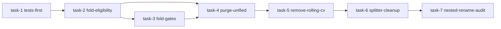

# Plan: unified-fold-gates — 2026-08-25
> Generated by writing-plans against commit d151be4 (d151be48c23dad8f02c1a852cc2bf1f1a1b72ea3) on branch main at 2026-08-25T15:05:38+03:30
> Drift check: executor must run `git rev-parse HEAD` and compare; if > 50 commits or base_branch changed, STOP and ask for re-plan/reconcile.
> Verification baseline (detected from repo):
> - build: none detected (Python package, no build step)
> - test:  PYTEST_LOW_MEMORY=1 .venv/bin/python -m pytest -q --ignore=tests/benchmark
> - lint:  none detected
> - typecheck: none detected

## Goal
Unify the pipeline on a single Top-Level Holdout (65% development / 35% validation with 96-candle embargo) plus one Adaptive Purged Expanding Master Temporal Fold system with FoldEligibility, single-source Purge per role, and fold-aware Count-gate scaling (quality gates fixed), removing the deprecated `purged_walk_forward` / `SPLIT_MODE` / `rolling_cv.py` / pseudo-nested path and achieving auditability.

## Non-goals
- Full true nested-validation research evaluation mode (outer reruns of HWC→MWC→LWC→Phase2→RB) — out of scope for this refactor; only removal/rename of current pseudo-nested module
- New trading signals, new features, or changes to RB optimization logic beyond gate/purge wiring
- Retraining or re-tuning hyperparameters; all hyperparameter values stay as configured, only derivation/derivation-location changes

## Context & Evidence
- Decisions & trade-offs: keep Top-Level Holdout as-is (65/35 + 96 embargo), expanding walk-forward only on `train_df` (Phase 3-4), equal time > equal rows (Phase 16), count-gates scale / quality gates fixed (Phase 8), absolute evidence floor (Phase 9)
- Key files touched (with file:line evidence):
  - `gpu_fuzzy_trader/config.py:251` – `SPLIT_MODE = "holdout"` abstraction to be removed (Phase 2)
  - `gpu_fuzzy_trader/config.py:289-332` – deprecated `PURGED_WF_*`, `CV_FOLDS_MANIFEST_PATH`, `_PURGED_WF_REFERENCE_ROWS` to be removed (Phase 1)
  - `gpu_fuzzy_trader/config.py:2240-2272` – `split_mode_is_purged_walk_forward()`, `set_purged_wf_reference_rows()`, `scale_trade_floor()` to be removed/replaced (Phase 1, 22)
  - `gpu_fuzzy_trader/config.py:499-513` – `MTF_HWC_HORIZON_BARS=6`, `MTF_MWC_HORIZON_BARS=4`, `MTF_N_FOLDS=4`, `MTF_MIN_FOLD_SUPPORT=2` to be evolved to `MTF_MAX_FOLDS/MTF_MIN_FOLDS` + ratio (Phase 5, 10)
  - `gpu_fuzzy_trader/config.py:361-371` – `MAX_HOLD_CANDLES=96`, `VALIDATION_HALF_PURGE_CANDLES=96`, `HOLDOUT_EMBARGO_CANDLES=96` — single purge source (Phase 13, 18)
  - `gpu_fuzzy_trader/validation/rolling_cv.py:1-538` – entire deprecated purged walk-forward implementation to be audited then deleted (Phase 1)
  - `gpu_fuzzy_trader/data/splitter.py:114-139` – `_purged_walk_forward_split()` to be removed; `_holdout_embargo_split()` becomes sole path (Phase 2)
  - `gpu_fuzzy_trader/data/splitter.py:173-210` – `split_validation_fitness_selection()` currently `max(VALIDATION_HALF_PURGE, HOLDOUT_EMBARGO, PURGED_WF_EMBARGO)` — simplify to `VALIDATION_PURGE_CANDLES = MAX_HOLD_CANDLES` single gap (Phase 18)
  - `gpu_fuzzy_trader/data/splitter.py:165-166` – `TRAIN_70_PATH` / `VALIDATION_30_PATH` stale 70/30 names to rename (Phase 20)
  - `gpu_fuzzy_trader/mtf/cross_fitting.py:19-21` – hardcoded `DEFAULT_*_PURGE_MINUTES` (1440/240/1440 vs stale 720 comment) to be derived from horizons (Phase 13)
  - `gpu_fuzzy_trader/mtf/cross_fitting.py:43-44` – `TemporalFold.is_seed` + `purge_minutes` to be removed / role-eligibility (Phases 12, 14)
  - `gpu_fuzzy_trader/mtf/cross_fitting.py:89-168` – `build_master_temporal_folds()` expanding logic to gain adaptive K + eligibility + per-symbol rows (Phases 5, 15-16)
  - `gpu_fuzzy_trader/mtf/cross_fitting.py:236-271` – `generate_oof_scores()` generic `is_seed` skip to become `eligible_for_role(fold, "hwc"|"mwc"|"lwc")` (Phases 11-12)
  - `gpu_fuzzy_trader/validation/nested_walk_forward.py:1-264` – pseudo-nested evaluation to be removed/renamed to `walk_forward_stability_report.py` (Phase 19)
  - `tests/unit/test_mtf_cross_fitting.py:1-80` – existing fold/purge tests to retain and extend
  - `tests/unit/test_data_splitter.py:1-100` – existing splitter tests asserting holdout+embargo; will be updated after splitter simplification
- Impact insight (from static reading; `nexus impact --json` to be run pre-task):
  - Direct dependents of `scale_trade_floor` / `PURGED_WF_*`: `gpu_fuzzy_trader/evolution/*`, `gpu_fuzzy_trader/phases/*`, `gpu_fuzzy_trader/rb_governor.py`, `gpu_fuzzy_trader/validation/rolling_cv.py`
  - Blast radius of `rolling_cv.py` deletion: imports in `gpu_fuzzy_trader/data/splitter.py`, `tests/unit/test_config_trade_scaling.py`, any aggregation helpers
  - Blast radius of `TemporalFold` field removal: `gpu_fuzzy_trader/mtf/*`, `gpu_fuzzy_trader/scoring/*`, `tests/unit/test_mtf_cross_fitting.py`
  - Affected tests: `test_mtf_cross_fitting`, `test_data_splitter`, `test_config_trade_scaling`, `test_config_validation`, property tests for splitter
- Existing patterns to match:
  - Exemplar: `gpu_fuzzy_trader/mtf/cross_fitting.py` — dataclass `TemporalFold`, pure functions `build_master_temporal_folds`, `apply_purge_embargo`, `generate_oof_scores` with UTC-normalized datetimes, `validate_master_temporal_folds` monotonic checks
  - Exemplar: `gpu_fuzzy_trader/data/splitter.py` — per-symbol chronological grouping, `_holdout_embargo_split` pattern, `downcast_numeric_df` before parquet, manifest with SHA256
  - Exemplar: `gpu_fuzzy_trader/config.py` — `validate_config()` + `effective_config_snapshot()` audit pattern

## Task breakdown (ordered, dependencies noted)
### Task 1: Fold/Gate regression & leakage tests first (slug: tests-first)
- id: task-1
- Effort: M
- Confidence: HIGH
- Risk if wrong: HIGH — without tests the adaptive-fold/gate/purge refactor cannot be verified
- Depends on: none
- Evidence:
  - `tests/unit/test_mtf_cross_fitting.py:1-80` – existing fold structure/purge tests to extend
  - `gpu_fuzzy_trader/mtf/cross_fitting.py:89-393` – current fold geometry/OOF to be characterized by tests
  - `gpu_fuzzy_trader/config.py:2240-2272` – current `scale_trade_floor` behavior to lock in scaling formula
- Scope:
  - In: `tests/unit/test_unified_folds.py` (new), `tests/unit/test_fold_gates.py` (new), `tests/unit/test_purge_leakage.py` (new), fixtures for multi-symbol / missing bars
  - Out (do NOT touch): `gpu_fuzzy_trader/config.py`, `gpu_fuzzy_trader/mtf/cross_fitting.py`, `gpu_fuzzy_trader/validation/*`, `gpu_fuzzy_trader/data/splitter.py`
  - Related callers (blast): future consumers of fold_gates and eligibility
- Acceptance criteria:
  - [ ] `test_unified_folds` covers: train precedes test, no overlap, monotonic expanding train, test intervals contiguous, adaptive K eligibility (tiny fold rejected), per-symbol coverage (NEWCOIN half-history rejected)
  - [ ] `test_fold_gates` covers: reference 100k base 40 → 100k→40, 50k→20, 25k→10, 5k→absolute_min; PF/MCC/MDD unchanged when fold size shrinks; Train-gate uses train exposure, OOF-gate uses OOF exposure
  - [ ] `test_purge_leakage` covers: for synthetic future spike, HWC/MWC/LWC last usable train label never reaches test_start for all three roles; HWC Fold1 usable, MWC Fold1 unavailable via role-specific eligibility
  - [ ] All new tests pass on `main` before any production change
- Verification gates (each task ends with these, exact commands):
  1. `PYTEST_LOW_MEMORY=1 .venv/bin/python -m pytest -q tests/unit/test_mtf_cross_fitting.py tests/unit/test_data_splitter.py` – expected: pass on main
  2. `PYTEST_LOW_MEMORY=1 .venv/bin/python -m pytest -q tests/unit/test_unified_folds.py tests/unit/test_fold_gates.py tests/unit/test_purge_leakage.py` – expected: all pass
  3. `git diff main...HEAD --stat` – only `tests/` files changed
- STOP conditions:
  - STOP if `tests/unit/test_mtf_cross_fitting.py` already failing on `main` (run baseline first)
  - STOP if `gpu_fuzzy_trader/mtf/cross_fitting.py:build_master_temporal_folds` does not contain expanding logic at line 89-168 as assumed
  - STOP if another task branch already modified `tests/` in a conflicting way (`git log main..HEAD -- tests/` non-empty)
- Implementation sketch:
  - Step 1: Create helpers `_make_synthetic_df(symbols, freq, missing bars)` reusable for multi-symbol tests.
  - Step 2: Write fold geometry tests against `build_master_temporal_folds` / `validate_master_temporal_folds`.
  - Step 3: Write gate scaling tests that will initially import a stub `validation/fold_gates.py` (to be implemented in Task 3) — keep Task 1 tests against the scaling *spec* using a local inline reference implementation, so they pass before the module exists; or guard import with skip. Prefer inline spec so Task 1 is independent.
  - Step 4: Write leakage tests: synthetic dataset with clear future pattern, assert thresholds/gates cannot access test fold.

### Task 2: Unified FoldContext + FoldEligibility + Adaptive K + per-symbol audit (slug: fold-eligibility)
- id: task-2
- Effort: M
- Confidence: MEDIUM
- Risk if wrong: HIGH — tiny folds accepted → spurious gates (Phase 5 principle)
- Depends on: task-1
- Evidence:
  - `gpu_fuzzy_trader/mtf/cross_fitting.py:30-56` – current `TemporalFold` fields (`is_seed`, `purge_minutes`)
  - `gpu_fuzzy_trader/config.py:510-513` – `MTF_N_FOLDS=4`, `MTF_MIN_FOLD_SUPPORT=2`
  - `gpu_fuzzy_trader/config.py:499-500` – `MTF_HWC_HORIZON_BARS`, `MTF_MWC_HORIZON_BARS`
- Scope:
  - In: `gpu_fuzzy_trader/mtf/cross_fitting.py`, `gpu_fuzzy_trader/config.py` (new config: `MTF_MAX_FOLDS`, `MTF_MIN_FOLDS`, `MTF_MIN_FOLD_SUPPORT_RATIO`, `FOLD_MIN_EFFECTIVE_ROWS`, `FOLD_MIN_ROWS_PER_SYMBOL`, `FOLD_ABSOLUTE_MIN_TRADES`, `FOLD_MIN_DURATION_BARS`, `FOLD_MIN_SYMBOL_COVERAGE`), `gpu_fuzzy_trader/validation/fold_manifest.py` (optional helper)
  - Out (do NOT touch): `gpu_fuzzy_trader/validation/rolling_cv.py`, `gpu_fuzzy_trader/data/splitter.py`, `gpu_fuzzy_trader/validation/nested_walk_forward.py`
  - Related callers: `generate_oof_scores`, any future `validation/fold_gates.py`, reporting
- Acceptance criteria:
  - [ ] `TemporalFold` no longer carries `purge_minutes`; geometry only (`fold_id, train_start, train_end, test_start, test_end`)
  - [ ] New `FoldContext`/`FoldEligibility` dataclass with `train_rows, test_rows, per_symbol_rows, train_duration, test_duration, symbols_available, eligible, reason`
  - [ ] `build_master_temporal_folds(df, max_folds=4, min_folds=2, ...)` tries K=4 then 3 then 2; fails closed if even min_folds ineligible; manifest records per-fold `train_rows/test_rows/per_symbol_*`
  - [ ] Approximately equal time partitions preserved (not row-equalized); eligibility checks duration + rows + per-symbol coverage
  - [ ] Task 1 tests (fold geometry + multi-symbol) pass with new adaptive logic
- Verification gates:
  1. `PYTEST_LOW_MEMORY=1 .venv/bin/python -m pytest -q tests/unit/test_unified_folds.py` – expected: pass (adaptive K cases now exercise real code)
  2. `PYTEST_LOW_MEMORY=1 .venv/bin/python -m pytest -q tests/unit/test_mtf_cross_fitting.py` – expected: pass (update expectations: `is_seed` removed, validate still holds with new fields)
  3. `PYTEST_LOW_MEMORY=1 .venv/bin/python -m pytest -q tests/unit/test_config_validation.py` – expected: pass (new config constraints validated)
- STOP conditions:
  - STOP if `gpu_fuzzy_trader/mtf/cross_fitting.py` no longer contains `TemporalFold` dataclass at line 30
  - STOP if `gpu_fuzzy_trader/config.py` already has `MTF_MAX_FOLDS` introduced by another branch
  - STOP if `validate_master_temporal_folds` cannot be extended without breaking downstream `gpu_fuzzy_trader/mtf/*` callers (check `grep -R validate_master_temporal_folds`)
- Implementation sketch:
  - Step 1: In `config.py` add `MTF_MAX_FOLDS=4`, `MTF_MIN_FOLDS=2`, `MTF_MIN_FOLD_SUPPORT_RATIO=0.67`, `FOLD_MIN_EFFECTIVE_ROWS`, `FOLD_MIN_ROWS_PER_SYMBOL`, `FOLD_ABSOLUTE_MIN_TRADES=5`, `FOLD_MIN_DURATION_BARS`, `FOLD_MIN_SYMBOL_COVERAGE` with `validate_config` checks; keep `MTF_N_FOLDS` temporarily as deprecated alias then remove in Task 7.
  - Step 2: In `cross_fitting.py` introduce `FoldContext`/`FoldExposure`/`FoldEligibility`, implement `assess_fold_eligibility(fold, df)` computing per-symbol rows/duration.
  - Step 3: Refactor `build_master_temporal_folds` to loop K descending, build boundaries equal-time, assess eligibility, return eligible set or fail closed; add `build_fold_contexts` helper.
  - Step 4: Remove `TemporalFold.purge_minutes` and update `to_dict`/`get_train_slice` signature to require explicit `purge_minutes` param.

### Task 3: Fold-aware Count Gate system + absolute floor + fixed quality gates (slug: fold-gates)
- id: task-3
- Effort: M
- Confidence: MEDIUM
- Risk if wrong: MEDIUM — wrong exposure (train vs OOF) scales gates incorrectly
- Depends on: task-2
- Evidence:
  - `gpu_fuzzy_trader/config.py:2253-2272` – current `scale_trade_floor()` scaled by `reference_rows` with `PURGED_WF_*` absolute floor
  - `gpu_fuzzy_trader/config.py:321-327` – `PURGED_WF_SCALE_TRADE_FLOORS`, `PURGED_WF_MIN_TRADE_FLOOR_ABSOLUTE=5`
  - `gpu_fuzzy_trader/evolution/*`, `gpu_fuzzy_trader/phases/*` – callers of `scale_trade_floor`
- Scope:
  - In: `gpu_fuzzy_trader/validation/fold_gates.py` (new), `gpu_fuzzy_trader/config.py` (wire `FOLD_ABSOLUTE_MIN_TRADES` etc), `gpu_fuzzy_trader/phases/*`, `gpu_fuzzy_trader/evolution/*`, `gpu_fuzzy_trader/rb_governor.py` (migrate callers)
  - Out (do NOT touch): `gpu_fuzzy_trader/validation/rolling_cv.py`, `gpu_fuzzy_trader/data/splitter.py`
  - Related callers: all `scale_trade_floor` and `scale_trade_floor_by_universe` consumers
- Acceptance criteria:
  - [ ] New `gpu_fuzzy_trader/validation/fold_gates.py` with `FoldExposure(rows, duration_bars, per_symbol_rows)`, `scale_count_gate(base, exposure, reference, absolute_min) = max(absolute_min, ceil(base * E_f/E_ref))`, `build_fold_gate_context(scoring_df, reference_df)`, `resolve_fold_gates(base_gates, gate_context)` that scales only count-based gates (MinTrades/MinSignals/MinSupport/MinCandidateSupport/min_trades_per_symbol) and leaves PF/MCC/Edge/WinRate/Sortino/MDD/Return fixed
  - [ ] Correct exposure selection: gates evaluated on Train → train exposure; OOF → OOF exposure (explicit test)
  - [ ] `MTF_MIN_FOLD_SUPPORT` converted to `MTF_MIN_FOLD_SUPPORT_RATIO` with `RequiredFolds = max(2, ceil(eligible_folds * ratio))` (e.g. `ceil(eligible*0.67)`)
  - [ ] Task 1 gate tests now import real `fold_gates` module and pass
  - [ ] Legacy `scale_trade_floor()` retained as thin deprecated wrapper or removed after migration (per plan: remove after replacements in place)
- Verification gates:
  1. `PYTEST_LOW_MEMORY=1 .venv/bin/python -m pytest -q tests/unit/test_fold_gates.py tests/unit/test_config_trade_scaling.py` – expected: pass with real gate module
  2. `PYTEST_LOW_MEMORY=1 .venv/bin/python -m pytest -q tests/unit/test_mtf_cross_fitting.py tests/unit/test_mtf_composer.py` – expected: pass
  3. `grep -R "scale_trade_floor" --include="*.py" gpu_fuzzy_trader/` – only `validation/fold_gates.py` or deprecated shim remains
- STOP conditions:
  - STOP if `gpu_fuzzy_trader/config.py:scale_trade_floor` does not exist at line 2253 as assumed (plan assumption broken)
  - STOP if Task 2 did not create `FoldExposure` / eligibility types needed for gate context
  - STOP if quality-gate invariance tests fail (PF/MCC changed with fold size)
- Implementation sketch:
  - Step 1: Create `validation/fold_gates.py` with HWC→MWC→LWC exposure handling, absolute floor, and manifest-ready output dict (`exposure_ratio`, `min_trades`, etc).
  - Step 2: Migrate callers from `config.scale_trade_floor` to `fold_gates.scale_count_gate` with explicit exposure.
  - Step 3: Add `MTF_MIN_FOLD_SUPPORT_RATIO` and deprecate fixed `MTF_MIN_FOLD_SUPPORT`.
  - Step 4: Ensure pooled vs macro metrics guidance documented (Phase 17) even if aggregation kept simple.

### Task 4: Single-source Purge + role-specific eligibility (slug: purge-unified)
- id: task-4
- Effort: M
- Confidence: MEDIUM
- Risk if wrong: HIGH — leakage if purge horizon mismatched
- Depends on: task-2, task-3
- Evidence:
  - `gpu_fuzzy_trader/mtf/cross_fitting.py:19-21` – hardcoded `DEFAULT_*_PURGE_MINUTES` vs comment `48*15m=12h` vs actual `MAX_HOLD_CANDLES=96` → 1440m (Phase 13)
  - `gpu_fuzzy_trader/config.py:499-500, 361` – `MTF_HWC_HORIZON_BARS=6*240=1440`, `MTF_MWC_HORIZON_BARS=4*60=240`, `MAX_HOLD_CANDLES=96*15=1440` — correct derivation
  - `gpu_fuzzy_trader/mtf/cross_fitting.py:236-280` – `generate_oof_scores` with `exclude_seed` / `is_seed` generic skip (Phase 11-12)
- Scope:
  - In: `gpu_fuzzy_trader/config.py` (derive `HWC_PURGE_MINUTES`, `MWC_PURGE_MINUTES`, `LWC_PURGE_MINUTES` from horizons), `gpu_fuzzy_trader/mtf/cross_fitting.py` (remove `is_seed`, add `eligible_for_role(fold, role)`), `gpu_fuzzy_trader/mtf/*`, `gpu_fuzzy_trader/scoring/*`
  - Out (do NOT touch): `gpu_fuzzy_trader/validation/rolling_cv.py`, `gpu_fuzzy_trader/data/splitter.py` (purge fix there is Task 6)
  - Related callers: `generate_oof_scores`, HWC/MWC/LWC discovery pipelines
- Acceptance criteria:
  - [ ] `config.py` derives `HWC_PURGE = MTF_HWC_HORIZON_BARS * 240` (HWC timeframe 240m), `MWC_PURGE = MTF_MWC_HORIZON_BARS * 60`, `LWC_PURGE = MAX_HOLD_CANDLES * 15`; hardcoded `DEFAULT_*_PURGE_MINUTES` removed
  - [ ] `TemporalFold` has no `purge_minutes` nor `is_seed`; geometry-only (Task 2 already removed purge_minutes, here remove is_seed and update validators)
  - [ ] `eligible_for_role(fold, "hwc"|"mwc"|"lwc")` implemented: HWC uses all eligible folds, MWC excludes first fold lacking HWC OOF, LWC similarly downstream; `generate_oof_scores` accepts `role=` param and delegates to `eligible_for_role`
  - [ ] `TemporalFold.get_train_slice(df, role=...)` or `get_train_slice(df, purge_minutes=purge_for_role(role))` — purge applied at retrieval, not stored in fold
  - [ ] Tests assert `HWC Fold1 usable`, `MWC Fold1 unavailable`, MWC never receives in-sample HWC score
- Verification gates:
  1. `PYTEST_LOW_MEMORY=1 .venv/bin/python -m pytest -q tests/unit/test_mtf_cross_fitting.py tests/unit/test_purge_leakage.py` – expected: pass (role-specific OOF)
  2. `PYTEST_LOW_MEMORY=1 .venv/bin/python -m pytest -q tests/unit/test_mtf_audit_fixes.py tests/unit/test_mtf_composer.py` – expected: pass
  3. `grep -R "is_seed" --include="*.py" gpu_fuzzy_trader/ tests/` – zero production hits (tests may assert absence)
- STOP conditions:
  - STOP if `gpu_fuzzy_trader/config.py` does not contain `MTF_HWC_HORIZON_BARS` at line 499 as assumed
  - STOP if `gpu_fuzzy_trader/mtf/cross_fitting.py` still requires `is_seed` for `validate_master_temporal_folds` downstream tests
  - STOP if purge derivation would change `LWC_PURGE` from 1440 to different value and tests indicate mismatch with `MAX_HOLD_CANDLES`
- Implementation sketch:
  - Step 1: In `config.py` add `def purge_for_role(role)` and constants `MTF_HWC_PURGE_MINUTES` etc derived; deprecate `DEFAULT_*_PURGE_MINUTES`.
  - Step 2: In `cross_fitting.py` replace `is_seed` with `eligible_for_role`, update `build_master_temporal_folds` to not set it, update `validate_master_temporal_folds` to check sequential IDs + monotonic without seed check.
  - Step 3: Update `generate_oof_scores` signature to `role` + `purge_minutes_for_role` and remove `exclude_seed` boolean (or keep as deprecated alias).
  - Step 4: Audit all callers; update manifest export to drop `is_seed`/`purge_minutes`.

### Task 5: Remove deprecated purged_walk_forward system (slug: remove-rolling-cv)
- id: task-5
- Effort: S
- Confidence: HIGH
- Risk if wrong: MEDIUM — dangling imports if not audited
- Depends on: task-3, task-4
- Evidence:
  - `gpu_fuzzy_trader/validation/rolling_cv.py:1-538` – entire file to delete after migration
  - `gpu_fuzzy_trader/config.py:289-332` – `PURGED_WF_N_SPLITS/HOLDOUT_FRACTION/EMBARGO/MIN_TRAIN/MIN_VALID/AGGREGATION/REQUIRE_ALL/SCALE_TRADE_FLOORS/MIN_TRADE_FLOOR_ABSOLUTE`, `CV_FOLDS_MANIFEST_PATH`, `_PURGED_WF_REFERENCE_ROWS`
  - `gpu_fuzzy_trader/config.py:2240-2253` – helpers `split_mode_is_purged_walk_forward`, `set_purged_wf_reference_rows`, `scale_trade_floor`
- Scope:
  - In: `gpu_fuzzy_trader/validation/rolling_cv.py` (delete), `gpu_fuzzy_trader/config.py` (remove purged-WF knobs/helpers), any remaining helpers migrated to `fold_gates.py`
  - Out (do NOT touch): `gpu_fuzzy_trader/mtf/cross_fitting.py` (already clean), `gpu_fuzzy_trader/data/splitter.py` (Task 6 handles SPLIT_MODE)
  - Related callers: `gpu_fuzzy_trader/data/splitter.py:_purged_walk_forward_split`, `tests/unit/test_config_trade_scaling.py`
- Acceptance criteria:
  - [ ] `gpu_fuzzy_trader/validation/rolling_cv.py` deleted; no `import rolling_cv` remains (`grep -R rolling_cv` yields 0 or only changelog)
  - [ ] `gpu_fuzzy_trader/config.py` no longer contains `PURGED_WF_*`, `CV_FOLDS_MANIFEST_PATH` (or replaced by new manifest path), `_PURGED_WF_REFERENCE_ROWS`, `split_mode_is_purged_walk_forward`, `set_purged_wf_reference_rows`, legacy `scale_trade_floor` (or only thin shim if still needed for Task 6)
  - [ ] `validate_config` no longer checks `SPLIT_MODE` purged mode branch
  - [ ] `PYTEST_LOW_MEMORY=1 .venv/bin/python -m pytest -q tests/unit/test_config_validation.py tests/unit/test_config_trade_scaling.py` – updated/removed tests pass (old scaling tests either deleted or migrated to fold_gates)
- Verification gates:
  1. `ls gpu_fuzzy_trader/validation/rolling_cv.py` – expected: not found
  2. `grep -R "PURGED_WF_\|split_mode_is_purged\|_PURGED_WF_REFERENCE" --include="*.py" gpu_fuzzy_trader/` – expected: 0 hits
  3. `PYTEST_LOW_MEMORY=1 .venv/bin/python -m pytest -q tests/unit/test_data_splitter.py tests/unit/test_mtf_cross_fitting.py` – expected: pass
- STOP conditions:
  - STOP if `grep -R "from gpu_fuzzy_trader.validation.rolling_cv\|import rolling_cv"` still finds imports after attempted deletion (must audit before delete)
  - STOP if `gpu_fuzzy_trader/config.py:289-332` block does not match expected purged-WF section (plan drift)
  - STOP if `tests/unit/test_config_trade_scaling.py` asserts `scale_trade_floor` API that was removed without replacement (migrate test first)
- Implementation sketch:
  - Step 1: `grep -R "rolling_cv\|PURGED_WF\|CV_FOLDS_MANIFEST\|scale_trade_floor"` and migrate any genuinely required helper to `fold_gates.py`.
  - Step 2: Delete `validation/rolling_cv.py`, remove config entries and helpers, update `validate_config`.
  - Step 3: Update tests that referenced old API to use `fold_gates`.

### Task 6: Remove SPLIT_MODE + simplify splitter/cache + fix validation purge (slug: splitter-cleanup)
- id: task-6
- Effort: M
- Confidence: MEDIUM
- Risk if wrong: MEDIUM — subtle cache invalidation if manifest keys changed
- Depends on: task-5
- Evidence:
  - `gpu_fuzzy_trader/config.py:251` – `SPLIT_MODE` to remove; only one top-level split remains `build_development_validation_split` / `_holdout_embargo_split`
  - `gpu_fuzzy_trader/data/splitter.py:114-139` – `_purged_walk_forward_split()` to delete; `Data_Splitter.split_and_persist` mode branch to simplify
  - `gpu_fuzzy_trader/data/splitter.py:173-210` – validation fitness/selection currently `max(VALIDATION_HALF_PURGE, HOLDOUT_EMBARGO, PURGED_WF_EMBARGO)` with 96+96 double-gap waste (Phase 18)
  - `gpu_fuzzy_trader/config.py:367-371` – `VALIDATION_HALF_PURGE_CANDLES = MAX_HOLD_CANDLES` — single gap after cleanup
  - `gpu_fuzzy_trader/config.py:165-166` – `TRAIN_70_PATH` / `VALIDATION_30_PATH` stale naming (Phase 20) — rename to `development_train.parquet` / `validation.parquet` or keep aliases
- Scope:
  - In: `gpu_fuzzy_trader/config.py` (remove `SPLIT_MODE`, simplify `VALIDATION_PURGE_CANDLES = MAX_HOLD_CANDLES`), `gpu_fuzzy_trader/data/splitter.py` (remove purged branch, simplify `split_validation_fitness_selection` to single `MAX_HOLD_CANDLES` gap, update manifest handling), artifact path renames, `tests/unit/test_data_splitter.py` updates
  - Out (do NOT touch): `gpu_fuzzy_trader/validation/nested_walk_forward.py` (Task 7), `gpu_fuzzy_trader/mtf/cross_fitting.py`
  - Related callers: `Data_Splitter`, `load_cached_split_if_fresh`, `purged_config_fingerprint`, reporting
- Acceptance criteria:
  - [ ] `SPLIT_MODE` and `_purged_walk_forward_split` removed; `splitter.py` contains only `build_development_validation_split` / `_holdout_embargo_split` plus `_holdout_embargo_split_with_mask`
  - [ ] `split_validation_fitness_selection` uses single gap `VALIDATION_PURGE_CANDLES = MAX_HOLD_CANDLES` (96) — i.e. `fitness |----96----| selection` not `fitness |---96--- midpoint ---96---| selection`; regression test locks 96 single-gap geometry
  - [ ] Cache manifest no longer contains `split_mode` or `purged_config_fingerprint`; holds `holdout_train_fraction`, `embargo_candles`, `purge_candles`, `source_sha256`, `artifact_sha256`
  - [ ] Stale artifact names renamed: `data/train_70.parquet` → `data/development_train.parquet`, `data/validation_30.parquet` → `data/validation.parquet` (or new constants `DEVELOPMENT_TRAIN_PATH` / `VALIDATION_PATH` with deprecated aliases); splitter writes new paths, reads old paths as fallback for one release
  - [ ] `tests/unit/test_data_splitter.py` updated to assert new purge geometry + new manifest keys + no purged branches
- Verification gates:
  1. `PYTEST_LOW_MEMORY=1 .venv/bin/python -m pytest -q tests/unit/test_data_splitter.py` – expected: pass with single-gap purge
  2. `grep -R "SPLIT_MODE\|_purged_walk_forward\|PURGED_WF" --include="*.py" gpu_fuzzy_trader/ tests/` – 0 hits (outside historical docs)
  3. `ls data/development_train.parquet data/validation.parquet 2>&1 || ls data/train_70.parquet data/validation_30.parquet 2>&1` – at least new paths or legacy fallback present after `Data_Splitter().split_and_persist(df)`
- STOP conditions:
  - STOP if `gpu_fuzzy_trader/data/splitter.py:_holdout_embargo_split` does not exist at line 43 as assumed
  - STOP if `gpu_fuzzy_trader/config.py` change to `VALIDATION_HALF_PURGE_CANDLES` would break `validate_config` `TAIL_DROP_ROWS == MAX_HOLD_CANDLES` invariant
  - STOP if `load_cached_split_if_fresh` cannot be simplified without re-reading full CSV for reference_rows check (keep lightweight check)
- Implementation sketch:
  - Step 1: In `config.py` remove `SPLIT_MODE`, replace `VALIDATION_HALF_PURGE_CANDLES` with `VALIDATION_PURGE_CANDLES = MAX_HOLD_CANDLES`, keep alias if needed; add `DEVELOPMENT_TRAIN_PATH` / `VALIDATION_PATH` constants.
  - Step 2: In `splitter.py` delete `_purged_walk_forward_split`, simplify `split_and_persist` to holdout only, simplify `split_validation_fitness_selection` to `purge_rows = VALIDATION_PURGE_CANDLES` single gap, update `load_cached_split_if_fresh` checks.
  - Step 3: Update parquet path constants and `write_cv_folds_manifest` → `write_split_manifest` if renamed.

### Task 7: Remove/rename pseudo-nested + final config/manifest cleanup + auditability (slug: nested-rename-audit)
- id: task-7
- Effort: S
- Confidence: MEDIUM
- Risk if wrong: LOW — diagnostic-only module, but docs may reference it
- Depends on: task-5, task-6
- Evidence:
  - `gpu_fuzzy_trader/validation/nested_walk_forward.py:1-50` – `evaluate_nested_strategy()` evaluates already-built final strategy over outer folds, not true nested search
  - `gpu_fuzzy_trader/config.py:158-159` – `NESTED_VALIDATION_ENABLED`, `NESTED_VALIDATION_OUTER_FOLDS`
  - `gpu_fuzzy_trader/config.py:499-516` – remaining MTF knobs to simplify to `HOLDOUT_TRAIN_FRACTION=0.65`, `MAX_HOLD_CANDLES=96`, `MTF_MAX_FOLDS`, `MTF_MIN_FOLDS`, `FOLD_MIN_EFFECTIVE_ROWS`, `FOLD_ABSOLUTE_MIN_TRADES`, `MTF_MIN_FOLD_SUPPORT_RATIO`, `MTF_HWC_HORIZON_BARS`, `MTF_MWC_HORIZON_BARS`
- Scope:
  - In: `gpu_fuzzy_trader/validation/nested_walk_forward.py` (delete or rename to `walk_forward_stability_report.py` with `evaluate_strategy_stability`), `gpu_fuzzy_trader/config.py` (remove `NESTED_VALIDATION_*` or gate under research profile), `gpu_fuzzy_trader/reporting/*`, `README.md`/`RUN.md` updates, `gpu_fuzzy_trader/mtf/cross_fitting.py` manifest export (audit fields: per-fold train/test rows, per-symbol rows, purge per role, base/scaled gates, eligible/reason)
  - Out (do NOT touch): `gpu_fuzzy_trader/validation/fold_gates.py`, `gpu_fuzzy_trader/data/splitter.py`
  - Related callers: `run_pipeline.py`, any research integrity checks referencing nested validation
- Acceptance criteria:
  - [ ] `validation/nested_walk_forward.py` either deleted from canonical pipeline (no import in `run_pipeline.py`) or renamed to `walk_forward_stability_report.py` with accurate docstring `evaluate_strategy_stability` (no longer called `nested`)
  - [ ] `NESTED_VALIDATION_ENABLED` / `NESTED_VALIDATION_OUTER_FOLDS` removed from canonical config or moved behind `research_profile.py` opt-in; `validate_config` updated
  - [ ] Final folding config shape: `HOLDOUT_TRAIN_FRACTION`, `MAX_HOLD_CANDLES`, `MTF_MAX_FOLDS`, `MTF_MIN_FOLDS`, `FOLD_MIN_*`, `MTF_MIN_FOLD_SUPPORT_RATIO`, `MTF_HWC_HORIZON_BARS`, `MTF_MWC_HORIZON_BARS`; derived purge values documented; no `PURGED_WF_*` remains
  - [ ] Per-fold audit record includes: `train_start/end`, `test_start/end`, `train_rows`, `test_rows`, `per_symbol_*`, `purge_hwc/mwc/lwc`, `base_min_trades/scaled_min_trades`, `base_min_signals/scaled_min_signals`, `eligible/reason` (exported to `mtf_manifest.json` and per-run report)
  - [ ] All prior tasks' tests still pass; full regression `PYTEST_LOW_MEMORY=1 .venv/bin/python -m pytest -q --ignore=tests/benchmark --ignore=tests/unit/test_gpu_engine.py --ignore=tests/unit/test_gpu_rule_set_batch.py` passes (or expected skips)
- Verification gates:
  1. `grep -R "nested_walk_forward\|NESTED_VALIDATION" --include="*.py" gpu_fuzzy_trader/` – 0 hits in canonical path (or only `walk_forward_stability_report.py`)
  2. `PYTEST_LOW_MEMORY=1 .venv/bin/python -m pytest -q tests/unit/test_mtf_cross_fitting.py tests/unit/test_mtf_composer.py tests/unit/test_data_splitter.py tests/unit/test_fold_gates.py tests/unit/test_purge_leakage.py` – expected: all pass
  3. `cat outputs/mtf_manifest.json 2>/dev/null | head -n 80 || cat gpu_fuzzy_trader/config.py | grep -n "MTF_MAX_FOLDS"` – audit fields present
- STOP conditions:
  - STOP if `run_pipeline.py` still imports `nested_walk_forward` after Task 7 claims removal (search `grep -R nested_walk_forward`)
  - STOP if removing `NESTED_VALIDATION_*` breaks `research_integrity.py` or `research_profile.py` checks (run `grep -R NESTED_VALIDATION` first)
  - STOP if final `config.py` still contains any `PURGED_WF` or `SPLIT_MODE` after all tasks (global grep must be 0)
- Implementation sketch:
  - Step 1: `grep -R "nested_walk_forward\|NESTED_VALIDATION"` and decide delete vs rename; if rename, create `walk_forward_stability_report.py` with same logic but new name and re-export.
  - Step 2: Remove or gate `NESTED_VALIDATION_*` from `config.py`; update docs.
  - Step 3: Extend `mtf_manifest.json` export to include audit fields via `export_fold_boundaries` + eligibility + gate contexts.
  - Step 4: RewriteREADME/RUN folding section to reflect single unified architecture.

## Execution order & dependency graph
- Recommended order: task-1 → task-2 → task-3 → task-4 → task-5 → task-6 → task-7
- Parallelizable: none (strict chain due to shared `config.py`/`cross_fitting.py`); task-3 can start after task-2 is APPROVED
- Mermaid:

## Verification strategy (global)
- Baseline: `PYTEST_LOW_MEMORY=1 .venv/bin/python -m pytest -q --ignore=tests/benchmark --ignore=tests/unit/test_gpu_engine.py --ignore=tests/unit/test_gpu_rule_set_batch.py --ignore=tests/property/test_gpu_engine_properties.py 2>&1 | tail -n 20` on `main` before Task 1; record pass/fail in handoff
- Per-task: run task-specific gates above plus targeted `PYTEST_LOW_MEMORY=1` slices; never run full suite together without low-memory guard per AGENTS.md
- Final: after Task 7, run full CPU slice again on merged branch; compare manifest `mtf_manifest.json` contains per-fold audit fields and gate scaling values

## Rollback / safety
- Each task is a feature branch worktree isolated via `nexus run transition --to IMPLEMENTING --branch <b>`; discard if blocked
- No migration/data loss/forced push to `main` without explicit user confirmation; parquet renames keep deprecated aliases as fallback for one release

## Outcome memory
- After each task completes, orchestrator records outcomes in `.opencode/handoffs/` + `nexus run transition --to TASK_IMPACT_READY` JSON
- On future plans, check `.opencode/reflections/LESSONS.md` and `.opencode/memory/` for patterns

