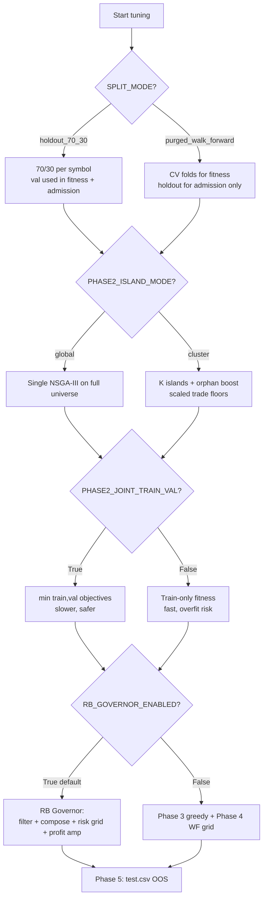
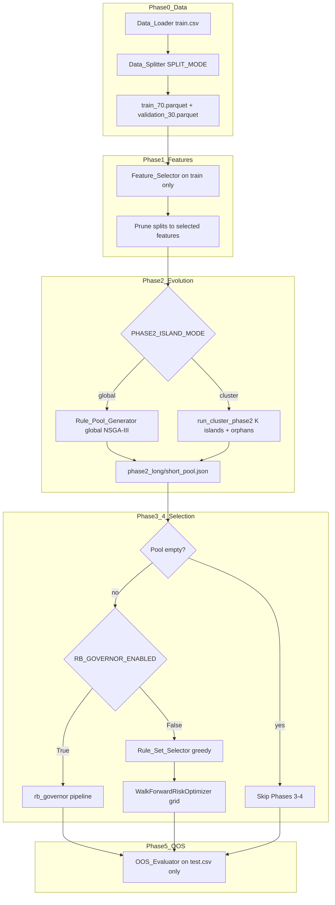
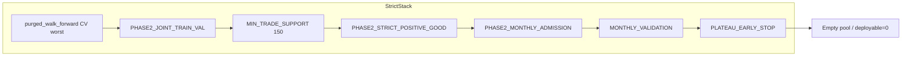

# Hyperparameter Workflow Reference

End-to-end map of the GPU-Fuzzy Trading Pipeline: every major toggle, both enabled/disabled paths, per-knob effects, and cross-parameter interactions that can break exploration.

**Source of truth:** [`gpu_fuzzy_trader/config.py`](../gpu_fuzzy_trader/config.py)  
**Orchestration:** [`gpu_fuzzy_trader/run_pipeline.py`](../gpu_fuzzy_trader/run_pipeline.py)

**Hard invariant:** `test.csv` is used only in Phase 5. Phases 1–4 tune exclusively on `train.csv` → persisted parquets.

---

## Table of contents

1. [Quick-start decision tree](#1-quick-start-decision-tree)
2. [Master pipeline flow](#2-master-pipeline-flow)
3. [Phase 0 — Data, split, backtest](#3-phase-0--data-split-backtest)
4. [Phase 1 — Feature selection](#4-phase-1--feature-selection)
5. [Phase 2 — Rule evolution](#5-phase-2--rule-evolution)
6. [Phase 3 + 4 — Selection paths](#6-phase-3--4--selection-paths)
7. [Monthly validation — three layers](#7-monthly-validation--three-layers)
8. [Phase 5 — Out-of-sample](#8-phase-5--out-of-sample)
9. [Critical interaction matrix](#9-critical-interaction-matrix)
10. [Symptom → knob troubleshooting](#10-symptom--knob-troubleshooting)
11. [Workflow variant appendix](#11-workflow-variant-appendix)
12. [Evaluator parity checklist](#12-evaluator-parity-checklist)

---

## 1. Quick-start decision tree

**First three knobs to set before anything else:**

| Order | Knob | Why |
|-------|------|-----|
| 1 | `SPLIT_MODE` | Changes train/val geometry, CV folds, trade-floor scaling, Phase 4 WF |
| 2 | `PHASE2_ISLAND_MODE` | Changes generation budget, trade floors, early-stop, migration |
| 3 | `RB_GOVERNOR_ENABLED` | Switches entire Phase 3+4 implementation |

---

## 2. Master pipeline flow

**Execution order** (`Pipeline_Orchestrator.run`):

1. Load `train.csv` → split → cache parquets (+ CV manifest if purged)
2. Phase 1 on train; prune feature columns from train/val/CV folds
3. Phase 2 long + short pools (global or cluster islands)
4. If pool empty → skip 3+4; else RB Governor **or** legacy Phase 3 → Phase 4
5. Phase 5 on `test.csv` (always)

---

## 3. Phase 0 — Data, split, backtest

### 3.1 `SPLIT_MODE` — biggest workflow fork

| Mode | Train block | Validation block | CV folds | Phase 2 fitness val | Pool admission val |
|------|-------------|------------------|----------|---------------------|-------------------|
| **`holdout_70_30`** (default) | First 70% per symbol | Last 30% per symbol | `None` | `validation_30` if joint val on | Same holdout |
| **`purged_walk_forward`** | Prefix minus holdout + embargo-purged CV trains | Tail `PURGED_WF_HOLDOUT_FRACTION` (30%) | K CV + holdout fold | **CV folds aggregated** if joint val on | **Holdout only** |

**Purged-mode fitness switch** (`phase2_rule_pool.py`):

- `holdout_70_30` + `PHASE2_JOINT_TRAIN_VAL=True` → fitness uses the 30% holdout.
- `purged_walk_forward` + `PHASE2_JOINT_TRAIN_VAL=True` → fitness uses CV fold aggregate (`worst` or `mean`); holdout never enters fitness.
- `PHASE2_JOINT_TRAIN_VAL=False` → train-only fitness in **both** modes; holdout checked only at pool admission.

#### Purged-only parameters (ignored when `SPLIT_MODE=holdout_70_30`)

| Parameter | Default | Higher / enabled | Lower / disabled |
|-----------|---------|------------------|------------------|
| `PURGED_WF_N_SPLITS` | 3 | More CV folds; smaller valid blocks | Fewer folds |
| `PURGED_WF_HOLDOUT_FRACTION` | 0.3 | Larger holdout (less CV prefix) | More CV data |
| `PURGED_WF_EMBARGO_CANDLES` | 288 | Wider purge gap; less train per fold | Leakage risk if &lt; label horizon |
| `PURGED_WF_MIN_TRAIN_FRACTION` | 0.25 | More history required before first CV | Too high → no folds → **fallback to holdout_70_30** |
| `PURGED_WF_MIN_VALID_ROWS` | 3000 | Stricter fold sizes; fewer folds | More/smaller folds |
| `PURGED_WF_AGGREGATION` | `worst` | Stricter fitness (`mean` = looser) | N/A (enum) |
| `PURGED_WF_REQUIRE_ALL_CV_FOLDS` | False | Pool gate also checks every CV fold | Holdout-only admission |
| `PURGED_WF_SCALE_TRADE_FLOORS` | True | Floors scale with slice size | Full global floors on thin slices |
| `PURGED_WF_MIN_TRADE_FLOOR_ABSOLUTE` | 5 | Higher minimum after scaling | Lower floor on tiny slices |

**Cache trap:** After changing `SPLIT_MODE` or purged knobs, delete `data/train_70.parquet`, `data/validation_30.parquet`, and `data/cv_folds_manifest.json`.

### 3.2 Global randomness & paths

| Parameter | Effect |
|-----------|--------|
| `GLOBAL_SEED` | `None` = random per process; `int` = fully reproducible |
| `DATA_ROOT`, `TRAIN_CSV_PATH`, `TEST_CSV_PATH` | Data locations (env overrides) |
| `OUTPUTS_DIR`, `REPORTS_DIR` | Run artifacts; rewritten per `--output` |
| `PHASE2_ARCHIVE_DIR` | Cross-run warm-start (not cleared by `--output`) |

### 3.3 Schema & labels

| Parameter | Effect |
|-----------|--------|
| `LABEL_COLUMNS`, `META_COLUMNS`, `INTERNAL_COLUMNS` | Never enter feature matrices |
| `TAIL_DROP_ROWS` | Bars dropped per symbol tail; **must equal** `MAX_HOLD_CANDLES` |

### 3.4 Backtest simulation (all phases — must match `evaluator_v5.ipynb`)

| Parameter | Default | Higher → | Lower → |
|-----------|---------|----------|---------|
| `INITIAL_CAPITAL` | 1000 | Absolute PnL scales | — |
| `LEVERAGE` | 1.0 | Larger gains/losses per trade | More conservative |
| `FEE_PCT` | 0.20 | Penalizes turnover | Optimistic backtest |
| `MAX_HOLD_CANDLES` | 288 | Longer holds; must match `TAIL_DROP_ROWS` | Quicker time exits |
| `MAX_TOTAL_EXPOSURE_PCT` | 100.0 | More concurrent exposure | Thinner overlap cap |
| `MIN_POSITION_NOTIONAL` | 1.0 | Filters dust trades | More micro-trades |

### 3.5 Logging

| Parameter | Effect |
|-----------|--------|
| `LOG_GENERATION_INTERVAL` | `0` = auto (~10% of gens); `N>0` = log every N generations |

### 3.6 `DEBUG_SYMBOL_SCOPE_ENABLED`

| False (default) | True |
|-----------------|------|
| Full symbol universe | Only `DEBUG_SYMBOL_COUNT` symbols from `DEBUG_SYMBOL` |
| Global trade/return floors | `effective_min_profitable_symbols()`, `effective_phase3_*()` scale down |

---

## 4. Phase 1 — Feature selection

Runs on **train split only** (no validation labels for ranking).

| Parameter | Default | True / higher | False / lower |
|-----------|---------|---------------|---------------|
| `PHASE1_DISPERSION_THRESHOLD` | 0.95 | Keep near-constant columns | Aggressive pruning |
| `PHASE1_TOP_K_FEATURES` | 25 | Wider Phase 2 gene space | Faster, may miss signals |
| `PHASE1_MAX_FEATURE_OVERLAP` | 0.8 | More shared long/short features | More asymmetric lists |
| `PHASE1_ASYMMETRIC_TARGET` | True | Separate MI targets per direction | Shared target |
| `PHASE1_REQUIRE_SIGN_CONSISTENCY` | True | Drop sign-flipping features | Keep unstable features |
| `PHASE1_SIGN_CONSISTENCY_MIN_FOLDS` | 2 | Stricter sign agreement | Looser |
| `PHASE1_SIGN_CONSISTENCY_MIN_ABS_CORR` | 0.02 | Only strong correlations must be stable | Stricter |
| `PHASE1_STATIONARITY_FOLDS` | 2 | More robust stationarity check | Faster, looser |
| `PHASE1_STATIONARITY_CV_MAX` | 1.0 | Allow rank instability | Drop swinging features |
| `PHASE1_STATIONARITY_RANK_DRIFT_MAX` | 8 | Tolerate rank jumps | Only stable top ranks |

### Phase 1 → Phase 2 bridge (GPU budget)

| Parameter | Default | Effect |
|-----------|---------|--------|
| `PHASE1_SAMPLING_TOTAL` | 701_000 | Max rows for Phase 2 GPU backtests; **largest VRAM lever** |
| `PHASE2_GPU_BATCH_SIZE` | 198 | Chromosomes per JAX chunk when auto off |
| `PHASE2_GPU_BATCH_SIZE_AUTO` | True | Cap batch by VRAM/RAM tiers |
| `PHASE2_SCAN_UNROLL` | 32 | Higher = fewer launches, more compile/VRAM |
| `PHASE2_EVAL_BATCH_DEDUP` | True | Skip duplicate chromosomes per batch |
| `PHASE2_EVAL_GLOBAL_CACHE` | True | Run-wide chromosome → metrics cache |
| `PHASE2_SKIP_ZERO_SIGNAL_SCAN` | True | Skip equity scan when 0 matches |
| `PHASE2_SKIP_INFEASIBLE_SIGNAL_SCAN` | True | Skip scan when below trade floor |
| `PHASE2_GPU_USE_FP32` | True | ~2× faster; tiny numeric drift |
| `PHASE2_GPU_DATA_INT8` | True | Lower VRAM for feature tensor |

---

## 5. Phase 2 — Rule evolution

### 5.1 `PHASE2_ISLAND_MODE`

| `global` (default) | `cluster` |
|--------------------|-----------|
| One `Rule_Pool_Generator` on full train/val | K=`PHASE2_N_CLUSTERS` symbol clusters + orphan boost |
| `PHASE2_GENERATIONS` × full pop | Budget: `PHASE2_ISLAND_TOTAL_GENERATIONS` across epochs of `PHASE2_ISLAND_EPOCH_GENERATIONS` |
| Global trade floors | `PHASE2_ISLAND_SCALE_TRADE_FLOORS` scales per island |
| `PHASE2_TWO_STAGE_ENABLED` respected | Default off: `PHASE2_ISLAND_TWO_STAGE_ENABLED=False` |
| Global early/plateau stop | Default off: `PHASE2_ISLAND_*_EARLY_STOP_ENABLED=False` |
| Symbol robustness penalty on | **Skipped** on islands |
| No migration | Elite migration every `PHASE2_MIGRATION_EPOCH_INTERVAL` epochs |

#### Island / cluster parameters

| Parameter | Default | Effect |
|-----------|---------|--------|
| `PHASE2_N_CLUSTERS` | 3 | Number of hybrid symbol clusters |
| `PHASE2_ISLAND_TOTAL_GENERATIONS` | = `PHASE2_GENERATIONS` | Total gen budget across islands |
| `PHASE2_ISLAND_EPOCH_GENERATIONS` | 25 | Gens per epoch before migration |
| `PHASE2_ISLAND_TWO_STAGE_ENABLED` | False | Two-stage in cluster mode |
| `PHASE2_ISLAND_SCALE_TRADE_FLOORS` | True | Scale support floors to island rows |
| `PHASE2_ISLAND_TRADE_FLOOR_ABSOLUTE_MIN` | 10 | Floor after island scaling |
| `PHASE2_ISLAND_MONTHLY_MIN_MONTHS` | 4 | Monthly gate min windows on islands |
| `PHASE2_MIGRATION_EPOCH_INTERVAL` | 2 | Epochs between elite exchange |
| `PHASE2_MIGRATION_TOP_K` | 5 | Elites migrated per island |
| `PHASE2_MIGRATION_REQUIRE_DEPLOYABILITY` | True | Only deployable elites migrate |
| `PHASE2_MIGRATION_MIN_VAL_RETURN_PCT` | 0.0 | Migration val return floor |
| `PHASE2_MIGRATION_MIN_VAL_TRADES` | None | Optional migration trade floor |

#### Orphan boost (`PHASE2_ORPHAN_ENABLED=True`)

| Parameter | Default | Effect |
|-----------|---------|--------|
| `PHASE2_ORPHAN_ENABLED` | True | Short run for symbols outside clusters |
| `PHASE2_ORPHAN_GENERATIONS` | 18 | Orphan evolution budget |
| `PHASE2_ORPHAN_POPULATION_SIZE` | 100 | Orphan pop size |
| `PHASE2_ORPHAN_MIN_TRADE_SUPPORT` | 8 | Relaxed support target |
| `PHASE2_ORPHAN_MIN_TRADE_POOL_FLOOR` | 8 | Relaxed pool floor |
| `PHASE2_ORPHAN_SORTINO_MIN_TRADE_THRESHOLD` | 8 | Relaxed Sortino threshold |
| `PHASE2_ORPHAN_MIN_VAL_TRADES` | 6 | Relaxed val trades |
| `PHASE2_ORPHAN_MIN_VAL_RETURN_PCT` | 0.0 | Relaxed val return |
| `PHASE2_ORPHAN_MONTHLY_MIN_PROFITABLE_RATIO` | 0.4 | Relaxed monthly ratio |

### 5.2 Fixed risk during rule search

| Parameter | Default | Effect |
|-----------|---------|--------|
| `PHASE2_TP` | 2.0 | TP % for Phase 2 scoring (Phase 4/RB retune) |
| `PHASE2_SL` | 1.0 | SL % during search |
| `PHASE2_CAPITAL_PCT` | 48.0 | Per-rule capital % during search |

### 5.3 Rule genome

| Parameter | Default | Effect |
|-----------|---------|--------|
| `MIN_CONDITIONS` | 3 | Higher → stricter, fewer matches |
| `MAX_CONDITIONS` | 5 | Higher → allow complex rules |
| `PHASE2_ENCODING` | `sparse_slots` | `dense` = legacy layout |

### 5.4 `PHASE2_JOINT_TRAIN_VAL` + objectives

| Setting | f1 Sortino | f3 return | Exploration |
|---------|------------|-----------|-------------|
| `JOINT=True`, `ROBUST_RETURN=True` | min(train, val) | min(train, val) return | Slowest; anti-overfit |
| `JOINT=False` | train only | train return | Fast; overfit risk |
| + purged WF | val = CV aggregate | same | Holdout unseen during search |

| Parameter | Default | Effect |
|-----------|---------|--------|
| `PHASE2_JOINT_TRAIN_VAL` | True | Joint train/val fitness |
| `PHASE2_USE_TOTAL_RETURN_OBJ` | True | f3 = return (not win rate) |
| `PHASE2_USE_ROBUST_RETURN_OBJ` | True | f3 = min(train, val) return |
| `SORTINO_CAP` | 10.0 | Max saturated Sortino on f1 |
| `SORTINO_SCALE` | 5.0 | Tanh compression divisor |

### 5.5 Trade support & pool admission (stacked gates)

**Layers (sequential — any failure drops the rule):**

1. Evolution feasibility (`PHASE2_RETURN_FLOOR_PCT`, PF, DD gate)
2. `passes_pool_trade_floor` (`MIN_TRADE_POOL_FLOOR`, scaled)
3. `passes_pool_admission_gate` (train/val returns, gap, PF)
4. `PHASE2_STRICT_POSITIVE_GOOD` → `gate_positive_good`
5. `PHASE2_MONTHLY_ADMISSION_ENABLED` → monthly ratio on train
6. `PHASE2_KEEP_TOP_RULES` cap

| Parameter | Default | Higher → | Lower → |
|-----------|---------|----------|---------|
| `MIN_TRADE_SUPPORT` | 150 | Stronger support penalty | Thin-sample rules survive |
| `SUPPORT_PENALTY_MAX` | 0.0 | Stronger quadratic penalty | **0 = no support penalty on objectives** |
| `MIN_TRADE_POOL_FLOOR` | 38 | Hard reject rare rules | Sparse rules in pool |
| `PHASE2_SUPPORT_PENALTY_WEIGHT_F1/F2/F3` | 0.8/0.6/0.5 | Per-objective support scale | — |
| `PHASE2_SORTINO_MIN_TRADE_THRESHOLD` | 50 | Sortino scaled down below this | — |
| `PHASE2_RETURN_FLOOR_PCT` | 0 | Stricter train feasibility | More exploration |
| `PHASE2_VAL_RETURN_FLOOR_PCT` | 0.5 | Stricter val feasibility | — |
| `PHASE2_PROFIT_FACTOR_FLOOR` | 1.05 | Fewer feasible rules | — |
| `PHASE2_SYMBOL_MEDIAN_RETURN_FLOOR_PCT` | -0.5 | Stricter cross-symbol median | — |
| `PHASE2_MIN_PROFITABLE_SYMBOLS` | 4 | Broad cross-symbol edge required | Niche specialists OK |
| `PHASE2_MAX_DRAWDOWN_GATE` | 25.0 | Stricter DD on objectives | Aggressive rules stay |
| `PHASE2_POOL_REQUIRE_POSITIVE_SPLITS` | True | Infeasible if negative train/val | — |
| `PHASE2_POOL_TRAIN_RETURN_MIN_PCT` | 0.0 | Pool train return floor | — |
| `PHASE2_POOL_VAL_RETURN_MIN_PCT` | 0.0 | Pool val return floor | — |
| `PHASE2_MAX_TRAIN_VAL_GAP_PCT` | 8.0 | Stricter train>>val rejection | — |
| `PHASE2_KEEP_TOP_RULES` | 120 | Larger downstream pool | Smaller, faster |
| `PHASE2_REQUIRE_LAST_FOLD_POSITIVE` | False | Reject val_return ≤ 0 at admission | — |
| `PHASE2_STRICT_POSITIVE_GOOD` | True | Pool must pass positive-good gate | Legacy pool floors only |

### 5.6 `PHASE2_MONTHLY_ADMISSION_ENABLED`

| False (default) | True |
|-----------------|------|
| No extra gate | Rule must pass `PHASE2_MONTHLY_ADMISSION_MIN_PROFITABLE_RATIO` on train months |
| | Skipped if &lt; `PHASE2_MONTHLY_ADMISSION_MIN_MONTHS` windows |

| Parameter | Default | Effect |
|-----------|---------|--------|
| `PHASE2_MONTHLY_GOOD_RETURN_MIN_PCT` | 0.0 | Min return % for a month to count "good" |
| `PHASE2_MONTHLY_ADMISSION_MIN_PROFITABLE_RATIO` | 0.5 | Fraction of good months required |
| `PHASE2_MONTHLY_ADMISSION_MIN_MONTHS` | 4 | Min windows before gate applies |

### 5.7 Diversity, early stop, two-stage

#### `PHASE2_TWO_STAGE_ENABLED` (global only unless `PHASE2_ISLAND_TWO_STAGE_ENABLED`)

| False (default) | True |
|-----------------|------|
| Single run `PHASE2_GENERATIONS` | Stage A exploration → Stage B refinement |
| | Requires `island_profile=global`, full pop & gen match defaults |

| Parameter | Default | Effect |
|-----------|---------|--------|
| `PHASE2_STAGE_A_GENERATIONS` | 85 | Stage A budget |
| `PHASE2_STAGE_B_GENERATIONS` | 45 | Stage B budget |
| `PHASE2_STAGE_B_SEED_TOP_K` | 50 | Elites seeded into Stage B |
| `PHASE2_STAGE_B_SEED_FRACTION` | 0.30 | Fraction of Stage B pop from elites |
| `PHASE2_STAGE_A_MUTATION_RATE` | 0.25 | Per-gene mutation probability in Stage A |
| `PHASE2_STAGE_A_MUTATION_WEIGHTED_ACTIVATE_PROB` | 0.50 | Activate-gene bias in Stage A |
| `PHASE2_STAGE_A_DIVERSITY_PENALTY` | 10.0 | Crowding penalty in Stage A |
| `PHASE2_STAGE_A_DIVERSITY_HAMMING_THRESHOLD` | 4 | Min genetic distance in Stage A |
| `PHASE2_STAGE_A_DIVERSITY_RECOVERY_MIN_UNIQUE_RATIO` | 0.35 | Diversity-recovery trigger in Stage A |
| `PHASE2_STAGE_A_DIVERSITY_RECOVERY_INJECT_FRACTION` | 0.35 | Random-injection fraction in Stage A |
| `PHASE2_STAGE_A_DIVERSITY_RECOVERY_MUTATION_BOOST` | 2.0 | Mutation boost during recovery (Stage A) |
| `PHASE2_STAGE_A_PLATEAU_EARLY_STOP_PATIENCE` | 28 | Plateau patience (gens) in Stage A |
| `PHASE2_STAGE_A_PLATEAU_EARLY_STOP_MIN_GENERATION` | 30 | Min gen before plateau stop in Stage A |
| `PHASE2_STAGE_A_EARLY_STOP_MIN_GENERATION` | 32 | Min gen before mean-return stop in Stage A |
| `PHASE2_STAGE_A_ARCHIVE_SEED_FRACTION` | 0.20 | Archive warm-start fraction in Stage A |
| `PHASE2_STAGE_A_RETURN_FLOOR_PCT` | 0.0 | Train return floor in Stage A |
| `PHASE2_STAGE_A_USE_ROBUST_RETURN_OBJ` | True | f3 = min(train, val) in Stage A |
| `PHASE2_STAGE_A_SOFT_FEASIBILITY` | True | Soft penalties in Stage A only |
| `PHASE2_STAGE_A_MIN_TRADE_SUPPORT` | 30 | Looser support in Stage A |
| `PHASE2_STAGE_B_MUTATION_RATE` | 0.18 | Per-gene mutation probability in Stage B |
| `PHASE2_STAGE_B_MUTATION_WEIGHTED_ACTIVATE_PROB` | 0.40 | Activate-gene bias in Stage B |
| `PHASE2_STAGE_B_DIVERSITY_PENALTY` | 5.0 | Crowding penalty in Stage B |
| `PHASE2_STAGE_B_DIVERSITY_HAMMING_THRESHOLD` | 2 | Min genetic distance in Stage B |
| `PHASE2_STAGE_B_DIVERSITY_RECOVERY_MIN_UNIQUE_RATIO` | 0.25 | Diversity-recovery trigger in Stage B |
| `PHASE2_STAGE_B_DIVERSITY_RECOVERY_INJECT_FRACTION` | 0.20 | Random-injection fraction in Stage B |
| `PHASE2_STAGE_B_DIVERSITY_RECOVERY_MUTATION_BOOST` | 1.4 | Mutation boost during recovery (Stage B) |
| `PHASE2_STAGE_B_PLATEAU_EARLY_STOP_PATIENCE` | 15 | Plateau patience (gens) in Stage B |
| `PHASE2_STAGE_B_PLATEAU_EARLY_STOP_MIN_GENERATION` | 15 | Min gen before plateau stop in Stage B |
| `PHASE2_STAGE_B_EARLY_STOP_MIN_GENERATION` | 20 | Min gen before mean-return stop in Stage B |

#### Early stop / plateau / recovery

| Parameter | Default | When enabled | Exploration risk |
|-----------|---------|--------------|------------------|
| `PHASE2_EARLY_STOP_ENABLED` | True | Stop on poor mean/median return after gen 40 | Ends before recovery |
| `PHASE2_EARLY_STOP_MIN_GENERATION` | 40 | Minimum gen before early stop can fire |
| `PHASE2_EARLY_STOP_MEAN_RETURN_PCT` | -5.0 | Mean return threshold below which stop fires |
| `PHASE2_EARLY_STOP_USE_MEDIAN_RETURN` | True | Use median (vs mean) for the threshold check |
| `PHASE2_EARLY_STOP_MIN_VALID_RULES` | 3 | Min number of valid rules required to keep going |
| `PHASE2_PLATEAU_EARLY_STOP_ENABLED` | True | Stop if no robust return improvement | Interacts with `PHASE2_PLATEAU_USE_ROBUST_RETURN` |
| `PHASE2_PLATEAU_EARLY_STOP_MIN_GENERATION` | 3 | Min gen before plateau stop |
| `PHASE2_PLATEAU_EARLY_STOP_PATIENCE` | 5 | Gens of no improvement before plateau stop |
| `PHASE2_PLATEAU_EARLY_STOP_MIN_DELTA_PCT` | 0.02 | Min improvement (%) to reset patience |
| `PHASE2_PLATEAU_USE_ROBUST_RETURN` | True | Score plateau on `min(train, val)` return |
| `PHASE2_PLATEAU_BLOCK_WHEN_DEPLOYABLE_ZERO` | True | Block plateau stop while deployable=0 | — |
| `PHASE2_PLATEAU_BLOCK_WHEN_DIVERSITY_LOW` | False | Also block plateau stop if unique ratio is low | — |
| `PHASE2_DIVERSITY_RECOVERY_ENABLED` | True | Inject random when unique ratio low | Counteracts early stop |
| `PHASE2_DIVERSITY_RECOVERY_MIN_UNIQUE_RATIO` | 0.30 | Unique-ratio floor that triggers recovery |
| `PHASE2_DIVERSITY_RECOVERY_INJECT_FRACTION` | 0.30 | Fraction of pop replaced during recovery |
| `PHASE2_DIVERSITY_RECOVERY_MUTATION_BOOST` | 1.75 | Mutation-rate multiplier during recovery |
| `PHASE2_VIABILITY_RECOVERY_ENABLED` | True | Archive seeds when valid rules collapse | — |
| `PHASE2_VIABILITY_RECOVERY_MIN_VALID` | 5 | Min valid rules before recovery seeds archive |
| `PHASE2_VIABILITY_RECOVERY_DEPLOYABLE_MUTATE_FRACTION` | 0.5 | Fraction of deployable elites mutated for seed |

Island mode uses `island_early_stop_enabled()` / `island_plateau_early_stop_enabled()`.

#### Diversity & feasibility

| Parameter | Default | Effect |
|-----------|---------|--------|
| `PHASE2_DIVERSITY_HAMMING_THRESHOLD` | 3 | Min genetic distance for uniqueness |
| `PHASE2_DIVERSITY_PENALTY` | 8.0 | Crowding penalty on objectives |
| `PHASE2_PHENOTYPE_SORTINO_STEP` | 0.5 | Sortino bucket width for phenotypic diversity |
| `PHASE2_PHENOTYPE_DD_STEP` | 5.0 | DD bucket width for phenotypic diversity |
| `PHASE2_PHENOTYPE_F3_STEP` | 10.0 | f3 (return/win-rate) bucket width |
| `PHASE2_FEASIBILITY_VIOLATION_WEIGHT` | 25.0 | Soft floor violation scale |
| `PHASE2_INFEASIBLE_OBJECTIVE_PENALTY` | 100.0 | Flat infeasible penalty |
| `PHASE2_DEPLOYABLE_ARCHIVE_MAX_SIZE` | 100 | Cross-run deployable elite cap |

### 5.8 NSGA-III search budget

| Parameter | Default | Higher → | Lower → |
|-----------|---------|----------|---------|
| `PHASE2_POPULATION_SIZE` | 200 | Better Pareto coverage; linear GPU cost | Faster gens; convergence risk |
| `PHASE2_GENERATIONS` | 150 | More search budget | Faster; under-explore |
| `PHASE2_ARCHIVE_MAX_SIZE` | 200 | Richer elite memory | Leaner archive |
| `PHASE2_ARCHIVE_SEED_FRACTION` | 0.25 | More warm-start; less fresh exploration | More random init |
| `PHASE2_SEED` | `get_seed()` | Process seed for evolution | — |
| `PHASE2_ALGORITHM` | `NSGA3` | — | — |

### 5.9 Engine, init, mutation

| Parameter | Default | Effect |
|-----------|---------|--------|
| `PHASE2_USE_GPU` | True | JAX GPU backtests |
| `PHASE2_NUMBA_ENABLED` | True | Numba NSGA helpers |
| `PHASE2_INIT_STRATEGY` | `stratified_sparse` | Initial population layout |
| `PHASE2_INIT_STRATUM_FRACTIONS` | (0.67, 0.33) | Explore vs exploit mix |
| `PHASE2_INIT_SOFTMAX_TEMP` | 1.5 | Feature pick temperature |
| `PHASE2_INIT_UNIFORM_MIX` | 0.05 | Random vs MI-guided init |
| `PHASE2_INIT_SCORE_EPS` | 1e-6 | Epsilon floor on init MI scores (avoid div-by-zero) |
| `PHASE2_MUTATION_RATE` | 0.22 | Per-gene mutation probability |
| `PHASE2_MUTATION_WEIGHTED_ACTIVATE_PROB` | 0.45 | Bias toward activating genes |
| `PHASE2_GPU_ENRICH_SYMBOL_METRICS` | True | CPU per-symbol metrics after GPU batch |

---

## 6. Phase 3 + 4 — Selection paths

### 6.1 `RB_GOVERNOR_ENABLED=True` (default)

Skips legacy Phase 3 and Phase 4; runs `rb_governor.py`:

1. `_filter_good_rules` — positive-good gate (`RB_MIN_*`)
2. `_compose_ruleset` — greedy team (`RB_MAX_RULES`, overlap, subset-beat or lenient-add)
3. `_optimize_risk` — grid on `RB_TP_GRID` / `RB_SL_GRID` / `RB_CAPITAL_GRID`
4. Optional `RB_PROFIT_AMPLIFIER_ENABLED` — swap rules + capital realloc + monthly certificate

#### RB scoring / gating

| Parameter | Default | Effect |
|-----------|---------|--------|
| `RB_MIN_TRAIN_RETURN` / `RB_MIN_VALID_RETURN` | 2.0 | Score penalty below these |
| `RB_MIN_TRAIN_PF` / `RB_MIN_VALID_PF` | 1.00 | PF floors |
| `RB_MIN_TRAIN_TRADES` / `RB_MIN_VALID_TRADES` | 10 / 6 | Per-rule trade floors |
| `RB_RULESET_MIN_TRAIN_TRADES` / `RB_RULESET_MIN_VALID_TRADES` | 20 / 12 | Team-level trade floors |
| `RB_MAX_POOL_RULES_TO_EVALUATE` | 200 | Cap on pool rules filtered |
| `RB_KEEP_TOP_RULES` | 80 | Candidates after ranking |
| `RB_MAX_RULES` | 20 | Hard team size cap |

#### RB team composition

| Parameter | Default | Effect |
|-----------|---------|--------|
| `RB_MAX_PAIR_OVERLAP` | 0.30 | Max Hamming overlap between rules |
| `RB_RULESET_MUST_BEAT_SUBSETS` | True | Team must beat parent subset |
| `RB_MIN_SCORE_IMPROVEMENT` | 0.03 | Min score delta to add rule |
| `RB_MIN_TRAIN_RETURN_IMPROVEMENT` / `RB_MIN_VALID_RETURN_IMPROVEMENT` | 0.005 | Min return uplift to add |
| `RB_RETURN_DD_FLOOR` | 0.50 | DD floor in return/DD ratio |
| `RB_TRADE_PENALTY` | 0.70 | Penalty below trade floors |
| `RB_TRAIN_VALID_RATIO_GAP_WEIGHT` / `RB_TRAIN_VALID_RETURN_GAP_WEIGHT` | 6.0 / 0.25 | Overfit gap penalties |

#### RB lenient-add mode (current defaults)

| Parameter | Default | Effect |
|-----------|---------|--------|
| `RB_RULE_ADD_BY_RETURN_ONLY` | True | Add on combined-return uplift |
| `RB_RULE_ADD_IGNORE_OVERLAP` | True | Skip overlap checks |
| `RB_RULE_ADD_IGNORE_SUBSET_BEAT` | True | Skip subset-beat checks |
| `RB_MIN_COMBINED_RETURN_IMPROVEMENT` | 0.05 | Min combined return uplift |

#### RB train-valid shape prior

| Parameter | Default | Effect |
|-----------|---------|--------|
| `RB_REQUIRE_TRAIN_SLIGHTLY_ABOVE_VALID` | True | Bonus/penalty for healthy train>val shape |
| `RB_TRAIN_VALID_MIN_RATIO` / `MAX_RATIO` | 1.03 / 1.35 | Acceptable train/val ratio band |
| `RB_TRAIN_VALID_MIN_ABS_GAP` / `MAX_ABS_GAP` | 0.20 / 12.0 | Absolute gap band |
| `RB_TRAIN_BELOW_VALID_PENALTY` | 900.0 | Penalty when train &lt; val |
| `RB_TRAIN_TOO_HIGH_PENALTY` | 220.0 | Penalty when train >> val |
| `RB_TRAIN_VALID_SHAPE_BONUS` | 160.0 | Bonus in healthy band |

#### RB default risk & grid

| Parameter | Default | Effect |
|-----------|---------|--------|
| `RB_DEFAULT_TP` / `SL` / `CAPITAL_PCT` | 2.0 / 1.2 / 12.5 | Initial embedded risk |
| `RB_REQUIRE_TP_SL_ABOVE_ONE` | True | Reject combo where TP or SL ≤ 1.0 |
| `RB_MIN_TP` / `RB_MIN_SL` | 1.0 / 1.0 | Per-rule TP/SL floor before grid eval |
| `RB_TP_GRID` | `(1.5, 2.0, 2.5, 3.0, 4.0, 5.0, 6.0, 8.0)` | TP search space |
| `RB_SL_GRID` | `(1.0, 1.2, 1.5, 2.0, 2.5)` | SL search space |
| `RB_CAPITAL_GRID` | `(15.0, 20.0, 25.0, 35.0)` | Capital search space |
| `RB_RISK_OPT_PASSES` | 2 | Round-robin passes |
| `RB_RISK_MIN_IMPROVEMENT` | 0.02 | Min score delta to accept combo |
| `RB_MAX_TOTAL_CAPITAL` | 95.0 | Hard cap on sum capital_pct |

#### RB symbol specialization

| Parameter | Default | Effect |
|-----------|---------|--------|
| `RB_REQUIRE_SYMBOL_FILTERS` | True | Every rule needs `symbol is X` |
| `RB_SYMBOL_USE_COMBINATIONS` | False | Multi-symbol variants |
| `RB_SYMBOL_MAX_SYMBOLS_PER_RULE` | 1 | Max symbols per rule |
| `RB_SYMBOL_TOP_SINGLE_SYMBOLS` | 5 | Seeds for combos |
| `RB_SYMBOL_MAX_VARIANTS_PER_RULE` | 10 | Variants scored per rule |
| `RB_SYMBOL_MIN_TRAIN_TRADES` / `MIN_VALID_TRADES` | 10 / 4 | Variant trade floors |
| `RB_SYMBOL_STRICT_OUTPUT_CHECK` | True | Validate output rules |

#### RB evaluator health (mirrors Phase 3)

| Parameter | Default | Effect |
|-----------|---------|--------|
| `RB_MAX_SKIPPED_SIGNAL_RATIO` | 0.20 | Max skip ratio |
| `RB_MIN_EXECUTED_RAW_RATIO` | 0.60 | Min executed/raw |
| `RB_SKIPPED_RATIO_PENALTY` / `RB_EXECUTED_RATIO_PENALTY` | 3500 / 2500 | Penalty weights |
| `RB_MAX_SIMULTANEOUS_POSITIONS` | 10 | Max concurrent positions |
| `RB_MAX_POSITIONS_PENALTY` | 120.0 | Excess position penalty |

#### RB profit amplifier

| Parameter | Default | Effect |
|-----------|---------|--------|
| `RB_PROFIT_AMPLIFIER_ENABLED` | True | Post-risk refinement pass |
| `RB_PROFIT_AMP_MAX_CANDIDATES` | 60 | Candidate pool size |
| `RB_PROFIT_AMP_MAX_RULES` | 5 | Max rules in amp stage |
| `RB_PROFIT_AMP_MIN_OBJECTIVE_IMPROVEMENT` | 0.05 | Min objective delta to accept amp |
| `RB_PROFIT_AMP_MIN_RETURN_IMPROVEMENT` | 0.02 | Min per-candidate return delta |
| `RB_PROFIT_AMP_VALID_WEIGHT` | 1.55 | Weight on validation return in objective |
| `RB_PROFIT_AMP_TRAIN_WEIGHT` | 1.00 | Weight on train return |
| `RB_PROFIT_AMP_BALANCE_WEIGHT` | 0.20 | Weight on train/valid balance |
| `RB_PROFIT_AMP_DD_WEIGHT` | 0.02 | Weight on drawdown |
| `RB_PROFIT_AMP_HEALTH_WEIGHT` | 0.030 | Weight on evaluator health penalty |
| `RB_PROFIT_AMP_OVERLAP_PENALTY` | 2.5 | Penalty per excess overlap unit |
| `RB_PROFIT_AMP_MAX_PAIR_OVERLAP` | 0.55 | Pair-overlap ceiling for amp team |
| `RB_PROFIT_AMP_MAX_VALID_DD` | 12.0 | Reject amp if valid DD > floor |
| `RB_PROFIT_AMP_MAX_TRAIN_DD` | 18.0 | Reject amp if train DD > floor |
| `RB_PROFIT_AMP_MONTHLY_ENABLED` | True | Monthly certificate in amp |
| `RB_PROFIT_AMP_MIN_MONTHLY_WINDOWS` | 2 | Min monthly windows before cert applies |
| `RB_PROFIT_AMP_MIN_MONTHLY_PROFITABLE_RATIO` | 0.55 | Min profitable-month ratio for cert |
| `RB_PROFIT_AMP_WORST_MONTHLY_RETURN_FLOOR` | -2.0 | Worst-month return floor |
| `RB_PROFIT_AMP_WORST_MONTHLY_PF_FLOOR` | 0.80 | Worst-month PF floor |
| `RB_PROFIT_AMP_MAX_MONTHLY_DD` | 10.0 | Worst-month DD ceiling |
| `RB_PROFIT_AMP_CAPITAL_REALLOCATION_ENABLED` | True | Re-run capital grid after rule swaps |
| `RB_PROFIT_AMP_CAPITAL_PASSES` | 2 | Capital reallocation passes |
| `RB_PROFIT_AMP_CAPITAL_GRID` | `= RB_CAPITAL_GRID` | Grid used for reallocation |
| `RB_PROFIT_AMP_KEEP_BASELINE_UNLESS_BETTER` | True | Never replace baseline with worse result |

#### RB global bank (default off)

| Parameter | Default | Effect |
|-----------|---------|--------|
| `RB_GLOBAL_BANK_ENABLED` | False | Cross-run rule bank |
| `RB_GLOBAL_COMPOSE_AFTER_EACH_RUN` | False | Compose global team after run |
| `RB_GLOBAL_BANK_DIRNAME` | `"rb_bank"` | Subdir under `outputs/` for the bank |
| `RB_GLOBAL_BANK_MAX_RULES_PER_DIRECTION` | 700 | Cap on bank size per direction |
| `RB_GLOBAL_BANK_IMPORT_TOP_SINGLE_RULES` | 80 | Top-N single rules imported from each run |
| `RB_GLOBAL_MAX_RULES` | 12 | Max rules in global team |
| `RB_GLOBAL_MIN_COMBINED_RETURN_IMPROVEMENT` | 0.05 | Min combined return uplift to add a global rule |
| `RB_GLOBAL_REQUIRE_POSITIVE_TRAIN_VALID` | True | Reject if train or valid ≤ 0 |
| `RB_GLOBAL_RISK_OPT_PASSES` | 2 | Risk-opt passes for global team |
| `RB_GLOBAL_BEST_DIRNAME` | `"best_global"` | Subdir for tracked best-global strategy |
| `RB_GLOBAL_TP_GRID` | `(1.5, 2.0, 3.0, 5.0, 8.0)` | Global TP search space |
| `RB_GLOBAL_SL_GRID` | `(1.2, 1.5, 2.0, 2.5)` | Global SL search space |
| `RB_GLOBAL_CAPITAL_GRID` | `(5.0, 12.5, 25.0, 50.0)` | Global capital search space |
| `RB_GLOBAL_MAX_TOTAL_CAPITAL` | 100.0 | Hard cap on global team capital |

### 6.2 `RB_GOVERNOR_ENABLED=False` — legacy Phase 3 + 4

#### Phase 3 — `Rule_Set_Selector`

| Parameter | Default | Effect |
|-----------|---------|--------|
| `PHASE3_PER_SYMBOL_MAX_RULES` | 2 | Max rules per symbol |
| `PHASE3_GLOBAL_MIN_RULES` / `MAX_RULES` | 2 / 20 | Team size bounds |
| `PHASE3_PER_SYMBOL_GREEDY_TOP_K` | 25 | Pool rules tested per greedy round |
| `PHASE3_PER_SYMBOL_MIN_TRADES` | 8 | Min val trades on symbol (debug-scaled) |
| `PHASE3_PER_SYMBOL_MIN_RETURN` | 0.5 | Min val return % on symbol |
| `PHASE3_DIAGNOSTIC_REPORT_ENABLED` | True | Write per-symbol diagnostic CSV |
| `PHASE3_MAX_CAPITAL_PCT_PER_RULE` | 50.0 | Per-rule capital cap |
| `PHASE3_MAX_TRAIN_VAL_GAP_PCT` | 12.0 | Overfit gap hard reject |
| `PHASE3_USE_GPU` | False (True on Colab) | GPU team evaluation |
| `PHASE3_BATCH_WORKERS` | min(32, cpu) | Parallel workers |
| `PHASE3_VAL_RETURN_FLOOR_PCT` | 5.0 | Team fallback return floor |

#### Phase 3 positive-good gate

| Parameter | Default | True | False |
|-----------|---------|------|-------|
| `PHASE3_REQUIRE_POSITIVE_GOOD` | True | `gate_positive_good` in greedy | Legacy scoring |
| `PHASE3_MIN_TRAIN_RETURN` / `MIN_VAL_RETURN` | 0.0 | Higher = stricter | — |
| `PHASE3_MIN_TRAIN_PF` / `MIN_VAL_PF` | 1.0 | Higher = stricter PF | — |
| `PHASE3_MIN_TRAIN_TRADES` / `MIN_VAL_TRADES` | 25 / 15 | Higher = stricter (purged-scaled) | — |
| `PHASE3_GATE_EXECUTION_HEALTH` | True | Also require `execution_ok()` | Skip exec gate |
| `PHASE3_EVAL_HEALTH_WEIGHT` | 1.0 | Full health penalty in scoring | 0 = off |

#### Symbol specialization (Phase 3)

| Parameter | Default | Effect |
|-----------|---------|--------|
| `SYMBOL_SPECIALIZATION_USE_COMBINATIONS` | True | 2-/3-symbol variants |
| `SYMBOL_SPECIALIZATION_MAX_SYMBOLS_PER_RULE` | 1 | Max symbols per rule |
| `SYMBOL_SPECIALIZATION_TOP_SINGLE_SYMBOLS` | 5 | Seeds for combos |
| `SYMBOL_SPECIALIZATION_MAX_VARIANTS_PER_RULE` | 10 | Variants scored |
| `SYMBOL_SPECIALIZATION_MIN_TRAIN_TRADES` / `MIN_VAL_TRADES` | 10 / 6 | Variant gate floors |

#### Phase 4 — `WalkForwardRiskOptimizer`

**Walk-forward on validation only.** `effective_phase4_wf_splits()`:

| `SPLIT_MODE` | Effective `PHASE4_WF_SPLITS` |
|--------------|------------------------------|
| `holdout_70_30` | `PHASE4_WF_SPLITS` (default 2) + optional tail holdout |
| `purged_walk_forward` | **Forced to 1** — avoids triple WF stacking |

| Parameter | Default | Effect |
|-----------|---------|--------|
| `PHASE4_WF_SPLITS` | 2 | WF windows on validation (ignored count when purged) |
| `PHASE4_INCLUDE_TAIL_HOLDOUT` | True | Reserve tail fraction as extra window |
| `PHASE4_TAIL_HOLDOUT_FRACTION` | 0.25 | Tail holdout size |
| `PHASE4_WORST_RETURN_WEIGHT` / `WORST_DRAWDOWN_WEIGHT` / `WORST_TURNOVER_WEIGHT` | 1.5 / 2.0 / 0.5 | Worst-fold objective weights |
| `PHASE4_MAX_WORST_DRAWDOWN_PCT` | 15.0 | Feasibility DD cap |
| `PHASE4_MIN_WORST_TRADES` | 20 | Min trades in worst window (purged-scaled) |
| `PHASE4_MIN_WORST_FOLD_RETURN_PCT` | -2.0 | Worst-window return floor |
| `PHASE4_MIN_WORST_FOLD_PF` | 1.0 | Worst-window PF floor |
| `PHASE4_HARD_CAP_NORMALIZE` | True | Scale capital to `MAX_TOTAL_EXPOSURE_PCT` |
| `PHASE4_TP_MIN` / `TP_MAX` | 2.0 / 5.0 | TP search range for the grid (clipped to `PHASE4_GRID_TP_VALUES`) |
| `PHASE4_SL_MIN` / `SL_MAX` | 1.0 / 2.0 | SL search range (clipped to `PHASE4_GRID_SL_VALUES`) |
| `PHASE4_MIN_TP_SL_RATIO` | 1.2 | Reject combos where TP/SL < ratio |
| `PHASE4_CAPITAL_PCT_MIN` / `CAPITAL_PCT_MAX` | 10.0 / 30.0 | Capital range (clipped to `PHASE4_GRID_CAPITAL_VALUES`) |
| `PHASE4_TP_STEP` / `SL_STEP` / `CAPITAL_STEP` | 0.5 / 0.5 / 5.0 | Linspace step per range |
| `PHASE4_GRID_TP_VALUES` | `(2.0, 2.5, 3.0, 4.0, 5.0)` | Explicit TP grid (used when set) |
| `PHASE4_GRID_SL_VALUES` | `(1.0, 1.5, 2.0, 2.5)` | Explicit SL grid (used when set) |
| `PHASE4_GRID_CAPITAL_VALUES` | `(10.0, 15.0, 20.0, 25.0, 30.0)` | Explicit capital grid (used when set) |
| `PHASE4_GRID_PASSES` | 2 | Round-robin passes |
| `PHASE4_GRID_MIN_IMPROVEMENT` | 0.005 | Min score delta to accept |
| `PHASE4_GRID_MAX_TOTAL_CAPITAL` | 95.0 | Skip combos above cap |
| `PHASE4_MAX_VAL_TRAIN_GAP_PCT` | 12.0 | Reject val>>train overfit |
| `PHASE4_USE_ROBUST_SCORE` | True | Score on min(train, val) return |
| `PHASE4_OPTIMIZE_PER_RULE_SYMBOL` | True | Tune per rule's symbol slice |

#### Evaluator health (shared Phase 3/4)

| Parameter | Default | Effect |
|-----------|---------|--------|
| `EVAL_HEALTH_MAX_SKIPPED_RATIO` | 0.20 | Max skipped/raw before penalty |
| `EVAL_HEALTH_MIN_EXECUTED_RATIO` | 0.60 | Min executed/raw |
| `EVAL_HEALTH_SKIPPED_WEIGHT` / `EXECUTED_WEIGHT` | 3500 / 2500 | Penalty multipliers |
| `EVAL_HEALTH_MAX_SIMULTANEOUS_POSITIONS` | 10 | Max concurrent positions |
| `EVAL_HEALTH_MAX_POSITIONS_WEIGHT` | 120.0 | Excess position penalty |

---

## 7. Monthly validation — three layers

| Layer | Toggle | Where applied |
|-------|--------|---------------|
| Phase 2 admission | `PHASE2_MONTHLY_ADMISSION_ENABLED` | **Hard** gate on train months |
| Phase 3/4 scoring | `MONTHLY_VALIDATION_ENABLED` | **Soft** penalty via `monthly_penalty()` |
| RB profit amp | `RB_PROFIT_AMPLIFIER_ENABLED` + `RB_PROFIT_AMP_MONTHLY_*` | Certificate after risk opt |

### Shared monthly knobs

| Parameter | Default | Effect |
|-----------|---------|--------|
| `MONTHLY_VALIDATION_ENABLED` | True | Toggle Phase 3/4 monthly penalty |
| `MONTHLY_WINDOW_DAYS` | 30 | Rolling window size |
| `MONTHLY_WINDOW_MIN_ROWS` | 2500 | Skip thin windows |
| `MONTHLY_WINDOW_MAX_WINDOWS` | 24 | Cap windows evaluated |
| `MONTHLY_RECENCY_WEIGHT` | 2.2 | Up-weight recent windows |
| `MONTHLY_MIN_TRADES` | 20 | Min trades per window (purged-scaled) |
| `MONTHLY_GOOD_RETURN_MIN_PCT` | 0.5 | Min return for "good" month |
| `MONTHLY_MIN_PROFITABLE_RATIO` | 0.60 | Target profitable fraction |
| `MONTHLY_WORST_RETURN_FLOOR` / `WORST_PF_FLOOR` / `MAX_DD` | -1.5 / 0.85 / 8.0 | Penalty floors |
| `MONTHLY_*_WEIGHT` | — | Penalty term weights |
| `PHASE3_MONTHLY_PENALTY_WEIGHT` / `SCALE` / `FALLBACK` | 1.0 / 7.0 / 5.0 | Phase 3 penalty scaling |
| `PHASE4_MONTHLY_SCORE_WEIGHT` / `SCALE` / `FALLBACK` | 0.70 / 10.0 / 5.0 | Phase 4 penalty scaling |
| `PHASE4_MONTHLY_EVAL_EVERY_TRIAL` | True | Monthly on every grid trial |

**Risk:** All three layers enabled with strict ratios → rules pass Phase 2 but fail RB/Phase 3/4.

---

## 8. Phase 5 — Out-of-sample

Always runs on `test.csv` only.

| Parameter | Default | Effect |
|-----------|---------|--------|
| `PHASE5_VALIDATION_RETURN_GATE_PCT` | 2.0 | Min val return for deployable flag |
| `PHASE5_VALIDATION_PROFIT_FACTOR_GATE` | 1.05 | Min val PF for deployable flag |
| `PHASE5_REMOVE_NEGATIVE_PNL_RULES` | True | Strip losing rules after OOS |

No workflow branching — Phase 5 surfaces mis-tuning from earlier stacked gates.

---

## 9. Critical interaction matrix

### Overlap map (what stacks on what)

| Layer A | Layer B | Interaction |
|---------|---------|-------------|
| `purged_walk_forward` | `PHASE2_JOINT_TRAIN_VAL` | Fitness uses CV aggregate; holdout for admission only — **good separation** |
| `purged_walk_forward` | `PHASE4_WF_SPLITS` | `effective_phase4_wf_splits()` → 1; **auto-mitigated** in legacy path |
| `purged_walk_forward` | `PURGED_WF_SCALE_TRADE_FLOORS` | Trade floors scale down on thin CV slices — **required** with high `MIN_TRADE_*` |
| `PHASE2_ISLAND_MODE=cluster` | `PHASE2_ISLAND_SCALE_TRADE_FLOORS` | Per-island rows much smaller than universe — floors must scale |
| `PHASE2_ISLAND_MODE=cluster` | `PHASE2_TWO_STAGE_ENABLED` | Two-stage **silently off** unless `PHASE2_ISLAND_TWO_STAGE_ENABLED` |
| `PHASE2_JOINT_TRAIN_VAL=False` | `PHASE2_STRICT_POSITIVE_GOOD` | Evolution ignores val; admission rejects overfit rules — **empty pool** |
| `PHASE2_MONTHLY_ADMISSION` | `MONTHLY_VALIDATION_ENABLED` | Same concept, different phases — **double time-stability filter** |
| `RB_MIN_TRAIN_RETURN=2.0` | `PHASE2_VAL_RETURN_FLOOR_PCT=0.5` | RB stricter than Phase 2 evolution — rules die at governor |
| `DEBUG_SYMBOL_SCOPE` | `PHASE2_MIN_PROFITABLE_SYMBOLS` | Capped by `effective_min_profitable_symbols()` but still tight |
| `PHASE2_ARCHIVE_SEED_FRACTION` | `PHASE2_PLATEAU_EARLY_STOP` | Warm-start + early stop → **truncated exploration** |
| `SUPPORT_PENALTY_MAX=0` | `MIN_TRADE_SUPPORT=150` | Support target exists but **no objective penalty** — thin-trade rules compete |

### Conflict table

| Conflict | Symptom | Mitigation |
|----------|---------|------------|
| Purged WF + high trade floors + island cluster | Zero rules per island | Lower `MIN_TRADE_*`; keep scaling on; relax `PHASE2_ORPHAN_*` |
| `PHASE2_JOINT_TRAIN_VAL=False` + strict pool gates | Train-only fitness; admission rejects all | Enable joint val OR loosen `PHASE2_VAL_*` / gap gates |
| `holdout_70_30` + `PHASE4_WF_SPLITS=4` + tail holdout | Tiny WF windows; all trials rejected | Reduce WF splits or `PHASE4_MIN_WORST_TRADES` |
| `purged_walk_forward` + legacy Phase 4 | Triple WF if splits not forced | Trust `effective_phase4_wf_splits()`; don't raise splits manually |
| Triple monthly gates | Rules pass P2, fail RB/P3 | Disable one layer; align `*_GOOD_RETURN_MIN_PCT` / ratios |
| `DEBUG_SYMBOL_COUNT=2` + `PHASE2_MIN_PROFITABLE_SYMBOLS=4` | Symbol gate impossible | Lower min profitable or disable debug scope |
| `PHASE2_TWO_STAGE` + island cluster | Two-stage never runs | Global mode or `PHASE2_ISLAND_TWO_STAGE_ENABLED=True` |
| Early stop + low gens + archive seed 25% | Run ends before diversity recovery | Disable island early stops; raise plateau patience |
| Stale parquet cache | Split mode change ignored | Delete parquets + `cv_folds_manifest.json` |
| `SUPPORT_PENALTY_MAX=0` | Thin-trade rules dominate Pareto | Raise `SUPPORT_PENALTY_MAX` or `MIN_TRADE_POOL_FLOOR` |
| `RB_MIN_TRAIN_RETURN=2.0` with thin per-symbol val | No rules pass `_filter_good_rules` | Lower RB return floors or raise Phase 2 pool quality first |
| `PHASE2_CAPITAL_PCT=48` + single rule | Half equity per signal | Expected for search; Phase 4/RB normalizes total exposure |

---

## 10. Symptom → knob troubleshooting

Extends the config.py cheat-sheet with cross-phase causes.

| Symptom | Likely cause | Knobs to try |
|---------|--------------|--------------|
| Empty Phase 2 pool | Trade floors too high for slice size | `MIN_TRADE_POOL_FLOOR` ↓, `PURGED_WF_SCALE_TRADE_FLOORS=True`, island scaling |
| Empty Phase 2 pool | Strict admission stack | `PHASE2_STRICT_POSITIVE_GOOD=False`, `PHASE2_MONTHLY_ADMISSION_ENABLED=False` |
| Empty Phase 2 pool | Purged WF produced no folds | `PURGED_WF_MIN_VALID_ROWS` ↓, `PURGED_WF_MIN_TRAIN_FRACTION` ↓ |
| Phase 2 stops early | Plateau/early stop | `PHASE2_PLATEAU_EARLY_STOP_ENABLED=False`, `PHASE2_EARLY_STOP_ENABLED=False` |
| Phase 2 too slow | Search budget / GPU | `PHASE2_GENERATIONS` ↓, `PHASE1_SAMPLING_TOTAL` ↓, `PHASE2_GPU_BATCH_SIZE` ↓ |
| GPU OOM | VRAM / RAM | `PHASE1_SAMPLING_TOTAL` ↓, `PHASE2_GPU_BATCH_SIZE` ↓, `PHASE2_SCAN_UNROLL` ↓ |
| Good train, bad val in pool | Overfit evolution | `PHASE2_JOINT_TRAIN_VAL=True`, `PHASE2_USE_ROBUST_RETURN_OBJ=True` |
| Phase 3 finds no teams | Per-symbol gates | `PHASE3_PER_SYMBOL_MIN_TRADES` ↓, `PHASE3_PER_SYMBOL_MIN_RETURN` ↓ |
| Phase 4 rejects all trials | WF too strict | `PHASE4_MIN_WORST_*` ↓, `PHASE4_WF_SPLITS` ↓ |
| RB produces empty team | RB floors > pool quality | `RB_MIN_TRAIN_RETURN` ↓, `RB_MIN_VALID_RETURN` ↓ |
| Short OOS / overfitting | Weak generalization | `PHASE2_JOINT_TRAIN_VAL`, `SPLIT_MODE=purged_walk_forward`, Phase 3 gap gates |
| Fees / horizon mismatch vs evaluator | Constant drift | `FEE_PCT`, `TAIL_DROP_ROWS`, `MAX_HOLD_CANDLES` must match `evaluator_v5.ipynb` |
| Split change has no effect | Stale cache | Delete `data/train_70.parquet`, `validation_30.parquet`, manifest |
| deployable=0 throughout run | Plateau blocked + strict gates | `PHASE2_PLATEAU_BLOCK_WHEN_DEPLOYABLE_ZERO`, loosen pool floors |

---

## 11. Workflow variant appendix

Eight canonical configuration paths:

| # | Name | `SPLIT_MODE` | `PHASE2_ISLAND_MODE` | `RB_GOVERNOR` | `JOINT_TRAIN_VAL` | Notes |
|---|------|--------------|----------------------|---------------|-------------------|-------|
| 1 | **Production default** | `holdout_70_30` | `global` | True | True | Current `config.py` defaults |
| 2 | **Purged + global + RB** | `purged_walk_forward` | `global` | True | True | CV fitness; holdout admission; P4 WF=1 if legacy |
| 3 | **Holdout + cluster + RB** | `holdout_70_30` | `cluster` | True | True | Scaled island floors; migration; orphan boost |
| 4 | **Purged + cluster + RB** | `purged_walk_forward` | `cluster` | True | True | Strictest; watch trade floors per island |
| 5 | **Legacy P3+P4** | `holdout_70_30` | `global` | False | True | Greedy + WF grid on validation |
| 6 | **Purged + legacy P4** | `purged_walk_forward` | `global` | False | True | Phase 4 WF forced to 1 window |
| 7 | **Fast exploration (risky)** | `holdout_70_30` | `global` | True | **False** | Train-only fitness; only use with loose admission |
| 8 | **Debug scope** | any | any | any | any | `DEBUG_SYMBOL_SCOPE_ENABLED=True`; floors auto-scale |

### Per-variant data flow summary

**Variant 1 (default):** 70% train → evolve with joint val on 30% holdout → RB governor on same splits → test.csv OOS.

**Variant 2 (purged):** ~75% prefix → K CV folds for fitness (worst aggregate) → 25% tail holdout for pool gate only → RB → OOS.

**Variant 3 (cluster):** Same split as 1, but train partitioned into K symbol clusters; each island gets fraction of gens; orphans for leftover symbols; merged pool.

**Variant 4:** Combines variant 2 + 3 — smallest slices; highest empty-pool risk without scaled floors.

---

## 12. Evaluator parity checklist

These constants **must match** `evaluator_v5.ipynb` or Phase 5 scores will disagree with optimization scores:

| Constant | Current default | Check in evaluator |
|----------|-----------------|-------------------|
| `FEE_PCT` | 0.20 | Round-trip fee % |
| `TAIL_DROP_ROWS` | 288 | Tail drop per symbol |
| `MAX_HOLD_CANDLES` | 288 | Force-exit horizon |
| `INITIAL_CAPITAL` | 1000.0 | Starting equity |
| `LEVERAGE` | 1.0 | Position multiplier |
| `MAX_TOTAL_EXPOSURE_PCT` | 100.0 | Concurrent exposure cap |
| `MIN_POSITION_NOTIONAL` | 1.0 | Dust trade skip |
| Threshold-based fuzzy matching | `cpu_engine.py` | Same thresholds as notebook |
| Rule priority order | First match in `rules_set` | Same as notebook |
| TP/SL/capital in final JSON | Set by RB/Phase 4 | Must match evaluator inputs |

**Do not modify** `evaluator_v5.ipynb` — it is the behavioral contract (per AGENTS.md).

---

## Related docs

| Document | Focus |
|----------|-------|
| [phase0_shared.md](phase0_shared.md) | Data loader, splitter, backtest engine detail |
| [phase1_feature_selection.md](phase1_feature_selection.md) | MI, stationarity algorithms |
| [phase2_rule_pool.md](phase2_rule_pool.md) | NSGA-III, penalties, joint fitness |
| [phase3_rule_set.md](phase3_rule_set.md) | Greedy team selection |
| [phase4_wf_risk.md](phase4_wf_risk.md) | Walk-forward risk grid |
| [phase5_oos.md](phase5_oos.md) | True OOS evaluation |