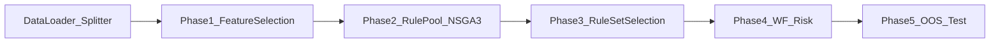

# Hyperparameter Reference

Detailed tuning guide for every constant in [`gpu_fuzzy_trader/config.py`](../../gpu_fuzzy_trader/config.py). Written for data scientists: each parameter includes default value, where it is used, and how changing it affects **out-of-sample performance**, **generalization**, **search diversity**, and **compute cost**.

**Source of truth:** edit `config.py` directly — the pipeline has no runtime hyperparameter flags.

---

## Pipeline overview

| Phase                                                | Module                             | Data split used                       | What is optimized                       |
| ---------------------------------------------------- | ---------------------------------- | ------------------------------------- | --------------------------------------- |
| [0 — Shared](phase0_shared.md)                       | loader, splitter, backtest engines | All                                   | Backtest semantics, paths, schema       |
| [1 — Feature selection](phase1_feature_selection.md) | `features/selector.py`             | Train only                            | Feature relevance × stability (MI)      |
| [2 — Rule pool](phase2_rule_pool.md)                 | `phases/phase2_rule_pool.py`       | Train (+ val when joint objective on) | Single-rule Sortino, drawdown, win rate |
| [3 — Rule set](phase3_rule_set.md)                   | `phases/phase3_rule_set.py`        | Train objectives, validation gates    | Ordered team of 2–3 rules               |
| [4 — Walk-forward risk](phase4_wf_risk.md)           | `phases/phase4_wf_optimizer.py`    | Validation walk-forward windows       | Per-rule TP, SL, capital_pct            |
| [5 — OOS](phase5_oos.md)                             | `phases/phase5_oos.py`             | Test (held-out)                       | Final reporting only                    |

---

## Data splits and leakage guards

The pipeline uses a **per-symbol chronological 75/25 split** of `data/train.csv`:

- **Train (75%)** — Phases 1–4 optimization signal (Phase 3 objectives when `PHASE3_USE_TRAIN_TARGET=True`).
- **Validation (25%)** — Phase 2 joint objective (`PHASE2_JOINT_TRAIN_VAL`), Phase 3 validation gates, Phase 4 walk-forward optimization.
- **Test (`data/test.csv`)** — Phase 5 only. Never touched during Phases 1–4.

**Label isolation:** feature columns never include `LABEL_COLUMNS`. Labels are used only for Phase 1 scoring targets and backtest outcome simulation.

**Temporal integrity:** splits are chronological per symbol (no shuffling). Phase 1 stationarity defaults to **regime-stratified** MI folds on train (`PHASE1_STATIONARITY_STRATIFY="regime"`); set `"chronological"` for time-based ablation.

---

## Performance metrics (shared definitions)

All phases report metrics from the same backtest engine ([`cpu_engine.py`](../../gpu_fuzzy_trader/backtest/cpu_engine.py), GPU equivalent in Phase 2):

| Metric              | Definition                                  | Tuning note                                               |
| ------------------- | ------------------------------------------- | --------------------------------------------------------- |
| **Sortino ratio**   | Mean return / downside deviation of returns | Primary risk-adjusted objective; sensitive to trade count |
| **Max drawdown %**  | Peak-to-trough equity decline               | Minimized in multi-objective search; gate in Phase 3      |
| **Win rate**        | Fraction of profitable trades               | Third objective; can conflict with high Sortino           |
| **Executed trades** | Count after filters                         | Low counts → noisy Sortino; support penalties apply       |
| **Total return %**  | Net PnL / initial capital                   | Reported in backtests; Phase 4 optimizes Sortino / drawdown |

Sortino is **scale-invariant** to `INITIAL_CAPITAL` but **not** to `FEE_PCT` or trade frequency.

---

## Suggested tuning workflow

Work backward from Phase 5 test results:

1. **Read Phase 5 test report** (`outputs/reports/test_*_report.json`) — this is ground truth.
2. **Compare train → val → test degradation:**
   - Val ≫ test → tighten generalization (Phase 3 gates, Phase 2 joint objective).
   - Train ≫ val → overfitting; tighten support/coverage or reduce search budget exploitation.
3. **Check trade count and symbol coverage** in validation/test per-symbol CSVs.
4. **Inspect Phase 2 history** (`outputs/phase2_*_history.json`) — flat Pareto front → increase generations/population or adjust support thresholds.
5. **Inspect Phase 4 Pareto plots** (`outputs/reports/phase4_*_pareto.png`) — adjust `PHASE4_N_TRIALS`, `PHASE4_MAX_WORST_DRAWDOWN_PCT`, or search bounds.

Tune **one phase at a time** when possible; downstream phases depend on upstream outputs.

---

## Failure mode → knob quick reference

| Symptom                                    | Likely cause                     | Knobs to try                                                                                         |
| ------------------------------------------ | -------------------------------- | ---------------------------------------------------------------------------------------------------- |
| Test Sortino ≪ validation Sortino          | Overfit rule sets or risk params | ↑ `PHASE3_VAL_GATE_PENALTY`, ↓ `PHASE3_VAL_SORTINO_RATIO_GATE`, enable/keep `PHASE2_JOINT_TRAIN_VAL` |
| Very few trades OOS                        | Rules too selective or high fees | ↓ `MIN_TRADE_SUPPORT` (careful), ↓ `MIN_CONDITIONS`, check `FEE_PCT`                                 |
| Rules fire on 1–2 symbols only             | Poor cross-symbol generalization | ↑ `PHASE3_MIN_SYMBOL_COVERAGE`, ↑ `MIN_TRADE_SUPPORT`, ↑ `PHASE3_SYMBOL_CONSISTENCY_WEIGHT`          |
| Long and short strategies nearly identical | Shared feature lists             | ↓ `PHASE1_MAX_FEATURE_OVERLAP`, keep `PHASE1_ASYMMETRIC_TARGET=True`                                 |
| Phase 2 Pareto front flat by gen 50        | Insufficient search budget       | ↑ `PHASE2_GENERATIONS`, ↑ `PHASE2_POPULATION_SIZE`                                                   |
| GPU OOM in Phase 2                         | JAX array too large              | ↓ `PHASE1_SAMPLING_TOTAL`, ↓ `PHASE2_POPULATION_SIZE`                                                |
| Total capital_pct > 100% in outputs        | Risk overallocation              | Keep `PHASE4_HARD_CAP_NORMALIZE=True`, ↑ `PHASE4_TOTAL_CAP_PENALTY`                                  |
| Phase 1 drops all features                 | Stationarity too strict          | ↑ `PHASE1_STATIONARITY_CV_MAX`, ↑ `PHASE1_STATIONARITY_RANK_DRIFT_MAX`                               |

---

## Phase documentation index

- **[Phase 0 — Shared constants](phase0_shared.md)** — paths, schema, backtest constants, logging
- **[Phase 1 — Feature selection](phase1_feature_selection.md)**
- **[Phase 2 — Rule pool generation](phase2_rule_pool.md)**
- **[Phase 3 — Rule set selection](phase3_rule_set.md)**
- **[Phase 4 — Walk-forward risk optimization](phase4_wf_risk.md)**
- **[Phase 5 — Out-of-sample evaluation](phase5_oos.md)**

---

## Diagnostics by phase

| Phase | Key output files                                                                                                 |
| ----- | ---------------------------------------------------------------------------------------------------------------- |
| 1     | `outputs/selected_features_long.json`, `outputs/selected_features_short.json`                                    |
| 2     | `outputs/phase2_{long,short}_pool.json`, `outputs/phase2_*_history.json`, `outputs/reports/phase2_*_metrics.png` |
| 3     | `outputs/long.json`, `outputs/short.json`, `outputs/reports/*_equity.png`                                        |
| 4     | Updated `outputs/long.json`, `outputs/short.json`, `outputs/reports/phase4_*_pareto.png`                           |
| 5     | `outputs/reports/test_*_report.json`, `outputs/reports/test_per_symbol_performance.csv`                          |

Persistent cross-run archive: `phase2_rule_archive/phase2_{long,short}_archive.json`.
